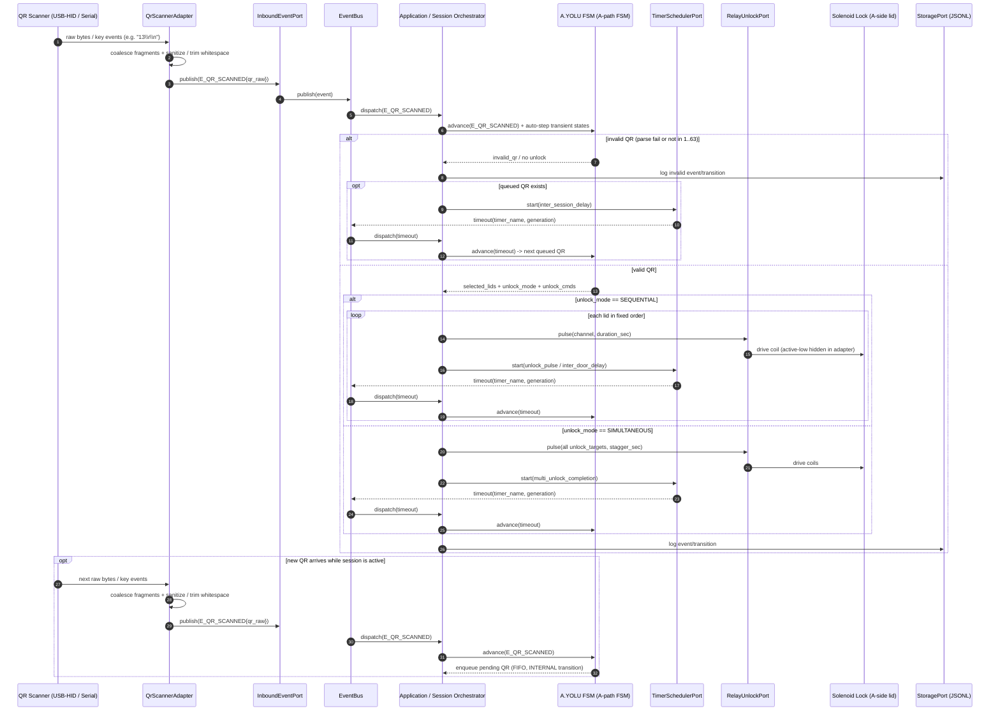
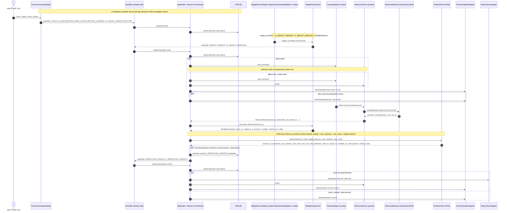
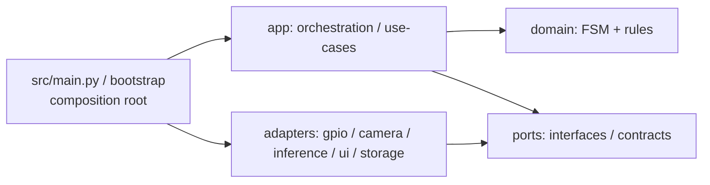

# Akıllı Atık Ayrıştırma Sistemi – README (Tek Doküman)

> Bu README, proje için **tek kaynak (Source of Truth)** dokümandır: amaç, mimari, donanım eşleşmeleri, akış kuralları ve geliştirme kuralları burada toplanır.
> FSM geçiş tablosunun **kesin** metni iki dosyadadır: **`FSM_SPEC_EXTRACT_A_yolu.md`** ve **`FSM_SPEC_EXTRACT_B_yolu.md`**.
> (Uyumluluk/kolaylık için) `FSM_SPEC_EXTRACT.md` bir **index (index)** dosyası olarak bu iki belgeye yönlendirebilir.
> Uzun/çok adımlı işler için (opsiyonel): **`PLANS.md`**. Bu belge, repo içinde bulunabilir; ancak varsayılan olarak **iş paketi planı / çalışma notu (work-package plan / working notes)** kabul edilir.
> **PLANS.md durumu (status):** `PLANS.md` güncel değilse (stale/outdated), yalnız backlog/not (backlog/notes) olarak okunur; **source of truth** sayılmaz.
> **Çelişki çözümü:** FSM geçişleri/guard/timeout gibi “FSM davranışı” için `FSM_SPEC_EXTRACT.md` (index) ve alt dosyalar (`FSM_SPEC_EXTRACT_A_yolu.md`, `FSM_SPEC_EXTRACT_B_yolu.md`); diğer tüm kararlar için bu README geçerlidir. `PLANS.md`, yalnız açıkça güncel/senkron (current/synced) işaretlendiyse yardımcı bağlam (supporting context) sayılır. Doküman ↔ kod çelişirse bu “bug” kabul edilir ve bilinçli bir kararla düzeltilir (kod mu, doküman mı — kullanıcı kararı).

## Geçerli Kararlar (Source of Truth)

Bu README, proje kararlarının derlenmiş ve güncellenmiş halidir. B.YOLU (B-path) için FSM geçişleri (transitions), korumalar (guards), zaman aşımları (timeouts), olay yükleri (event payloads) ve yürütme sözleşmesi (execution contract) açısından `corum_fsm_b_yolu_spec_extract_v0_2_10_rev02.md` esas alınır; uyuşmazlık durumunda kaynak diyagram (source diagram) `corum_fsm_b_yolu_v0_2_10_rev02.drawio.xml` ile doğrulanır. Mimari hizalama (architecture alignment), portlar (ports), adaptörler (adapters) ve ortak sözleşmeler (shared contracts) için `corum_architecture_hexagonal_fsm_contract_v02_rev04.drawio.xml` esas alınır; bunun dışındaki yüksek seviye (high-level) açıklamalarda bu README geçerlidir.

* **Mimari (architecture):** Hexagonal (Ports & Adapters) + olay güdümlü (event-driven) FSM + Uygulama / Oturum düzenleyici (Application / Session Orchestrator). Giriş olayları (inbound events) `InboundEventPort` üzerinden `EventBus`’a gelir; düzenleyici (orchestrator) ilgili FSM’i ilerletir ve `UiOutputPort`, `CameraPort`, `PredictionPort`, `WeightAnalysisPort`, `RelayUnlockPort`, `StoragePort`, `ClockPort`, `TimerSchedulerPort`, `ConfigPort` ve `TelemetryPort` üzerinden yan etkileri (side effects) yürütür.

* **Çoklu modalite füzyonu (multi-modal fusion):** Geç füzyon (late fusion / meta-classifier). Tahmin portu (PredictionPort / FPM), `InferenceResult` (çıkarım sonucu, inference result; v0.x’te çoğunlukla (mostly) classifier output) + ağırlık öznitelikleri (WeightFeatures) + kullanıcı beyanı (user declaration; `user_subclass`) + türetilmiş ana sınıf (derived `user_main`) bilgisini birleştirir. FSM (finite state machine) yalnız `E_PREDICTION_UPDATE` / `E_PREDICTION_TIMEOUT` çıktı sözleşmesini (output contract) görür.

* **Ağırlık işleme (weight processing):** Ham ağırlık akışı (raw weight stream) `weight_g`, Ağırlık analizi portu (WeightAnalysisPort) tarafından sorgulama (polling), eşik (threshold), histerezis (hysteresis) ve stabilite penceresi (stability window) mantığıyla işlenir; `E_WEIGHT_PRESENT`, `E_WEIGHT_REMOVED` ve `WeightFeatures` burada üretilir. FSM’e ham sensör verisi (raw sensor data) değil, türetilmiş olaylar (derived events) ve öznitelikler (features) verilir.

* **Ağırlık sensörü arabirimi (weight sensor interface):** B.YOLU (B-path) için seçilen kart (selected board) SparkFun OpenScale (SEN-13261) olacaktır; Raspberry Pi 5 bağlantısı (connection) USB-seri (USB serial) üzerindendir. `WeightSensorPort`, OpenScale’in kalibre edilmiş okumasını (calibrated reading) ve birim bilgisini (unit information) kanonik `weight_g` (gram) alanına (field) normalize eder; load cell / load cells modeli ve kapasitesi (model and capacity) kesinleşmediği için kalibrasyon sabitleri (calibration constants) ve ağırlık eşikleri (weight thresholds) TBD (to be defined) kalır.

* **FSM (finite state machine):** B.YOLU (B-path) ayrıntılı metin spesifikasyonu (textual specification) `corum_fsm_b_yolu_spec_extract_v0_2_10_rev02.md` dosyasında tutulur; kaynak durum makinesi (source state machine) diyagramı `corum_fsm_b_yolu_v0_2_10_rev02.drawio.xml` dosyasıdır. Aynı-durum (same-state) okları, aksi açıkça belirtilmedikçe, içsel geçiş (INTERNAL transition) kabul edilir; çıkış (exit) / yeniden giriş (re-entry) tetiklenmez.

* **Sınıflar (classes):** Bu cihazın kanonik ana sınıf anahtar uzayı (canonical main-class key space) `plastic`, `glass`, `metal`, `biodegradable`, `paper`, `other` değerlerinden oluşur. `v0.x` varsayılan aktif küme (default active set) bu altılı kümenin tamamıdır; etkin küme (effective active set) `[classes].main` ile belirlenir ve deployment profiline göre tutarlı bir alt küme (consistent subset) olarak yapılandırılabilir. Alt sınıflar (subclasses) `subclass_map.yaml` ile bu ana sınıflara (main classes) eşlenir (map). `everything_else`, model etiket kümesinde (model label set) bulunmayan sanal alt sınıftır (virtual subclass) ve zorunlu olarak `other` ana sınıfına (main class) eşlenir. Eski `non_recyclable` adı varsa yalnız arayüz/metin (UI/text) etiketi olarak kullanılmalıdır; FSM/log anahtarı (key) olarak kullanılmaz.

* **Görüntü modeli (vision model):** Exact production classifier olarak Hailo-8 kamu Model Zoo hattında (public Model Zoo line) karşılığı bulunan **`mobilenet_v3` / `224x224`** sınıflandırma hattı kullanılır. Model doğrudan ana sınıf (main class) üretmez; önce alt sınıf (subclass) üretir, sonra `subclass_new → main_new` eşlemesi (mapping) uygulanır. Eşleme (mapping) bulunamazsa `main_new='unknown'`, `prediction_valid=false` ve `err_unrecognized=true` kabul edilir.

* **Gerçek çalışma koşulu (real operating condition):** Sabit ışık (fixed lighting) + sabit arka plan (fixed background) + tek nesne (single object) varsayımı korunur; model yerel veri (local data) ile ince ayar (fine-tuning) alır.

* **Inference stratejisi (inference strategy):** Backend olarak `cpu` / `hailo` / `imx500` seçilebilir; üçü de aynı Tahmin portu (PredictionPort) sözleşmesini (contract) uygular ve FSM tarafı arka uç (backend) farkı görmez.

* **Ortak kurallar (cross-cutting rules):** Zaman aşımı olayları (timeout events) `timer_name + generation/token` taşır; bayat zaman aşımları (stale timeouts) yok sayılır (ignore). Loglama (logging) `JSONL` biçimindedir; `record_type=event|transition` ve durum/olay/geçiş adları (state/event/transition names) sembolik yazılır (symbolic names).

* **PLANS.md rolü (role):** `PLANS.md` yardımcı iş paketi planıdır; güncel değilse karar belgesi değildir ve README + `FSM_SPEC_EXTRACT*.md` önceliklidir.

## Projenin Amacı (Project Goal)

* **Amaç (goal):** Atıkların (waste) yanlış kutuya atılmasını (**mis-sorting**) engelleyen, kullanıcıya kendi hatasını fark ettiren (**error awareness**), kullanıcı kararı (**self-decision**) mantığını koruyan ve düşük enerji tüketimiyle (**low energy consumption**) çalışan bir akıllı atık yönlendirme sistemi (**smart waste guidance system**) kurmak.
* Mevcut “sıfır atık (zero waste)” uygulamalarında insanlar çoğunlukla **yanlış kutuya atıyor (mis-sorting)**, depozito makineleri (deposit machines) ve mobil atık merkezleri (mobile collection units) **genellikle düşük kullanıma sahip (low usage)** oluyor ve sistem çoğu zaman kullanıcı hatasını sessizce telafi ettiği için (**silent correction**) kullanıcı hangi hatayı yaptığını fark etmiyor.

* **Sistemin iki kullanım yolu (two usage paths) vardır:**

  * **A.YOLU (A-path):** Telefon uygulaması (mobile app) tarafından üretilen QR kodu (QR code) ile çalışır. Cihaz tarafı (device side), `E_QR_SCANNED` olayı (event) üzerinden gelen QR verisini (QR data) doğrular (**validate**); geçerli değer (valid value) `1..63` aralığında ise bit-mask (bitmask) ile sabit kapak sırası (fixed lid order) `25→24→23→22→21→20` üzerinden bir kapak planı (lid plan) üretir ve ilgili A tarafı kapağını/kapaklarını (A-side lid or lids) açar.
  * **B.YOLU (B-path):** Dokunmatik ekran (touchscreen), kamera (camera), ağırlık analizi (weight analysis) ve Birinci Tahmin Modeli (First Prediction Model, FPM) ile çalışır. Kullanıcıdan alt sınıf beyanı (subclass declaration) alır; bu beyanı model sonucu (prediction result), ağırlık özellikleri (weight features) ve yerleştirme durumu (placement state) ile birlikte değerlendirir.

* **A.YOLU (A-path) ile B.YOLU (B-path) ortak olarak (shared) şu hedefleri ve kuralları taşır:**

  * Her iki yol da aynı ana atık sınıflarını (canonical main classes) kullanır: `plastic`, `glass`, `metal`, `biodegradable`, `paper`, `other`.
  * Her iki yol da olay güdümlü durum makinesi (event-driven finite state machine, FSM) ve hexagonal mimari (hexagonal architecture) içinde çalışır; kullanıcı girdisi (user input), oturum yönetimi (session management), zamanlayıcılar (timers), kapak açma komutları (unlock commands) ve loglama (logging) ayrık sözleşmelerle (separate contracts) yönetilir.
  * Her iki yol fiziksel olarak ayrıdır (physically separated), ancak ortak atık kutularına (shared bins) boşaltım yapar; A ve B kullanıcıları birbirinin kapaklarına erişmez (no cross-access), fakat sistem eşzamanlı çalışabilir (concurrent operation).
  * Her iki yol da düşük enerji yaklaşımını (low-power approach) korur; boşta bekleme (idle) durumlarında ilgili akış uykuya (sleep) alınabilir ve yalnız gerekli olaylarda (required events) yeniden etkinleşir (reactivate).

* **Bizim farkımız (key difference):**

  * Sistem sessiz düzeltme (silent correction) yapmaz; kullanıcıya yönlendirici geri bildirim (guiding feedback) verir.
  * **A.YOLU (A-path)**, kullanıcı veya harici uygulama (external app) tarafından açık biçimde oluşturulmuş seçimi (explicit selection) cihaz tarafında (device side) tutarlı ana sınıf/kapak eşlemesi (main-class/lid mapping) ile uygular.
  * **B.YOLU (B-path)**, kullanıcı yanlış seçim yaptığında yeniden deneme (retry) ve kendi hatasını düzeltme (self-correction) imkânı verir; uyuşmazlık (mismatch), düşük güven (low confidence), sıvı şüphesi (liquid suspicion), çoklu atık şüphesi (multiple-item suspicion), tanınamama (unrecognized) veya tahmin zaman aşımı (prediction timeout) gibi durumlarda yanlış seçim sessizce onaylanmaz (not silently approved).


## Ana Atık Sınıfları (Main Classes / Bin Classes)

Bu projede **ana sınıf (main class / bin class)** şu anlama gelir:

* FSM (finite state machine) sonunda **hangi kapağın/haznenin** (lid/bin) açılacağını belirleyen **üst kategori** (top-level category).
* Görüntü sınıflandırma modeli (vision classifier), ana sınıfları (main classes) **doğrudan üretmez**; alt sınıfları (subclasses) üretir ve sonra ana sınıfa (main class) eşlenir (map).

### Değiştirilebilirlik (Configurable by deployment)

Ana sınıflar (main classes) ve alt sınıflar (subclasses) **saha/kurulum (deployment/site)** bazında değişebilir (ör. üniversite kampüsü (university campus) vs Starbucks). Bu yüzden ana sınıf listesi (main class list), alt sınıf → ana sınıf eşlemesi (subclass-to-main mapping) ve UI Screen2 menüsü (Screen2 menu) **konfigürasyon (configuration)** ile gelir; FSM (finite state machine) tarafı da bu sınıfları **enum / sabit liste** yerine **anahtar string** olarak taşır.

> Not (note): Donanım (hardware) belirli sayıda kapak/hazne (lid/bin) sunar; bu sayı (count) ile ana sınıf sayısı (main class count) tutarlı olmalıdır (consistent).

### Varsayılan örnek (Default example) – 6 ana sınıf

v0.x için örnek (example) ana sınıflar (main classes):

* `plastic`
* `glass`
* `metal`
* `biodegradable`
* `paper`
* `other`

> Not (note): `other`, FSM/log için (for FSM/log) kanonik ana sınıftır (canonical main class). Eski `non_recyclable` adı yalnız görünen metin (display text) / arayüz etiketi (UI label) olarak kullanılmalıdır.

Bu sınıflar (main classes), A.YOLU’nda (A-path) QR ile seçim (QR selection) için; B.YOLU’nda (B-path) ise `user_subclass` → `user_main` türetimi (derived main class) için kullanılır.

## Alt Atık Sınıfları (Subclasses)

Seçilen sınıflandırma modeli (selected classifier) **ana sınıfları (main classes) bilmez**; modelin sınıfları (classes) **alt sınıflardır (subclasses)** ve sayısı (count) **kurulum profiline (deployment profile) bağlıdır** (ilk sürümde (v0.x) netleşecek / TBD (to be defined)).

Alt sınıf (subclass) örnekleri (examples):
* `pet_water_bottle`  → `plastic`
* `glass_soda`        → `glass`
* `aluminum_beverage_can` → `metal`
* `banana_peel`             → `biodegradable`
* `paper_sheet`       → `paper`
* `paper_cup` / `packaging_waste` → `other`

Alt sınıf → ana sınıf eşlemesi (subclass-to-main mapping) **konfigürasyon (configuration)** ile yapılır: `subclass_map.yaml` (veya JSON (JSON)), şema (schema) `{subclass_name: main_class}`.

UI tarafında `screen2_menu.yaml`, Screen2 beyan menüsü (Screen2 declaration menu) için ekrana sığacak (fit on screen) alt sınıf listesini (subclass list) ve sırasını (order) ayrı yönetir. Yeni alt sınıf (new subclass) eklemek için model yeniden eğitilir (re-train) ve ilgili mapping/menu dosyalarına yeni satır eklenir; FSM (finite state machine) değişmez.

## Yazılım Yığını (Software Stack)

### Bu cihazda doğrulanan ortam (Verified Environment on This Device)

* `OS (Operating System)`: `Debian GNU/Linux 13 (Trixie)`
* `Kernel (kernel version)`: `6.12.62+rpt-rpi-2712`
* `Image (exact image/release information)`: `Raspberry Pi reference 2025-12-04`
* `Hardware (device model)`: `Raspberry Pi 5 Model B Rev 1.1`
* `Language`: **Python**
* `GUI`: **PySide6** (Qt)

### Görüntü modeli (Vision Model)

* Görev tipi: **sınıflandırma (classification)**
* **Seçilen temel model (selected base model):** **`mobilenet_v3` / `224x224`** (`224x224` girişli, tek nesne sınıflandırma hattı / single-object classification pipeline)

  * `v0.x` için (for `v0.x`) karar çizgisi (decision line): Hailo-8 tarafında (on the Hailo-8 side) kamu Model Zoo hattında (public Model Zoo line) doğrudan bulunan **`mobilenet_v3`** modeli tercih edilir. Amaç (purpose), generic bir `MobileNetV3 Large` varyantı seçmek değil; Hailo-8 üzerinde kanıtlanmış/public yol (proven public path) ile CPU fallback üzerinde temiz referans/fallback yolu (clean reference/fallback path) birlikte korumaktır.
  * Exact `model_id` (model id), **`mobilenet_v3`** olarak kilitlenmiştir (locked). Backend başına (per-backend) artefact dosya adları (artifact file names) bu model kimliğini (model identity) yansıtmalıdır (should reflect).
  * README düzeyinde (at README level) taşınan minimum model ayrıntısı (minimum model detail) şudur: exact `model_id`, `224x224` giriş boyutu (input size), subclass etiket kümesi (subclass label set), backend başına artefact türü (`.onnx` / `.hef`) ve `model_id` başına sabit preprocess sözleşmesi (`top_k_n`, `norm_mean/std`, resize/crop/color/layout). Daha ayrıntılı mimari/paper özeti (deeper architecture/paper summary) bu README'nin parçası değildir.

  * Not (note): Bu projede seçilen model bir **classifier** modelidir; detection (detection) modeli değildir.
  * Bu projede modelin sınıfları (classes) **ana sınıflar (main classes) değildir**. Model, **alt sınıfları (subclasses)** üretir (label set = subclasses).

* Ana sınıflar (main classes) **kapak seçimi (lid selection)** için kullanılır; model çıktısı (model output) alt sınıf → ana sınıf eşlemesi (mapping) ile ana sınıfa çevrilir:

  * `main_new = MAP(subclass_new → main_class)` (mapping / eşleştirme)
  * Mapping kaynağı (mapping source): `subclass_map.yaml` (schema: `{subclass_name: main_class}`)

* B.YOLU’nda “güven/puan” (confidence/score) `conf_new` artık doğrudan model top-1 skoru (model top-1 score) olmak zorunda değildir; **FPM (First Prediction Model)** skoru (FPM score) olabilir. Önemli ayrım (important distinction): vision model / `InferencePort`, yalnız `subclass + conf + top_k` üretir; **FPM / `PredictionPort`** ise bu sonucu (result) `weight_features` + `user_subclass` + `user_main` ile birleştirip (fuse) FSM’in kullandığı `main_new`, `conf_new` ve hata bayraklarını (error flags) üretir:
  classifier inference + `weight_features` (WeightFeatures) + `user_subclass` + `user_main` → `conf_new`.

  Ayrıca FPM (First Prediction Model), FSM/UI için semantik hata bayrakları (semantic error flags) üretir: `err_liquid`, `err_multiple`, `err_unrecognized`.

  (`weight_features`, WeightAnalysisPort (weight analysis port) tarafından `weight_g` akışından (stream) türetilir (derived).)

* Çalışma koşulu (operating condition): **sabit ışık (fixed lighting) + sabit arka plan (fixed background) + tek nesne (single object)**; yerel veri ile fine-tune (fine-tuning).

### Inference / Hızlandırma (kritik karar)

Tek kod tabanı + konfigürasyon ile **3 inference backend** seçilebilir:

* `cpu` — Raspberry Pi 5 üzerinde (referans/fallback)
* `hailo` — AI HAT+ (Hailo-8) üzerinde (opsiyonel hızlandırma)
* `imx500` — AI Camera (IMX500) sensör üzerinde (opsiyonel hızlandırma)

> Önemli: “tek model dosyası her backend’de çalışsın” hedeflenmez; **backend başına ayrı model artefact’ı** (ör. CPU için ONNX/PT, Hailo için HEF, IMX500 için deploy paketi) beklenir.
> Not: Seçilen exact production classifier (`mobilenet_v3` / `224x224`) için `imx500` backend’i v0.1’de **opsiyonel/deneysel** kabul edilir. CPU backend “garanti yol”dur; Hailo ana hızlandırma yolu olsa bile saha güvenliği için CPU fallback korunur.

Backend değişimi **hot-swap yerine** güvenli durumda (tercihen IDLE state) **clean restart** ile uygulanır.

### Ağırlık sensörü (Weight sensor) – Event + Feature hattı (event + feature pipeline)

* **Seçilen arayüz kartı (selected interface board):** SparkFun OpenScale (SEN-13261), Raspberry Pi 5’e USB-seri (USB serial) ile bağlanacaktır. Kart üzerinde (on-board) ATmega328P mikrodenetleyici (microcontroller), FT231 USB-seri dönüştürücü (USB-to-serial bridge) ve HX711 24-bit ADC (analog-to-digital converter) bulunduğu için, Pi tarafında (on Pi side) doğrudan HX711 `DOUT/SCK` pin sürme (direct pin driving) hedeflenmez.
* **Uygunluk notu (fitness note):** OpenScale, sabit yük (static load) veya kullanıcı müdahalesi olmadan sürekli okuma (continuous readings without user intervention) gereken uygulamalar için tasarlanmıştır; bu yüzden B.YOLU tablasındaki (B-path tray/platform) sürekli ağırlık akışı (continuous weight stream) için uygun bir başlangıç çözümüdür (good starting solution).
* **Load cell durumu (load cell status):** Load cell / load cells henüz seçilmedi (TBD). OpenScale, tek 4 telli (4-wire) veya 5 telli (5-wire) load cell ile ya da dört yük sensörü (four load sensors) Wheatstone köprüsü (Wheatstone bridge) yapısında kullanılabilir. Nihai kapasite (final capacity), mekanik yerleşim (mechanical layout) ve kalibrasyon (calibration) bilgileri load cell seçimi sonrası eklenecektir.
* **WeightSensorPort** (weight sensor port), OpenScale seri akışını (serial stream) `WeightSample` anlık görüntülerine (snapshots) çevirir ve kanonik `weight_g` (gram) ölçümünü (measurement) üretir; `E_WEIGHT_PRESENT` / `E_WEIGHT_REMOVED` türetmez (does not derive) ve bu karar (decision) `WeightAnalysisPort` tarafında kalır.
* **WeightAnalysisPort** (weight analysis port) bu akıştan (stream) iki çıktı (outputs) türetir (derives):
  1) `E_WEIGHT_PRESENT` / `E_WEIGHT_REMOVED` olayları (events) — B.YOLU FSM bunları oturum boyunca (session lifetime) **B_SCREEN1 / B_SCREEN2 / B_SCREEN3 / B_UNLOCKED_WAIT_REMOVE / ...** durumlarında (states) izler (monitors).
  2) `weight_features` (WeightFeatures) — PredictionPort (FPM) için girdi (input).
* **Adapter kuralı (adapter rule):** İlk gerçek adaptör (first concrete adapter) `OpenScaleUsbSerialAdapter` olmalıdır. Bu adaptör (adapter), OpenScale satırlarını (OpenScale lines) okuyup kalibre edilmiş okuma (calibrated reading) + birim (unit) bilgisini `weight_g` alanına (field) normalize eder (normalize). OpenScale tarafında (on device side) `lbs` / `kgs` seçilebildiği için, iç sözleşme (internal contract) olan gram (grams) birimi Pi tarafında korunmalıdır.
* **Protokol kuralı (protocol rule):** OpenScale çıktı alanları (output fields) yapılandırılabilir (configurable); zaman damgası (timestamp), ham okuma (raw reading) ve sıcaklık alanları (temperature fields) açılıp kapanabilir (enable/disable). Parser (parser), tam alan sayısını (field count) sabit varsaymamalı; gerekirse tam satırı (full line) `WeightSample.raw` içinde saklamalıdır.
* **Zaman tabanı kuralı (time-base rule):** OpenScale zaman damgası (timestamp) açıksa (enabled), bu değer kartın açılışından (power-on) beri geçen milisaniyeyi (milliseconds) temsil eder. Uygulamanın kanonik zamanı (canonical application time) için `ts_mono_ns`, Raspberry Pi monoton saatiyle (Raspberry Pi monotonic clock) üretilmelidir; kart zamanı (board time) yalnız tanısal veri (diagnostic data) olarak tutulabilir.
* **Kalibrasyon durumu (calibration status):** OpenScale kalibrasyonu (calibration) seri menü (serial menu) üzerinden yapılır; ancak load cell / load cells henüz alınmadığı için nihai tara (tare), katsayı (scale factor), eşik (threshold) ve histerezis (hysteresis) değerleri bu aşamada **belirtilmemiştir (unspecified)**.
* **Geçiş durumu (transition status):** Load cell / load cells henüz sahada (in hardware) olmadığı için ilk geliştirme safhasında (initial development phase) mock (mock) adapter veya geçici buton simülasyonu (temporary button simulation) kullanılabilir; ancak üretim yolu (production path) OpenScale + gerçek load cell akışıdır.
* Not (note): “Sıvı var mı?” (liquid present) gibi yorumlar (interpretation) için `weight_features` tek başına (weight-only) zayıf kalabilir; bu yüzden FPM (First Prediction Model) classifier sonucu (classifier output) + kullanıcı beyanı (user declaration, `user_subclass` + türetilmiş (derived) `user_main`) ile birlikte birleştirerek (fusion) değerlendirmelidir.

### QR/Barkod okuyucu bağlantısı

* (5) GM67 QR/Barkod okuyucu için entegrasyon modu (integration mode) **henüz sabitlenmemiştir (not frozen yet)**; hızlı başlangıç / basit entegrasyon (quick start / simple integration) için **USB-HID keyboard wedge** modu, daha açık uyandırma (wake), başlat/durdur tarama (start/stop decode) ve cihaz kontrolü (device control) gerekirse **seri / host mode (serial / host mode)** düşünülmelidir (should be considered).
* Hangi mod seçilirse seçilsin (regardless of selected mode), uygulama katmanı (application layer) gelen veriyi (incoming data) `sanitize/trim` etmeli, sonda gelen `Enter/newline/whitespace` değerlerini (values) güvenle temizlemeli (safely trim) ve parça veri (fragmented data) durumunda tek mantıksal tarama (single logical scan) oluşturmalıdır (should construct).
* A.YOLU uyku/uyandırma davranışı (A-path sleep/wake behavior) bench test ile doğrulanmalıdır (must be verified by bench test); mevcut FSM’de (current FSM) `A_SLEEP` → `A_IDLE` uyandırma olayı (wake event) `E_BUTTON32_PRESS` ile modellenir, bu nedenle `(32) A_YOLU_UYAN_BUTTON` şu aşamada (at this stage) **provizyonel yardımcı giriş (provisional auxiliary input)** olarak tutulur (is kept).

### Görseller (images) notu

* Codex yükünü artırmamak için görseller zorunlu değildir; repo’ya görsel eklenecekse dosya adları **boşluksuz + ASCII** olmalıdır (örn. `Sekil_8_Dokunmatik_Ekran_2.svg`).

## Mimari (Hexagonal + Event-Driven FSM)

### Neden bu mimari?

* UI (PySide6), donanım (GPIO/relay), inference runtime ve FSM birbirine yapışırsa her donanım değişikliği “yeniden yazım” acısı üretir. Hexagonal mimari ile **domain (çekirdek)** FSM + kurallar + event’leri dış dünyadan bağımsız tutar; **ports** çekirdeğin ihtiyaç duyduğu arayüzleri (`InferencePort`, `CameraPort`, `StoragePort`, `TelemetryPort`, `ClockPort`...) tanımlar; **adapters** ise IMX500/Hailo/CPU, kamera, GPIO, UI ve storage gibi dış dünya implementasyonlarını taşır.

### Event-driven FSM yaklaşımı

* UI doğrudan state değiştirmez; **event yayınlar**. FSM state transition yapar, use-case katmanı da gerekli aksiyonları (ör. inference start/stop, relay unlock pulses, UI update, persist/log/telemetry) tetikler.

### Threading / performans (temel kural)

* UI thread asla bloklanmaz.
* Inference ayrı thread/process’te koşar.
* Frame kuyruğu **bounded** olmalı (unbounded queue yok).
* Kamera kareleri “hot path”te diske yazılıp geri okunmaz (örn. `rpicam-still` ile dosyaya snapshot almak yok); mümkün olduğunca RAM içi stream/pipeline kullanılır.
* Kararlılık için (opsiyonel): EMA / `N_STABLE_FRAMES` gibi stabilizasyon uygulanabilir (B.YOLU Ekran3 kuralları bunu zaten kullanır).

## Data Flow, Bağımlılık (Dependency) ve Kütüphane Politikası

Bu bölüm, kodlamadan önce **data flow’u** (veri + kontrol akışı), **bağımlılık sınırlarını** (dependency rules) ve **kütüphane/3rd-party bağımlılık politikasını** netleştirir; amaç “kim kimi çağırır / kim kimi bekler?” sürprizlerini ve eski yazılımdaki klasik sorunları (UI donması, dosya tabanlı kamera I/O, her inference çağrısında yeniden init, hard-coded config) tekrarlamamaktır.

> Not: Diyagramlar için Mermaid önerilir; Markdown içinde ` ```mermaid ` code block ile çizim üretir ve GitHub dahil birçok araçta desteklenir.

### 4.1 Data Flow – A.YOLU (QR) (event → orchestrator → FSM → unlock/timer)

A.YOLU’nda kullanıcı etkileşimi (user interaction), cihaz UI’ından (device UI) değil, QR okuyucudan (QR scanner / USB-HID) gelir. Mimari hizalamaya (architecture alignment) göre akış doğrudan `EventBus → FSM` değildir; `InboundEventPort → EventBus → Application / Session Orchestrator → A.YOLU FSM (A-path FSM)` zinciri kullanılır. Bu ayrım (separation), QR okuma (QR scan), FIFO oturum kuyruğu (FIFO session queue), geçersiz QR (invalid QR), zamanlayıcı üretimi (timer generation) ve röle darbesi (relay pulse) yan etkilerini (side effects) uygulama katmanında (application layer) toplar.



**A.YOLU kritik sözleşmeler (contracts):**

* QR okuyucu (QR scanner) “Enter/newline” ekleyebilir → `qr_raw` için baş/son boşluk temizleme (trim/strip whitespace) zorunludur.
* `QrScannerPort` (özel/iç seam, private/internal seam) yalnız sanitize/trim (sanitize/trim) ve parça birleştirme (fragment coalescing) yapar; `qr_value_int`, `qr_mask` ve `selected_lids` türetimi (derivation) uygulama katmanı / A.YOLU FSM (application layer / A-path FSM) tarafında kalır.
* `qr_value_int` yalnız `1..63` aralığında geçerlidir (valid); bunun dışı (outside this range) **geçersiz QR (invalid QR)** kabul edilir ve **kapak açma yoktur (no unlock)**.
* `qr_mask` → `selected_lids` dönüşümü (mapping), sabit bit→kapak eşlemesi (fixed bit-to-lid mapping) ve sabit öncelik sırası (fixed priority order) ile yapılır: `b0→25`, `b1→24`, `b2→23`, `b3→22`, `b4→21`, `b5→20`; yürütme sırası (execution order) `25→24→23→22→21→20` şeklindedir.
* Aktif/beklemeli durumlarda (active/waiting states) yeni `E_QR_SCANNED` gelirse mevcut oturum (current session) bölünmez (not preempted); olay (event) **INTERNAL transition (internal transition)** ile bekleyen FIFO kuyruğuna (pending FIFO queue) eklenir.
* Aynı payload (payload) iki ayrı fiziksel taramadan (physical scan) geldiyse bunlar iki ayrı mantıksal tarama (logical scan) kabul edilir; `QrScannerPort` QR replay (QR replay) / oturum kuyruğu (session queue) davranışını bozacak semantik tekrar-silme (semantic deduplication) yapmaz.
* `A_SLEEP` durumunda (in `A_SLEEP`) QR okutmak (scan QR) uyandırma (wake) üretmez; `E_QR_SCANNED` **ignore + buffer flush** davranışıyla ele alınır. Uyandırma (wake) yalnız `E_BUTTON32_PRESS` ile yapılır.
* `A_INVALID_QR` ve `A_SESSION_DONE`, geçici / otomatik (transient / AUTO) durumlardır (states); bekleyen oturum (queued session) varsa `inter_session_delay` sonrasında (after) sıradaki QR işlenir, yoksa `A_IDLE` durumuna (state) dönülür.
* “Unlock” (kilit açma, unlock) yalnız **pulse** komutudur; “close” (kapatma, close) komutu yoktur. Kapak kapanması (lid closure) mekaniktir (mechanical), röle kartının aktif-seviyesi (active level) olan **active-low** ayrıntısı (detail) ise yalnız adaptörde (adapter) tutulur.
* Zamanlayıcı olayları (timer events), `timer_name + generation/token` taşır; `stop/restart` sonrası (after) bayat zaman aşımları (stale timeouts) **ignore** edilir. Bu kural (rule), `unlock_pulse`, `inter_door_delay`, `inter_session_delay` ve çoklu açma tamamlanma zamanlayıcısı (multi-unlock completion scheduler) için kritik önemdedir.
* `unlock_mode = SEQUENTIAL | SIMULTANEOUS` seçimi (selection), domain (domain) kararından gelir; uygulama katmanı (application layer) bunu `unlock_targets / unlock_cmds` üzerinden uygular.


### 4.2 Data Flow – B.YOLU (Touchscreen + Camera + Inference + FPM)

B.YOLU, dokunmatik giriş (touch input), ağırlık hattı (weight pipeline), kamera/çıkarım hattı (camera/inference pipeline), FPM (First Prediction Model) ve zamanlayıcı olaylarını (timer events) **Application / Session Orchestrator** (uygulama / oturum orkestratörü, application / session orchestrator) üzerinden **FSM**’e (sonlu durum makinesi, finite state machine) bağlar; UI (kullanıcı arayüzü, user interface) state (durum, state) değiştirmez, yalnız **sembolik olay** (symbolic event) yayınlar.



**Akış özeti (flow summary):**

1. **TouchscreenInputAdapter** (dokunmatik giriş adaptörü, touchscreen input adapter), `E_TOUCH`, `E_DECLARATION_DONE`, `E_DECLARATION_CLEARED` ve `E_CANCEL_SESSION_BUTTON` olaylarını (events) yayınlar (publish).  
2. **EventBus** (olay veri yolu, event bus) olayı (event) **Application / Session Orchestrator**’a iletir (dispatch); orkestratör (orchestrator) de **FSM (B)** üzerinde `advance(event)` çalıştırır ve çıkan aksiyonları (actions) uygular.  
3. **WeightSensorAdapter** (ağırlık sensörü adaptörü, weight sensor adapter) için ilk hedef (first target) `OpenScaleUsbSerialAdapter`’dır; bu adaptör (adapter), SparkFun OpenScale seri akışını (serial stream) okuyup normalize edilmiş `weight_g` ölçümünü (normalized measurement) üretir. **WeightAnalysisPort** (ağırlık analiz portu, weight analysis port) de bu akıştan (stream) hem `E_WEIGHT_PRESENT` / `E_WEIGHT_REMOVED` olaylarını (events) hem de `WeightFeatures` verisini (data) türetir (derive).  
4. **InferenceService** (çıkarım servisi, inference service) bounded queue (sınırlı kuyruk, bounded queue) ile en yeni kareyi (latest frame) işler; backend (arka uç, backend) ilk başlatmadan (initialization) sonra kare başına (per-frame) yeniden kurulmaz (re-init).  
5. **PredictionPort (FPM)**, `InferenceResult` (çıkarım sonucu, inference result; v0.x’te çoğunlukla (mostly) classifier output) + `weight_features` + `user_subclass` + `user_main` girdilerini (inputs) birleştirir (fuse) ve `PredictionUpdatePayload` (tahmin güncelleme yükü, prediction update payload) üretir; uygulama katmanı (application layer) bu çıktıyı (output) `E_PREDICTION_UPDATE` olarak publish eder, `E_PREDICTION_TIMEOUT` ise `prediction_wait_timer` (tahmin bekleme zamanlayıcısı, prediction wait timer) üzerinden gelir.

**E_DECLARATION_DONE payload (event payload) — güncel (updated):**

* `user_subclass` (kullanıcı beyanı alt sınıfı, user-declared subclass) — Screen2’de (Screen2) seçilen alt sınıf (selected subclass).
* `user_main` (türetilmiş ana sınıf, derived main class) — `user_main = MAP(user_subclass → main_class)` (eşleme, mapping).
* `E_DECLARATION_CLEARED` (beyan silindi, declaration cleared) geldiğinde: `decl_done=false`; `user_subclass/user_main=unset`; `prediction_wait_timer` durdurulur (stop); `Screen2 timer (T1/T2)` yeniden başlatılır (restart/reset).

**E_PREDICTION_UPDATE payload (event payload) — güncel (updated):**

* `session_id` (oturum kimliği, session id)
* `placement_seq` (yerleştirme sırası, placement sequence) — aynı oturum (same session) içindeki yeni yerleştirme (new placement) sayacı (counter)
* `subclass_new` (alt sınıf, subclass)
* `main_new` (ana sınıf, main class)
* `conf_new` (güven/puan, confidence/score)
* `prediction_valid` (geçerli mi, validity)
* `err_liquid` (sıvı şüphesi, liquid suspected)
* `err_multiple` (çoklu/karışık atık şüphesi, multiple/mixed suspected)
* `err_unrecognized` (tanınamadı, unrecognized)
* `stable_count` (kararlı kare sayısı, stable frame count)

> Kural (rule): **Unlock** (kilit açma, unlock) guard’ları (koşulları, guards) `err_*` bayrakları (flags) `true` iken geçmemelidir (must not pass).

**E_PREDICTION_TIMEOUT payload (event payload):**

* `prediction_wait_timer` (tahmin bekleme zamanlayıcısı, prediction wait timer) zaman aşımıdır (timeout).
* Aynı `session_id + placement_seq` için yeni `E_PREDICTION_UPDATE` gelmediğinde (when no new update arrives) oluşur.

**B.YOLU kritik sözleşmeler (contracts):**

* **UI thread** (arayüz iş parçacığı, UI thread) bloklanmaz (non-blocking); ağır işler (heavy tasks) worker thread/process (işçi iş parçacığı/süreç, worker thread/process) tarafında çalışır.
* **FSM olay sıralaması (FSM event ordering / serialized dispatch):** `EventBus` (event bus) thread-safe (thread-safe) olabilir; ancak `Application / Session Orchestrator`, `advance(event)` çağrılarını (calls) tek tüketici (single-consumer) sırada (queue) seri işler (serialize). UI (user interface), ağırlık (weight), zamanlayıcı (timer) ve inference worker’ları (workers) doğrudan eşzamanlı FSM re-entry (concurrent FSM re-entry) yapmaz.
* **FSM yürütme notu (FSM execution note):** same-state geçişler (same-state transitions) aksi açıkça belirtilmedikçe (unless explicitly stated otherwise) `INTERNAL transition` kabul edilir; `state exit` / `re-entry` / `entry-exit action` tekrar çalıştırılmaz (are not rerun).
* **WeightAnalysisPort** içindeki `E_WEIGHT_PRESENT` / `E_WEIGHT_REMOVED` üretimi (generation), ham eşik geçişinden (raw threshold crossing) değil; **eşik (threshold) + histerezis (hysteresis) + kararlılık penceresi (stability window)** ile yapılır.
* **Touch-first** (önce dokunma, touch-first) akışında (flow) `B_SCREEN1 --E_TOUCH--> B_SCREEN2` ile kamera önizlemesi (camera preview) başlar; inference (çıkarım, inference) `placement_done=true` olana kadar bekler.  
  **Place-first** (önce bırakma, place-first) ve **wake+start** (uyan ve başlat, wake+start) akışında (flow) `E_WEIGHT_PRESENT` ile kamera + preview + inference birlikte başlar.
* `B_SCREEN2` içinde `E_DECLARATION_DONE` geldiğinde: `Screen2 timer (T1/T2)` resetlenir (reset); `placement_done==true` ise `prediction_wait_timer` başlatılır/yeniden başlatılır (start/restart); aynı `session_id + placement_seq` için **cached prediction** (önbellekli tahmin, cached prediction) varsa doğrudan değerlendirilir (evaluate immediately).
* `B_SCREEN2` veya `B_SCREEN3` içinde `E_WEIGHT_PRESENT [!placement_done]` geldiğinde: `placement_done=true`; `placement_seq=placement_seq+1`; inference gerekirse başlatılır (start if needed).
* `E_WEIGHT_REMOVED (before unlock)` geldiğinde: inference durur (stop); `placement_done=false` yapılır; model tahmin alanları (prediction fields) temizlenir (clear); `prediction_wait_timer` durur (stop); `B_SCREEN2` içinde `Screen2 timer (T1/T2)` aktifse (if active) resetlenmez, yalnız zaten durmuşsa (only if already inactive) yeniden başlatılır (restart); `B_SCREEN3` içinde `retry_start_ts=unset` ile `max_retry_time` sayacı (timer) duraklatılır (paused); ancak beyan durumu (declaration state) **korunur** (preserved).
* **Late result / stale session / stale placement** (geç gelen sonuç / eski oturum / eski yerleştirme, late result / stale session / stale placement): `placement_done==false` **veya** `payload.session_id != session_id` **veya** `payload.placement_seq != placement_seq` ise gelen `E_PREDICTION_UPDATE` **ignore** edilir (ignored).
* `everything_else` (sanal alt sınıf, virtual subclass) için **özel akış** (special flow) korunur: kanonik geri dönüş (canonical fallback) `other`’dır; `err_liquid=false` ve `err_multiple=false` olduğu sürece, model başka bir bilinen ana sınıfı (known main class) `CONF_SUGGEST_KNOWN_EVERYTHING_ELSE` eşiğinin (threshold) üstünde güçlü önermiyorsa (no strong suggestion), `prediction_valid=false` veya `err_unrecognized=true` tek başına (by itself) `other` açmayı engellemez (does not block unlock); bu özel akışta (in this special flow) `E_PREDICTION_TIMEOUT` / `NO_PREDICTION` doğrudan (directly) `other` kapağını (other lid) açmaya gidebilir, `B_SCREEN3` zorunlu değildir (is not mandatory).
* Hata önceliği (error precedence): `err_liquid > err_multiple > err_unrecognized`.
* Zamanlayıcı güvenliği (timer safety): timeout event (zaman aşımı olayı, timeout event) `timer_name + generation/token` taşır; bayat timeout event (stale timeout event) ignore edilir.
* **B_SCREEN3 zamanlayıcı varsayılanları (B_SCREEN3 timer defaults):** `retry_inactivity_timeout_sec=15` (default) ve `max_retry_time_sec=13` (default) birlikte kullanılır; `placement_done=false` olduğunda (when) `max_retry_time` sayacı (timer) duraklatılır (paused).
* **B_UNLOCKED_WAIT_REMOVE zamanlayıcı varsayılanları (B_UNLOCKED_WAIT_REMOVE timer defaults):** `unlocked_remove_timeout_sec=5` (default) ve `MAX_UNLOCKED_PROMPTS=3` (default) birlikte kullanılır.
* `B_UNLOCKED_WAIT_REMOVE` gerçek girişinde (on real entry) mevcut ağırlık seviyesi (current weight level) senkronlanır (sync); atık (item) zaten kaldırılmışsa (already removed) doğrudan `E_WEIGHT_REMOVED` gibi ele alınır (treated as immediate remove).


### 4.3 Eşzamanlılık (Concurrency) ve Röle Sürme Kuralları

Bu projede **aynı anda birden fazla röle darbesi (relay pulse) üretmek mimari olarak mümkündür**; ancak bu, **sınırsız paralellik (unbounded parallelism)** anlamına gelmez. Domain (alan katmanı, domain) yalnız `unlock_targets / unlock_cmds` üretir; gerçek yürütme politikası (execution policy) `RelayUnlockPort / RelayUnlockAdapter` içinde uygulanır.

**Önerilen kesin politika (recommended concrete policy):**

* **Kanal tekilliği (per-channel exclusivity):** Her röle kanalı (relay channel) aynı anda en fazla bir aktif darbe (active pulse) taşıyabilir. Kanal durumu (channel state) en az `IDLE | PULSING` olarak izlenmelidir (tracked).
* **Aynı kanal ikinci istek (same-channel second request):** İlk sürüm (first version) için önerilen davranış (recommended behavior) `REJECT_IF_BUSY` / `IGNORE_DUPLICATE_WHILE_ACTIVE` olmalıdır; aynı kanala (same channel) ikinci darbe (second pulse), aktif darbe sürerken (while an active pulse is running) queue’lanmaz (not queued), loglanır (logged) ve yok sayılır (ignored). Gerekçe (reason): arka arkaya darbe (back-to-back pulse), etkin açık kalma süresini (effective unlock time) uzatabilir, bobin ısısını (coil heating) artırabilir ve kullanıcıya görünen davranışı (user-visible behavior) belirsizleştirebilir.
* **Farklı kanal paralelliği (cross-channel parallelism):** Farklı röle kanalları (different relay channels) aynı anda darbe alabilir (may pulse simultaneously). Bu, A.YOLU `unlock_mode=SIMULTANEOUS` ve A/B eşzamanlılığı (A/B concurrency) için gereklidir.
* **Küresel sınır (global limit):** Buna rağmen pratik üst sınır (practical upper bound) `max_parallel_pulses` veya eşdeğer güç bütçesi sınırı (power-budget limit) ile tanımlanmalıdır (must be defined). “İstenirse bütün kanallar aynı anda” (all channels at once) varsayılan kabul edilmez (not assumed by default).
* **Güç bütçesi (power budget) ve ısıl sınır (thermal limit):** Eşzamanlı sürme (simultaneous driving), yalnız 12V güç kaynağı (12V power supply), röle kartı (relay board), kablolama (wiring) ve solenoid bobinlerinin (solenoid coils) toplam akımını (aggregate current) güvenle taşıyabiliyorsa (if they can safely carry it) etkinleştirilmelidir (should be enabled). Bu sayısal sınır (numeric limit) bu belgede **belirtilmemiştir (unspecified)**; saha ölçümü (field measurement) ile doğrulanmalıdır (must be verified).
* **Polarite gizleme (polarity hiding):** Röle kartı **active-low** ise mantıksal `ON/OFF` → fiziksel `GPIO LOW/HIGH` çevirisi (translation) yalnız adaptörde (adapter) yapılır. Domain (domain) / FSM (finite state machine) bu polarite ayrıntısını (polarity detail) bilmez.
* **Güvenli başlangıç / duruş (safe startup / shutdown):** Uygulama açılışında (startup), yeniden başlatmada (restart), `E_FATAL_ERROR` sonrası (after fatal error) ve çıkışta (shutdown) tüm röle çıkışları (relay outputs) mantıksal `OFF` durumuna (safe-off state) zorlanır (forced). Active-low kartta (on an active-low board) bu, tipik olarak (typically) fiziksel `HIGH` seviyesidir (physical HIGH level).
* **Yürütme modeli (execution model):** Röle darbesi (relay pulse) UI thread (arayüz iş parçacığı, user-interface thread) içinde `sleep` ile tutulmaz (must not be held with sleep); ayrı bir worker / scheduler (işçi / zamanlayıcı, worker / scheduler) bitiş zamanı (deadline) bazlı aç/kapat (on/off) yürütür (executes).
* **Gözlemlenebilirlik (observability):** Her darbe isteği (pulse request) en az `request_id`, `session_id`, `path`, `channel`, `duration_ms`, `accepted/rejected_reason` alanlarıyla (fields) loglanmalıdır (must be logged).
* **Batch tutarlılığı (batch consistency):** `pulse_many` ile (with `pulse_many`) tek açma planından (single unlock plan) gelen eşzamanlı komutlar (simultaneous commands) `v0.x` için **all-or-none validation** (ya hep ya hiç doğrulama, all-or-none validation) ile ele alınmalıdır (should be handled). Aynı batch (batch) içinde bir komut (command) `invalid`, `busy` veya `max_parallel_pulses` sınırını (limit) aşıyorsa (if it exceeds), kısmi açma (partial unlock) yapılmaması (not performing partial unlock) daha güvenlidir (safer).
* **Boot seviyesi güvenlik notu (boot-level safety note):** Raspberry Pi GPIO pinleri (GPIO pins) güç verildiğinde (on power-on reset) önce giriş (input) + varsayılan çekme direnci (default pull) durumuna (state) döner; `config.txt` içindeki `gpio=` ayarı (setting) erken boot aşamasında (early boot stage) çıkış yönü/değeri (output direction/value) vermeye yardımcı olabilir, fakat etkisinin (effect) birkaç saniye gecikmesi (delay) olabilir. Bu nedenle (therefore), röle/solenoid hattında (relay/solenoid line) yanlışlıkla enerjilenme (accidental energisation) emniyet açısından (for safety) kritikse (if critical), yalnız uygulama başlatma koduna (application startup code) güvenmek yerine (rather than relying only on it) harici pull-up/pull-down (external pull-up/pull-down), enable hattı (enable line), güç sıralama (power sequencing) veya sürücü katmanında (driver stage) fail-safe (fail-safe) düşünülmelidir (should be considered).
* **Genişletilebilirlik notu (extensibility note):** İleride gerekirse (if needed later) aynı kanal politikası (same-channel policy) `reject_if_busy | coalesce_if_busy | queue_after_release` olarak konfigürasyonla (by configuration) genişletilebilir; ancak `v0.x` için önerilen varsayılan (recommended default) `reject_if_busy`’dir.

### 4.4 Bağımlılık Kuralları (Code Dependency Rules)

Hexagonal mimaride (hexagonal architecture) en kritik teknik çizgi (technical boundary), **çağrı yönü (call direction)** değil, **import bağımlılığı yönüdür (import-dependency direction)**. Bu projede en güvenli ve pratik kural şudur: **domain (alan katmanı, domain layer) tamamen içte (innermost) kalır; somut bağlama (concrete wiring) `src/main.py` veya eşdeğer bootstrap/composition root içinde yapılır.**



> Düzeltme (correction): Önceki sade şema (previous simplified diagram) `Domain -> Ports` izlenimi (impression) verebiliyordu. Bu projede (in this project) bu bağımlılık (dependency) genellikle gereksizdir; FSM (finite state machine) yalnız sembolik olay (symbolic event), guard (guard) ve aksiyon kararı (action decision) üretir, gerçek port çağrılarını (real port calls) `Application / Session Orchestrator` uygular.

Kurallar (rules):

1. `src/domain`
   * Bu projede kural olarak (project rule), yalnız **Python standart kütüphanesi (Python standard library)** ve `src/domain/*` modüllerini (modules) import eder.
   * `src/app`, `src/ports`, `src/adapters` ve `PySide6`, `gpiozero`, `Picamera2`, `cv2`, `serial`, `hailo`, `libcamera` gibi çerçeve/donanım kütüphanelerini (framework/hardware libraries) import etmez.
   * FSM durumları (states), olaylar (events), guard’lar (guards), aksiyon adları (action names) ve saf kurallar (pure rules) burada kalır.

2. `src/ports`
   * Yalnız arayüz (interface) / sözleşme (contract) tanımlar: `Protocol` (Protocol) veya `ABC` (abstract base class) + gerekirse (if needed) saf veri taşıyıcıları (pure data carriers / DTOs).
   * Implementasyon (implementation), I/O (input/output), thread açma (thread spawning), dosya erişimi (file access), GPIO erişimi (GPIO access), kamera çağrısı (camera call) içermez.
   * Port imzalarında (port signatures) ortak saf tipler (shared pure types) gerekiyorsa (if needed), bunlar `src/domain/types.py` gibi saf tip modülünde (pure types module) tutulabilir; yön (direction) `ports -> domain types` olabilir, `domain -> ports` değil.

3. `src/app`
   * Orchestration (orchestration) katmanıdır: `EventBus` (event bus), `Application / Session Orchestrator`, oturum bağlamı (session context), timer başlat/durdur (timer start/stop), FSM `advance(event)` ve aksiyon uygulama (action application) burada olur.
   * İş akışı modülleri (workflow modules) `src/domain` ve `src/ports` import eder.
   * **Önemli nüans (important nuance):** `src/app` altındaki sıradan modüller (regular modules) somut adaptör (concrete adapter) sınıflarını import etmez; bunu yalnız `src/main.py` veya `src/app/bootstrap.py` gibi **composition root** (composition root) yapar.

4. `src/adapters`
   * `src/ports` sözleşmelerini (contracts) uygular.
   * Dış dünya bağımlılıkları (external-world dependencies) burada toplanır: `PySide6`, `Picamera2/libcamera`, `gpiozero` / `RPi.GPIO`, `pyserial`, `onnxruntime`, `hailort`, `imx500` vb.
   * Domain karar mantığı (domain decision logic) taşımaz; örneğin (for example) “`main_new == user_main` ise kapağı aç” gibi kararlar (decisions) adapter’da değil, FSM/app tarafındadır.

5. `src/main.py` / `bootstrap`
   * Somut nesne kurma (concrete object construction), dependency injection (bağımlılık enjeksiyonu, dependency injection), config yükleme (config loading) ve wiring (wiring) burada yapılır.
   * Başka yerde (elsewhere) `PredictionCpuAdapter(...)`, `RelayUnlockAdapter(...)`, `TouchscreenInputAdapter(...)` gibi sınıfların doğrudan örneklenmesi (direct instantiation) önerilmez.

6. Adapterlar arası (between adapters) ilişki
   * Varsayılan kural (default rule): bir adaptör (adapter) başka bir adaptörü import etmez.
   * Ortak yardımcı kod (shared helper code) gerekirse (if needed), ya aynı adaptör paketinin (adapter package) içinde yerel yardımcı modül (local helper module) olarak, ya da ayrı saf yardımcı katmanda (separate pure helper layer) tutulur; adapterlar birbirine yapışmaz (do not couple).

7. UI özel kuralı (UI-specific rule)
   * UI adaptörü (UI adapter) FSM state (state) değiştirmez; `advance(event)` çağırmaz.
   * UI yalnız sembolik olay (symbolic event) üretir (`E_TOUCH`, `E_DECLARATION_DONE`, `E_CANCEL_SESSION_BUTTON` gibi); state ilerletme (state advancement) `app` katmanında kalır.

8. Timer / weight / prediction özel kuralı (special rule)
   * `TimerSchedulerAdapter`, `WeightAnalysisAdapter`, `Prediction*Adapter` olay yayınlayabilir (may publish events), ama FSM transition (transition) seçimi yapmaz.
   * “late result / stale session” gibi kararlar (decisions) adapter’da değil, app/FSM guard’larında (guards) değerlendirilir.

**Pratik karar (practical decision):** Bu projede `src/domain -> src/ports` bağımlılığını (dependency) **varsayılan olarak kapalı tutmak (keep disabled by default)** daha temizdir (cleaner), çünkü mevcut tasarımda (current design) port çağrılarını (port calls) domain değil, orchestrator yapar. İleride (later) bir domain service (domain service) gerçekten bir port’a (port) ihtiyaç duyarsa (needs), bu ayrı bir mimari kararla (architectural decision) açılmalıdır; başlangıçta (initially) açık bırakmak (leaving it open) gereksiz sızıntıya (unnecessary leakage) yol açabilir.

**Kısa iyi örnek (short good example):**

```python
# src/app/orchestrator.py
class SessionOrchestrator:
    def __init__(
        self,
        relay: RelayUnlockPort,
        prediction: PredictionPort,
        timer: TimerSchedulerPort,
    ) -> None:
        ...
```

```python
# src/main.py  (composition root)
relay = RelayUnlockAdapter(...)
prediction = PredictionCpuAdapter(...)
timer = TimerSchedulerAdapter(...)
app = SessionOrchestrator(relay=relay, prediction=prediction, timer=timer)
```

```python
# kötü örnek (bad example) — src/domain/fsm_b.py
from src.adapters.relay_gpio import RelayUnlockAdapter  # yanlış (wrong)
```

**CI ile sınır denetimi (boundary enforcement in CI) — öneri (recommended):**

Bu kurallar (rules) yalnız README’de (README) yazılı kalmamalı; `import-linter` (import-linter) veya benzeri bir araçla (tool) `CI` (continuous integration) içinde doğrulanmalıdır (should be validated). Başlangıç için (to start) iki sözleşme (contracts) yeterlidir:

* `domain_no_outer_dependencies` — `domain`, dış katmanları (outer layers) import etmez.
* `app_no_concrete_adapters` — `app`, bootstrap/composition root dışı (outside bootstrap/composition root) yerlerde somut adaptör (concrete adapter) import etmez.

Örnek (pseudo) `import-linter` yapılandırması (configuration):

```ini
[importlinter]
root_package = <package_name>

[importlinter:contract:1]
name = Domain has no outer dependencies
type = forbidden
source_modules =
    <package_name>.domain
forbidden_modules =
    <package_name>.app
    <package_name>.adapters

[importlinter:contract:2]
name = App does not import concrete adapters
type = forbidden
source_modules =
    <package_name>.app
forbidden_modules =
    <package_name>.adapters
ignore_imports =
    <package_name>.main -> <package_name>.adapters
    <package_name>.app.bootstrap -> <package_name>.adapters
```


### 4.5 Port Sözleşmeleri (Contracts) – “Yazmadan Kodlama Yok”

Bu bölümün kuralı (rule) şudur: yeni bir port (port) veya mevcut portta (port) önemli bir revizyon (revision), README içinde yazılı sözleşme (written contract) olmadan koda (code) girmez. Amaç (purpose), adapter değişiminde (adapter swap) sistemin sessizce kırılmasını (silent breakage) önlemek ve FSM / app / adapter sınırını (boundary) sabit tutmaktır.

**Önemli hizalama notu (alignment note):**

Senin alıntıladığın plan-seviyesi (plan-level) “minimum port set” yaklaşımı mantıklıdır; ancak tamamlanmış mimari (completed architecture) bunu iki katmana (two layers) ayırır:

* **Uygulama-sınırı portları (app-boundary ports):** `InboundEventPort`, `UiOutputPort`, `CameraPort`, `PredictionPort`, `WeightAnalysisPort`, `RelayUnlockPort`, `StoragePort`, `ClockPort`, `TimerSchedulerPort`, `ConfigPort`, `TelemetryPort`
* **Uygulama-içi / özel portlar (internal/private ports):** `QrScannerPort`, `WeightSensorPort`, `InferencePort`

Bu ayrımın nedeni (reason):

* Plan-seviyesi (plan-level) `QrScannerPort`, ham cihaz akışı (raw device stream) → mantıksal tarama (logical scan) dönüşümü (conversion), `trim/strip` ve parça birleştirme (fragment coalescing) için faydalıdır; fakat güncel mimaride (current architecture) uygulama katmanının (application layer) gördüğü sınır (boundary) `InboundEventPort`’tur.
* Plan-seviyesi (plan-level) `WeightSensorPort`, ham ağırlık örneği (raw weight sample) sözleşmesi olarak faydalıdır; fakat güncel mimaride (current architecture) uygulama katmanının (application layer) gördüğü asıl sınır (main boundary) `WeightAnalysisPort`’tur.
* Plan-seviyesi (plan-level) `InferencePort`, ham classifier / backend sonucu (raw classifier / backend result) sözleşmesi olarak faydalıdır; fakat FSM kararına (FSM decision) çıkan görünür sınır (visible boundary) `PredictionPort (FPM)`’dur.
* Eski yardımcı fikir (legacy helper idea) olan `TaxonomyPort`, bu revizyonda (revision) ayrı zorunlu port (mandatory port) olmaktan çıkarılır; taksonomi (taxonomy) ve eşleme dosyaları (mapping files) `ConfigPort` üzerinden yüklenir (loaded). Gerekirse (if needed) ileride ayrı servis (service) veya özel port (private port) olarak tekrar ayrılabilir (can be re-split).

**Port yazım kuralları (port-writing rules):**

1. Varsayılan arayüz tipi (default interface type) `Protocol` (Protocol) olmalıdır; ortak temel davranış (shared base behavior), soyut temel sınıf (abstract base class) veya `isinstance/issubclass` tabanlı çalışma zamanı (runtime) ihtiyacı varsa `ABC` (abstract base class) kullanılabilir.
2. `src/domain` (domain) cihaz kütüphanesi (device library), UI kütüphanesi (UI library) veya OS bağımlılığı (OS dependency) görmez; port imzaları (port signatures) saf tiplerle (pure types) konuşur.
3. Asenkron sınır (asynchronous boundary) aşan her B.YOLU çıktısı (B-path output), gerekli yerde (where relevant) `session_id`, `placement_seq` ve `timer_name + generation/token` alanlarını (fields) taşımalıdır.
4. `open/start/stop/close` yöntemleri (methods), aksi açıkça belirtilmedikçe (unless explicitly stated otherwise) idempotent (idempotent) tasarlanmalıdır.
5. UI iş parçacığı (UI thread) bloklanmaz (non-blocking); bloklayıcı I/O (blocking I/O), worker thread (worker thread) veya worker process (worker process) içinde çalışır.
6. Her port sözleşmesi (port contract), yalnız mutlu yolu (happy path) değil; zamanlama (timing), geri basınç (backpressure), hata modeli (error model) ve test edilebilirlik (testability) politikasını da yazmalıdır.
7. Port sözleşmesi (port contract) “hangi hatanın (which error) olay (event) olarak FSM’e çıktığı”nı açıkça söylemelidir; ham adaptör istisnası (raw adapter exception) doğrudan FSM’e sızmaz.
8. Aynı isimli port (same-named port) için birden fazla adapter (adapter) yazılabilir; fakat sözleşme (contract) aynı kaldığı sürece app/FSM tarafı (app/FSM side) değişmemelidir.

**Ortak veri tipleri (shared data types) – minimum çekirdek (minimum core):**

* `FramePacket`: `session_id`, `frame_id`, `ts_mono_ns`, `image_bgr`, `roi`, `metadata`
* `InferenceResult`: `session_id`, `placement_seq`, `frame_id`, `subclass`, `conf`, `top_k`, `backend`, `ts_mono_ns`
* `WeightSample`: `ts_mono_ns`, `weight_g`, `valid`, `raw` (+ opsiyonel tanısal alanlar (optional diagnostic fields): `device_ts_ms`, `unit_raw`, `raw_reading`, `temperature_c`, `metadata`)
* `WeightFeatures`: `ts_mono_ns`, `weight_g`, `is_present`, `is_stable`, `window_ms`, `valid`
* `PredictionUpdatePayload`: `session_id`, `placement_seq`, `subclass_new`, `main_new`, `conf_new`, `prediction_valid`, `err_liquid`, `err_multiple`, `err_unrecognized`, `stable_count`
* `SymbolicEvent`: `name`, `payload`, `source`, `ts_mono_ns`
* `TimerToken`: `timer_name`, `generation`, `event_name`, `deadline_mono_ns`
* `TimerTimeoutPayload`: `timer_name`, `generation`, `event_name`, `deadline_mono_ns`, `ts_mono_ns`, `payload`
* `PulseCommand`: `channel`, `duration_ms`, `request_id`, `session_id`, `path`
* `PulseSubmitResult`: `request_id`, `channel`, `status`, `reason`, `accepted`
* `ChannelStateSnapshot`: `channel`, `state`, `active_request_id`, `until_mono_ns`, `valid`
* `EventLogRecord`: `record_type`, `record_id`, `ts_utc`, `ts_mono_ns`, `device_id`, `path`, `session_id`, `event`, `event_source`, `payload`
* `TransitionLogRecord`: `record_type`, `record_id`, `ts_utc`, `ts_mono_ns`, `device_id`, `path`, `session_id`, `state_from`, `state_to`, `event`, `transition_id`, `guard_name`, `guard_result`, `actions[]`
* `StorageAppendResult`: `accepted`, `reason`, `record_id`, `queue_depth`
* `StorageHealthSnapshot`: `queue_depth`, `queue_capacity`, `dropped_count`, `writer_state`, `last_error`, `valid`
* `TelemetryMetric`: `name`, `kind`, `value`, `unit`, `attributes`, `ts_mono_ns`, `ts_utc`, `source`
* `TelemetryEmitResult`: `accepted`, `reason`, `queue_depth`, `coalesced`
* `TelemetryHealthSnapshot`: `enabled`, `exporter_kind`, `queue_depth`, `queue_capacity`, `dropped_count`, `worker_state`, `last_error`, `valid`
* `ConfigSnapshot`: `app_config`, `subclass_map`, `subclass_mass_limits`, `screen2_menu`, `lid_map`, `labels_tr`, `config_schema_version`, `config_hash`, `loaded_files`
* `ConfigReloadResult`: `accepted`, `applied`, `reason`, `old_hash`, `new_hash`, `snapshot`

**Uygulama-sınırı portları (app-boundary ports):**

#### InboundEventPort

**Amaç (purpose):** Dokunmatik giriş (touch input), QR tarama (QR scan), uyandırma butonu (wake button) ve zamanlayıcı zaman aşımı (timer timeout) gibi sembolik olayları (symbolic events) uygulama katmanına (application layer) tek giriş kapısı (single ingress) üzerinden vermek.

**Threading/Lifecycle (threading/lifecycle):**
- `publish()` farklı thread’lerden (threads) çağrılabilir; port (port) thread-safe (thread-safe) olmalıdır.
- Ömür (lifecycle): uygulama açılışında (startup) kurulur (initialized), uygulama kapanışında (shutdown) kapatılır (closed).
- `close()` idempotent (idempotent) olmalıdır.

**API (API):**
```python
def publish(event: SymbolicEvent) -> None: ...
```
- `SymbolicEvent` minimum alanları (minimum fields): `name`, `payload`, `source`, `ts_mono_ns`
- Zamanlayıcı kaynaklı (timer-originated) olaylarda (events) `payload`, tipik olarak (typically) `TimerTimeoutPayload` taşır (carries).

**Zamanlama (timing):**
- `publish()` FSM yürütmesini (FSM execution) doğrudan çalıştırmamalı (must not run directly); olay (event) kuyruğa (queue) verilip (enqueued) dönmelidir (return).
- İç kuyruk (internal queue) bounded (bounded) olmalıdır; sınır (capacity) config ile verilebilir (configurable) veya belirtilmemiş (unspecified) kalabilir, ama sonsuz (unbounded) olmamalıdır.

**Hata Modeli (error model):**
- Malformed payload (bozuk yük) veya source-level parse hatası (source-level parse error) bu porttan (port) değil, ilgili adapter’dan (adapter) düşürülür (dropped) veya loglanır (logged).
- Event bus / queue bütünlüğü (integrity) bozulursa (if corrupted) app katmanı (app layer) `E_FATAL_ERROR` üretebilir.

**Testability (testability):**
- `FakeInboundEventPort`, yayımlanan olayları (published events) sırayla (in order) toplar (capture).
- Deterministic test (deterministic test) için olay zamanları (event times) `ClockPort` ile üretilir (generated).

#### UiOutputPort

**Amaç (purpose):** Ekran durumlarını (screen states), kullanıcı mesajlarını (user messages), preview görünürlüğünü (preview visibility) ve servis/hata ekranlarını (service/error screens) render etmek (render) için tek çıkış sözleşmesi (single output contract) sağlamaktır.

**Threading/Lifecycle (threading/lifecycle):**
- Render çağrıları (render calls) UI thread (UI thread) üzerinde yürür (run); app katmanı (app layer) gerekiyorsa (if needed) çağrıyı (call) UI thread’e marshal eder.
- `open()` / `close()` idempotent (idempotent) olmalıdır.
- Preview başlatma/durdurma (start/stop) çağrıları (calls) tekrar edilebilir (repeatable) olmalıdır.

**API (API):**
```python
def show_screen(screen_id: str, view_model: dict) -> None: ...
def show_prompt(message_key: str, payload: dict | None = None) -> None: ...
def set_preview_visible(visible: bool) -> None: ...
def show_error(error_code: str, detail: str | None = None) -> None: ...
```

**Zamanlama (timing):**
- Render çağrısı (render call) kısa sürmelidir (should be short); ağır veri hazırlığı (heavy view-model preparation) UI thread dışında (outside UI thread) yapılır.
- Art arda gelen aynı görünüm (same view) gerekiyorsa (if appropriate) coalesce (birleştirme, coalescing) edilebilir.

**Hata Modeli (error model):**
- UI toolkit (UI toolkit) kaynaklı ham istisna (raw exception) FSM’e sızmaz.
- Kalıcı render hatası (persistent render error) durumunda (in case of), app katmanı (app layer) `E_FATAL_ERROR` veya servis ekranı (service screen) politikasını (policy) uygular.

**Testability (testability):**
- `SpyUiOutputPort`, son `screen_id` ve `view_model` değerlerini (values) saklar (store).
- Snapshot test (snapshot test) veya view-model test (view-model test) yapılabilir.

#### CameraPort

**Amaç (purpose):** Kameradan (camera) gelen canlı görüntüyü (live video) iki mantıksal akış (logical streams) olarak üretmek: UI önizleme (UI preview) ve inference giriş karesi (inference input frame). Bu port (port), Picamera2/libcamera/IMX500 gibi kamera yığını (camera stack) ayrıntılarını (details) uygulama katmanından (application layer) saklar.

**Threading/Lifecycle (threading/lifecycle):**
- Kamera açma (camera open), frame yakalama (frame capture), buffer yönetimi (buffer management) ve gerekiyorsa (if needed) renk dönüşümü (color conversion), UI thread (UI thread) dışında; worker thread (worker thread) veya kamera callback hattında (camera callback path) çalışmalıdır.
- `open()/close()/start_preview()/stop_preview()` idempotent (idempotent) olmalıdır.
- `start_preview()` inference’den (inference) bağımsız çağrılabilir (can be called independently); B.YOLU touch-first akışında (touch-first flow) preview akar (preview flows), inference daha sonra başlayabilir.
- `close()` sonrası (after `close()`) yeni frame (frame) üretilmez (must not be produced); `open()` olmadan `start_preview()` başarılı (successful) sayılmaz.
- Uzun bekleme yapan (long-waiting) `wait_next()` çağrıları (calls) UI thread (UI thread) üzerinde çalıştırılmamalıdır (must not run on UI thread).

**Veri sözleşmesi (data contract):**

* **StreamKind (akış türü, stream kind):**
  * `"preview"` (önizleme, preview)
  * `"inference"` (çıkarım girişi, inference input)
  * Not (note): Bunlar mantıksal akışlardır (logical streams); somut adapter (concrete adapter) tek fiziksel akıştan (single physical stream) iki görünüm (two views) türetebilir (derive) veya iki ayrı stream (two separate streams) yapılandırabilir (configure).

* **Roi (ilgi bölgesi, region of interest):**
  * Tip (type): `(x, y, w, h)` biçiminde (in the form of) normalize edilmiş (normalized) `float` değerler
  * Aralık (range): `0.0 <= x, y, w, h <= 1.0`
  * Uygulama içi anlam (in-app meaning): ROI, aktif referans görüntü (active reference image) üzerinde normalize edilmiş (normalized) bir dikdörtgendir (rectangle).
  * Cihaz-yerel anlam (device-native meaning) farklı olabilir; adapter (adapter), uygulama sözleşmesini (application contract) backend’in beklediği koordinat sistemine (coordinate system) çevirir (translate).
  * `None` ise (if `None`): varsayılan politika (default policy) `full frame` (tam görüntü, full frame) kabul edilir; backend (backend) isterse (if needed) model en-boy oranını (aspect ratio) koruyan (preserving) merkez crop (center crop) uygulayabilir (apply).

* **FramePacket (kare paketi, frame packet):**
  * `session_id` (oturum kimliği, session id): `str`
  * `frame_id` (kare kimliği, frame id): `int` — port örneği (port instance) içinde monoton artar (monotonically increasing)
  * `ts_mono_ns` (monoton zaman damgası, monotonic timestamp): `int` — nanosecond (nanosecond)
  * `image_bgr` (BGR görüntü, BGR image): `np.ndarray`
    * Şekil (shape): `(H, W, 3)`
    * Tip (dtype): `uint8` (8-bit işaretsiz tamsayı, unsigned 8-bit integer)
    * Kanal sırası (channel order): **BGR** (blue-green-red)
    * Bellek (memory): mümkünse (if possible) **contiguous (bitişik)**
    * Ömür (lifetime): port dışına çıktıktan sonra (after leaving the port) veri (data) geçerli (valid) kalmalıdır; adapter (adapter), sürücüye ait ödünç buffer’ı (borrowed driver buffer) sızdırmamalıdır (must not leak)
  * `roi` (ilgi bölgesi, ROI): `Roi | None`
  * `metadata` (üstveri, metadata): `dict[str, Any]` (opsiyonel, optional)
    * Ham `libcamera` / `Picamera2` request nesnesi (request object) port dışına verilmez (must not be exposed outside the port)
    * IMX500 tabanlı (IMX500-based) adapter’larda (adapters) inference/tensor bilgisi (inference/tensor information) sanitize edilmiş (sanitized) metadata alanlarında (metadata fields) taşınabilir (can be carried)

**Piksel formatı standardı (pixel format standard):**
- Uygulama içi kanonik biçim (in-app canonical representation): `image_bgr = uint8, HxWx3, BGR`.
- Kamera tarafındaki gerçek format (real camera-side format) `RGB/BGR/YUV/...` olabilir; port sınırını (port boundary) geçmeden önce (before crossing the port boundary) adapter bunu (this) kanonik biçime (canonical representation) çevirir (convert).
- Picamera2/libcamera biçim adları (format names) pratikte (in practice) kafa karıştırıcı (counterintuitive) olabildiği için (because they can be counterintuitive) README bu seviyede (at this level) `RGB888 mi, BGR888 mi?` kuralı (rule) koymaz; somut adapter (concrete adapter) hedef donanımda (on target hardware) renk kartı (color card) veya RGB test görüntüsü (RGB test image) ile doğrulanır (validated).
- Inference ön-işleme zinciri (preprocess chain) model-sözleşmesinin (model contract) parçasıdır: renk dönüşümü (color conversion), crop politikası (crop policy), resize/interpolation, tensor düzeni (layout) ve `norm_mean/std` uygulaması (application) `model_id` başına sabitlenmelidir (must be fixed per `model_id`).
- Aynı `model_id` farklı backend'lerde (`cpu` / `hailo` / `imx500`) kullanılıyorsa (if used), etkin ön-işleme davranışı (effective preprocessing behaviour) semantik olarak eşdeğer (semantically equivalent) olmalıdır; backend, center-crop/resize/norm politikasını sessizce değiştirmemelidir (must not silently change).

**Çözünürlük standardı (resolution standard):**
- `preview` (önizleme, preview): `camera.preview_size_px` (config)
- `inference` (çıkarım girişi, inference input): `inference.input_size_px` (config) veya backend’in yerel tensor boyutu (backend-native tensor size)
- Çoğu modelde (in many models) kare (square) giriş yaygındır (common) — örn. `224x224`, `320x320`, `640x640` — ama CameraPort sözleşmesi (CameraPort contract) kareyi (square) zorunlu tutmaz (does not require)

**Crop/ROI politikası (crop/ROI policy):**
- CameraPort’un sorumluluğu (responsibility): istenen ROI bilgisini (requested ROI information) taşımak (carry) ve dönen frame’e (returned frame) gerekiyorsa (if needed) etkili ROI’yi (effective ROI) eklemek (attach).
- Yazılımsal crop/resize (software crop/resize) veya sensör tarafı ROI (sensor-side ROI) uygulaması (application), adapter-özel (adapter-specific) ayrıntıdır (detail); fakat davranış (behavior) deterministik (deterministic) olmalı ve aynı girişte (for the same input) aynı sonucu (same result) vermelidir.
- IMX500 gibi sensör-içi inference (on-sensor inference) yapan yapılarda (setups) cihaz-yerel ROI (device-native ROI), tam sensör çözünürlüğü (full-resolution sensor output) üzerinde piksel (pixel) cinsinden (in pixels) tanımlanabilir; bu çeviri (translation) adapter içinde (inside the adapter) yapılır.

**API (somut, concrete API – pseudo):**
```python
def open() -> None: ...
def close() -> None: ...
def start_preview() -> None: ...
def stop_preview() -> None: ...
def set_roi(roi: tuple[float, float, float, float] | None) -> None: ...
def get_latest(stream: str = "preview") -> FramePacket | None: ...
def wait_next(
    stream: str = "preview",
    last_frame_id: int | None = None,
    timeout_s: float = 0.0,
) -> FramePacket | None: ...
def get_info() -> dict[str, Any]: ...
```
- `last_frame_id` verilirse (if provided): yalnız daha yeni frame (newer frame) gelince döner (returns only when a newer frame arrives).
- `get_info()` örnek alanları (example fields): `sensor_name`, `active_mode`, `preview_size_px`, `inference_size_px`, `native_formats`, `supports_roi`.

**Queue/backpressure (kuyruk/geri basınç, queue/backpressure):**
- CameraPort, consumer (tüketici, consumer) yavaşsa (if slow) sınırsız birikme (unbounded accumulation) oluşturmamalıdır (must not create).
- Önerilen politika (recommended policy): **bounded buffer (sınırlı tampon, bounded buffer)** + **latest wins (en yeni kazanır, latest wins)**.
- Buffer doluysa (if buffer is full): en eski frame (oldest frame) düşürülür (dropped) ve yenisi (new one) yazılır; amaç (goal) tamlık (completeness) değil, düşük gecikmedir (low latency).
- Kamera adapter’ı (camera adapter), diske yaz-sonra-oku (write-to-disk then read-back) yoluna (path) girmemelidir.

**Hata Modeli (error model):**
- Ham kütüphane hatası (raw library error) veya ham istisna (raw exception) port dışına (outside the port) sızdırılmaz (must not leak).
- Port seviyesinde (at port level) örnek hata sınıfları (example error classes): `CameraOpenError`, `CameraStreamError`, `CameraTimeoutError`, `CameraFormatError`.
- Tekil `wait_next()` zaman aşımı (single `wait_next()` timeout), akış (stream) sağlıklıysa (if healthy) `None` dönüşü (return) veya uyarı log’u (warning log) ile temsil edilebilir; her timeout (timeout) otomatik olarak (automatically) `E_FATAL_ERROR` değildir (is not).
- Süregelen açılış/akış arızası (persistent open/stream failure), uygulama katmanında (application layer) `E_FATAL_ERROR` veya servis/tanı (service/diagnostics) akışına (flow) yükseltilir (escalated).

**Testability (testability):**
- `MockCameraPort`, deterministik (deterministic) `FramePacket` üretir (produce): dosyadan (from file), sentetik renk çubuklarından (synthetic color bars) veya hazır frame dizisinden (prepared frame sequence).
- `wait_next()` davranışı (behavior), `frame_id` artışı (increment) ve `ts_mono_ns` üretimi (generation), `ClockPort` (ClockPort) veya enjekte edilen (injected) monotonic clock (monotonic clock) ile kontrol edilebilir (controllable).
- Renk sırası (channel order), ROI çevirisi (ROI translation) ve backpressure politikası (backpressure policy) için ayrı deterministic test (deterministic test) yazılmalıdır.


#### WeightAnalysisPort

**Amaç (purpose):** `WeightSensorPort / OpenScale` hattından (pipeline) gelen normalize edilmiş ağırlık örneklerini (normalized weight samples) yorumlayıp (interpret) `E_WEIGHT_PRESENT`, `E_WEIGHT_REMOVED` ve `WeightFeatures` üretmek; uygulama katmanına (application layer) ham eşik geçişi (raw threshold crossing) yerine FSM-kararlı (FSM-stable) bir ağırlık sınırı (weight boundary) sunmak.

**Mimari sınır notu (architectural boundary note):**
- Bu port (port), uygulama katmanının (application layer) gördüğü resmi sınırdır (official boundary).
- Ham `WeightSample` besleme (feeding raw `WeightSample`) çoğu somut implementasyonda (concrete implementation) `WeightSensorPort / OpenScaleUsbSerialAdapter` ile `WeightAnalysisAdapter` arasındaki iç seam (internal seam) olarak kalır.
- Bu yüzden önerilen resmi uygulama-sınırı API’si (official app-boundary API) `start()/stop()/get_latest_features()/sync_level()` eksenindedir.
- `update(sample)` imzası (signature) kullanılacaksa, bunu adapter-içi / private (adapter-internal / private) kanca (hook) olarak düşünmek daha temizdir (cleaner); app katmanı (app layer) ham örnek (raw sample) ile konuşmamalıdır (should not talk directly).

**Threading/Lifecycle (threading/lifecycle):**
- Analiz (analysis), polling worker (polling worker), reader callback (reader callback) veya periodik görev (periodic task) içinde çalışabilir.
- `start()` analiz döngüsünü (analysis loop), aday geçiş takibini (candidate transition tracking) ve olay üretimini (event generation) başlatır.
- `stop()` yeni olay üretimini (new event generation) durdurur; bekleyen aday geçişleri (pending candidate transitions) ve geçici zaman pencerelerini (transient time windows) geçersiz kılar (invalidate).
- `start()/stop()` idempotent (idempotent) olmalıdır.
- `get_latest_features()` yan etkisizdir (side-effect free).
- `sync_level()` mevcut kararlı seviye özetini (current debounced level snapshot) döndürür (return); tek başına (by itself) `E_WEIGHT_PRESENT` / `E_WEIGHT_REMOVED` yayımlamaz (must not publish directly).

**Veri sözleşmesi (data contract):**
- `WeightSample` (ağırlık örneği, weight sample) minimum alanları (minimum fields):
  - `ts_mono_ns` (monoton zaman damgası, monotonic timestamp): `int`
  - `weight_g` (gram cinsinden ağırlık, weight in grams): `float`
  - `valid` (geçerli mi, validity): `bool`
  - `raw` (ham satır / ham payload, raw line / raw payload): `str | bytes | None`
- `WeightFeatures` (ağırlık öznitelikleri, weight features) minimum alanları (minimum fields) — B.YOLU FSM/FPM sözleşmesiyle (contract) uyumlu (aligned):
  - `ts_mono_ns` (monoton zaman damgası, monotonic timestamp): `int`
  - `weight_g` (anlık ağırlık, current weight): `float`
  - `is_present` (mantıksal varlık seviyesi, logical presence level): `bool`
  - `is_stable` (kararlı mı, stable): `bool`
  - `window_ms` (kararlılık penceresi, stability window): `int`
  - `valid` (geçerli snapshot mı, valid snapshot): `bool`
- Anlam (meaning):
  - `is_present`, ham eşik geçişi (raw threshold crossing) değil; histerezis (hysteresis) ve kararlılık penceresi (stability window) sonrasındaki mantıksal seviye (logical debounced level) anlamına gelir.
  - `is_stable`, son karar penceresinde (latest decision window) ağırlık değişiminin (weight change) izin verilen sapma bandı (allowed variance band) içinde kaldığını (stayed within band) ifade eder.
  - `valid=false`, “şu anda güvenle karar verme” (not safe to decide right now) anlamına gelir; otomatik olarak (automatically) `is_present=false` anlamına gelmez.
- `get_latest_features(session_id=...)` içindeki `session_id` (session_id), fiziksel ağırlık durumunu (physical weight state) bölmez (does not partition); korelasyon (correlation), loglama (logging) veya snapshot ilişkilendirme (snapshot association) amacıyla kullanılabilir.

**API (uygulama-sınırı / official app-boundary API):**
```python
def start() -> None: ...
def stop() -> None: ...
def get_latest_features(session_id: str | None = None) -> WeightFeatures: ...
def sync_level() -> WeightFeatures: ...
```

**Adapter-içi / özel kanca (adapter-internal / private hook) — opsiyonel (optional):**
```python
def update(sample: WeightSample) -> list[SymbolicEvent]: ...
```
- `update(sample)` varsa (if present), tek çağrıda (single call) `0..N` sembolik olay (symbolic event) döndürebilir (return).
- Dönen olay sırası (returned event order) deterministik (deterministic) olmalıdır.
- Bu imza (signature), zorunlu resmi port yüzeyi (mandatory public port surface) değildir; somut adapter (concrete adapter) iç tasarımı (internal design) için uygundur (appropriate).

**Analiz parametreleri (analysis parameters):**
- `present_threshold_g` (varlık eşiği, presence threshold)
- `absent_threshold_g` (yokluk eşiği, absence threshold)
- `stable_window_ms` (kararlılık penceresi, stability window)
- `variance_tol_g` (izin verilen ağırlık sapması, allowed weight variance)
- `sensor_stale_timeout_ms` (akış bayatlama zaman aşımı, stream stale timeout)
- Kural (rule): histerezis (hysteresis) için `absent_threshold_g < present_threshold_g` olmalıdır.
- Sayısal varsayılanlar (numeric defaults), load cell seçimi (load cell selection) ve kalibrasyon (calibration) tamamlanmadan önce **belirtilmemiştir (unspecified)**.

**Zamanlama ve olay üretimi (timing and event generation):**
- `E_WEIGHT_PRESENT`, yalnız `ABSENT -> PRESENT` kararlı geçişi (stable transition) tamamlandığında (when completed) **bir kez** (once) üretilir (emit).
- `E_WEIGHT_REMOVED`, yalnız `PRESENT -> ABSENT` kararlı geçişi (stable transition) tamamlandığında (when completed) **bir kez** (once) üretilir (emit).
- Aynı mantıksal seviyede (same logical level) kalan tekrar örnekler (repeated samples), aynı olayı (same event) tekrar üretmez (must not re-emit).
- Kararlılık değerlendirmesi (stability evaluation), `ts_mono_ns` (monotonic timestamp) veya `ClockPort` monoton zamanı (ClockPort monotonic time) ile yapılmalıdır; duvar saati (wall-clock time / UTC) kullanılmamalıdır.
- Zaman damgası (timestamp) geriye giden (going backward), bariz bozuk (obviously malformed) veya fiziksel olmayan (physically impossible) örnekler (samples) drop + log (drop + log) olarak ele alınabilir.
- `sync_level()` özellikle (especially) `B_SCREEN2`, `B_SCREEN3` ve `B_UNLOCKED_WAIT_REMOVE` gerçek girişlerinde (real entry) kullanılabilir.
- `sync_level()` sonucu (result), gerekirse (if needed) app katmanında (app layer) “hemen oldu” (immediate) olayı gibi yorumlanabilir (can be interpreted), fakat port (port) bunu doğrudan publish etmemelidir (must not publish directly); aksi halde (otherwise) duplicate event (yinelenen olay, duplicate event) riski doğar.
- Sensör sessizliği (sensor silence) veya örnek gelmemesi (missing samples), tek başına (by itself) `E_WEIGHT_REMOVED` üretmemelidir (must not generate); önce `valid=false` / sağlık bozulması (health degradation) olarak ele alınmalıdır (should be treated first).

**Hata Modeli (error model):**
- Gürültülü örnek (noisy sample), tekil bozuk örnek (single malformed sample) veya parse edilemeyen satır (unparseable line), `valid=false` snapshot (snapshot) veya drop + log (drop + log) ile yutulabilir (absorbed); her gürültü (noise) `E_FATAL_ERROR` üretmez.
- Geçici kararsızlık (temporary instability) — örn. eşik çevresi titreşim (near-threshold chatter), tabla salınımı (platform oscillation), kısa temas (brief contact) — retry logic (yeniden deneme mantığı, retry logic) değil; bu portun debounce / hysteresis / stability (debounce / hysteresis / stability) sorunudur.
- Uzun süreli sensör akış kaybı (prolonged sensor stream loss), sürekli `valid=false` durumu (persistent `valid=false` state) veya analiz işçisinin (analysis worker) çökmesi (crash), app katmanında (app layer) servis modu (service mode) veya `E_FATAL_ERROR` politikasına (policy) yükseltilir (escalated).
- Başlangıç geçiş dönemi (startup transient) veya kalibrasyon sonrası (post-calibration), ilk kararlı pencere (first stable window) tamamlanmadan önce (before completion) olay üretimi (event generation) bastırılabilir (may be suppressed); bu davranış (behavior) adapter içinde deterministik (deterministic) olmalıdır.

**Testability (testability):**
- `VectorWeightAnalysisPort` veya fake (fake) adapter, örnek dizisi (sample sequence) üzerinden deterministik olay üretimi (deterministic event generation) yapar.
- `ClockPort` veya `FakeClock` ile birlikte (together with) senaryo testi (scenario test) yapılmalıdır.
- Minimum zorunlu testler (minimum mandatory tests):
  - eşik çevresi titreşim (near-threshold chatter) → tek olay (single event)
  - geç gelen stabil `present` (late stable present) → tek `E_WEIGHT_PRESENT`
  - `remove-before-unlock` + `sync_level()` senaryosu (scenario)
  - akış kesilmesi (stream stall) → sahte `E_WEIGHT_REMOVED` üretmeme (no fake `E_WEIGHT_REMOVED`)


#### PredictionPort (FPM)

**Amaç (purpose):** `InferenceResult` (çıkarım sonucu, inference result) + `WeightFeatures` (ağırlık öznitelikleri, weight features) + `user_subclass` (kullanıcı alt sınıf beyanı, user-declared subclass) + `user_main` (türetilmiş ana sınıf, derived main class) girdilerini (inputs) birleştirip (fuse) B.YOLU FSM’in (B-path finite state machine) beklediği `PredictionUpdatePayload` (tahmin güncelleme yükü, prediction update payload) çıktısını (output) üretmek. Bu port (port), **tahmin güncellemesi (prediction update)** üretir; `E_PREDICTION_TIMEOUT` (tahmin zaman aşımı, prediction timeout) ise `prediction_wait_timer` (tahmin bekleme zamanlayıcısı, prediction wait timer) üzerinden uygulama katmanında (application layer) üretilir.

**Mimari sınır notu (architectural boundary note):**
- Bu port (port), uygulama-sınırı (app-boundary) porttur.
- Port (port) doğrudan `EventBus`’a (olay veri yolu, event bus) publish yapmaz; `FSM transition` (FSM geçişi, FSM transition) seçmez; `unlock/retry` kararı (unlock/retry decision) vermez.
- Port çıktısı (port output), olay (event) değil; veri sözleşmesidir (data contract). `Application / Session Orchestrator` (uygulama / oturum orkestratörü, application / session orchestrator) bu çıktıyı (output) `E_PREDICTION_UPDATE` (tahmin güncellemesi olayı, prediction update event) olarak publish eder.
- `cached prediction` (önbellekli tahmin, cached prediction) için önerilen sahiplik (recommended ownership) app/orchestrator tarafıdır. Saklanan nesne (stored object), immutable (değişmez, immutable) `PredictionUpdatePayload` olmalıdır. Minimum anahtar (minimum key) `session_id + placement_seq` olmalıdır; ileride (later) FPM implementasyonu (implementation) beyan-duyarlı (declaration-sensitive) hale gelirse (if it becomes), `declaration_revision` (beyan revizyonu, declaration revision) anahtara (key) eklenmeli veya son `InferenceResult` (çıkarım sonucu, inference result) üzerinden yeniden `predict()` çağrılmalıdır.

**Threading/Lifecycle (threading/lifecycle):**
- `predict()` uygulama katmanı (application layer) tarafından çağrılır (called); UI thread (arayüz iş parçacığı, UI thread) üzerinde çalıştırılmaz (must not run on the UI thread).
- `rules_v1` gibi durumsuz (stateless) FPM implementasyonlarında (implementations) `start()/stop()` no-op (etkisiz çağrı, no-op) olabilir.
- `ml_v1` gibi model tabanlı (model-backed) FPM implementasyonlarında (implementations) model/artifact yükleme (model/artifact loading) `start()` içinde bir kez (once) yapılmalı; `predict()` çağrılarında (calls) yeniden başlatma (re-initialization) yapılmamalıdır.
- `start()/stop()` idempotent (idempotent) olmalıdır.
- `predict()` sıcak yolunda (hot path) disk/ağ/cihaz I/O’su (disk/network/device I/O) bulunmaması tercih edilir (preferred); ağır ek işlem (heavy extra work) gerekiyorsa (if needed) worker thread/process (worker thread/process) tarafında yürütülmelidir (should be executed there).

**Veri sözleşmesi (data contract):**
- Girdi (input) alanları (fields):
  - `inference_result: InferenceResult` (çıkarım sonucu, inference result) — minimum alanlar (minimum fields): `session_id`, `placement_seq`, `frame_id`, `subclass`, `conf`, `top_k`, `backend`, `ts_mono_ns`
  - `weight_features: WeightFeatures` (ağırlık öznitelikleri, weight features)
  - `user_subclass: str | None` (kullanıcı alt sınıf beyanı, user-declared subclass)
  - `user_main: str | None` (türetilmiş ana sınıf, derived main class)
- Çıktı (output) `PredictionUpdatePayload` zorunlu alanları (required fields):
  - `session_id`
  - `placement_seq`
  - `subclass_new`
  - `main_new`
  - `conf_new`
  - `prediction_valid`
  - `err_liquid`
  - `err_multiple`
  - `err_unrecognized`
  - `stable_count`
- `PredictionUpdatePayload.session_id` ve `PredictionUpdatePayload.placement_seq`, asenkron sınır (asynchronous boundary) geçtiği için zorunludur (mandatory) ve normal durumda (under normal conditions) `inference_result` içinden (from `inference_result`) taşınır (carried forward).
- `main_new = MAP(subclass_new → main_class)` (eşleme, mapping) kuralı korunur (preserved).
- Mapping bulunamazsa (if mapping is missing): `main_new="unknown"`, `prediction_valid=false`, `err_unrecognized=true`.
- Hata önceliği (error precedence) sözleşmesi (contract): `err_liquid > err_multiple > err_unrecognized`.
- `conf_new`, FSM eşiklerinde (thresholds) kullanılabildiği için (because it is used), normalize edilmiş (normalized) `0.0..1.0` aralığında (range), monoton (monotonic) ve aynı `fpm_backend` içinde karşılaştırılabilir (comparable) olmalıdır. Ham logit (raw logit) veya yorumsuz backend skoru (uninterpreted backend score) `conf_new` olarak dönmemelidir (must not be returned).
- `PredictionPort`, `user_subclass/user_main` bilgisini (information) puan şekillendirme (score shaping), anomali işaretleme (anomaly flagging) veya `everything_else` (sanal alt sınıf, virtual subclass) bağlamı (context) için kullanabilir; fakat dönen payload (returned payload), gizli port-içi oturum durumu (hidden port-internal session state) gerektirmeden FSM tarafından tekrar değerlendirilebilir (re-evaluable by the FSM).

**API (API):**
```python
def start() -> None: ...
def stop() -> None: ...
def predict(
    inference_result: InferenceResult,
    weight_features: WeightFeatures,
    user_subclass: str | None,
    user_main: str | None,
) -> PredictionUpdatePayload: ...
```

**Zamanlama (timing):**
- `predict()` UI thread (UI thread) üzerinde çalıştırılmaz (must not run).
- `predict()` aynı giriş (same input), aynı `config_hash` (konfigürasyon özeti, configuration hash) ve aynı `model_hash` (model özeti, model hash) altında deterministik (deterministic) olmalıdır; bu, hem `cached prediction` (önbellekli tahmin, cached prediction) hem de test (test) güvenilirliği (reliability) için önemlidir.
- Port (port) `prediction_wait_timer` (tahmin bekleme zamanlayıcısı, prediction wait timer) sahibi (owner) değildir; zaman aşımı (timeout) üretimi (generation) `TimerSchedulerPort` (zamanlayıcı zamanlayıcı portu, timer scheduler port) ve app katmanında (application layer) kalır.

**Hata Modeli (error model):**
- Mapping yokluğu (missing mapping) veya sınıf tanınmaması (class not recognized) istisna (exception) yerine `prediction_valid=false`, `err_unrecognized=true`, `main_new="unknown"` gibi sözleşmeli alanlarla (contracted fields) temsil edilir.
- `everything_else` özel akışı (special flow) port içinde (inside the port) doğrudan `unlock` (kilit açma, unlock) kararına çevrilmez; port yalnız payload alanlarını (payload fields) üretir, özel akışın (special flow) son kararı (final decision) app/FSM tarafındadır.
- Kurtarılabilir giriş bozukluğu (recoverable input defect) veya kısmi uyumsuzlukta (partial mismatch), ham backend/kütüphane istisnası (raw backend/library exception) port dışına (outside the port) sızdırılmamalıdır (must not leak); mümkünse (if possible) sözleşmeli geçersiz sonuç (contracted invalid result) döndürülmelidir.
- Port içi (inside-port) yapılandırma bozukluğu (configuration corruption), zorunlu mapping eksikliği (missing required mapping) veya başlatma hatası (startup error) boot-time error (başlangıç hatası, boot-time error) olarak ele alınmalıdır (should be treated that way), yani sistem (system) normal çalışma moduna (normal run mode) girmeden önce yakalanmalıdır (should be caught before entering normal run mode).

**Testability (testability):**
- `FakePredictionPort`, belirli girişe (input) belirli `PredictionUpdatePayload` döndürür (return).
- Zorunlu test senaryoları (mandatory test scenarios):
  - mapping yokluğu (missing mapping) → `main_new="unknown"` + `err_unrecognized=true`
  - `everything_else` + güçlü bilinen-sınıf önerisi (strong known-class suggestion) → retry akışı (retry path) için uygun payload
  - hata önceliği (error precedence) → `err_liquid > err_multiple > err_unrecognized`
  - düşük güven (low confidence) / `stable_count` değişimi (stable_count variation) → Screen2 / Screen3 guard testleri (guard tests)
  - geç beyan (late declaration) geldiğinde (when it arrives), app/orchestrator içindeki (inside app/orchestrator) `cached prediction` yeniden değerlendirme senaryosu (re-evaluation scenario)
- `ClockPort` (saat portu, clock port) ile ilişkisi (relation) dolaylıdır (indirect): önerilen mevcut sözleşme (recommended current contract) zaman-bağımsızdır (time-free). İleride (later) FPM içine zaman bağımlı (time-dependent) bozunma (decay) veya pencereleme (windowing) eklenirse (if added), saat (clock) dışarıdan enjekte edilmelidir (should be injected).

#### RelayUnlockPort

**Amaç (purpose):** Domain/app tarafında (domain/app side) zaten çözülmüş (already resolved) `unlock_targets / unlock_cmds` veya `PulseCommand` girdilerini (inputs) fiziksel röle darbesine (physical relay pulse) çevirmek; active-low (active-low), GPIO pin ayrıntıları (GPIO pin details), güvenli kapalı durum (safe-off state) ve kanal meşguliyeti (channel busy handling) gibi donanım ayrıntılarını (hardware details) adapter içinde saklamak. Bu port (port), **hangi kapağın (which lid) açılacağına karar vermez**; yalnız seçilmiş kanalı/kanalları (selected channel(s)) güvenli biçimde sürer (drive safely).

**Threading/Lifecycle (threading/lifecycle):**
- Darbe yürütmesi (pulse execution) UI thread (UI thread) dışında (outside) worker/scheduler (worker/scheduler) ile yapılır.
- `pulse()` / `pulse_many()` çağrıları (calls), ideal olarak (ideally) “pulse bitti” (pulse finished) anına kadar (until completion) bloklamaz (must not block); önce doğrula (validate), sonra zamanla/schedule et (schedule), ardından (then) hızlı dön (return quickly).
- `open()` / `close()` / `safe_off()` idempotent (idempotent) olmalıdır.
- Açılışta (startup), kapanışta (shutdown), `E_FATAL_ERROR` sonrasında (after `E_FATAL_ERROR`) ve mümkünse (if possible) adapter yeniden başlatmada (adapter restart), tüm kanallar (all channels) güvenli kapalı (safe-off) durumda (state) olmalıdır.
- Güncel mimaride (in the current architecture) A.YOLU sıralı açma (A-path sequential unlock) için kanonik zamanlama (canonical scheduling) app + timer katmanındadır (app + timer layer); `pulse_many()` özellikle (especially) eşzamanlı batch (simultaneous batch) gönderimi (submission) için yararlıdır (useful).

**Veri sözleşmesi (data contract):**
- `PulseCommand` (darbe komutu, pulse command) minimum alanları (minimum fields):
  - `channel` (röle kanalı, relay channel): `int`
  - `duration_ms` (darbe süresi, pulse duration): `int`
  - `request_id` (istek kimliği, request id): `str`
  - `session_id` (oturum kimliği, session id): `str | None`
  - `path` (yol, path): `str` — örn. `A` / `B`
- `PulseSubmitResult` (darbe gönderim sonucu, pulse submission result):
  - `request_id` (istek kimliği, request id): `str`
  - `channel` (röle kanalı, relay channel): `int`
  - `status` (durum kodu, status code): `ACCEPTED | REJECTED_BUSY | REJECTED_INVALID | REJECTED_LIMIT | ERROR`
  - `reason` (sebep, reason): `str | None`
  - `accepted` (kabul edildi mi, accepted?): `bool`
- `ChannelStateSnapshot` (kanal durum anlık görüntüsü, channel state snapshot):
  - `channel` (röle kanalı, relay channel): `int`
  - `state` (durum, state): `IDLE | PULSING | SAFE_OFF | ERROR | UNKNOWN`
  - `active_request_id` (aktif istek kimliği, active request id): `str | None`
  - `until_mono_ns` (beklenen bitiş zamanı, expected finish time): `int | None`
  - `valid` (snapshot geçerli mi, snapshot validity): `bool`

**API (API):**
```python
def open() -> None: ...
def close() -> None: ...
def safe_off() -> None: ...
def pulse(command: PulseCommand) -> PulseSubmitResult: ...
def pulse_many(
    commands: list[PulseCommand],
    mode: str = "SIMULTANEOUS",
) -> list[PulseSubmitResult]: ...
def get_channel_state(channel: int) -> ChannelStateSnapshot: ...
```
- `mode` (mode) için (for `mode`) `v0.x` zorunlu destek (mandatory support) olarak `SIMULTANEOUS` yeterlidir (is sufficient). `SEQUENTIAL` (sıralı, sequential) desteklenecekse (if supported), giriş sırası (input order) korunmalı (must be preserved); fakat güncel projede (in the current project) sıralı açma (sequential unlock) ana olarak (primarily) app/timer katmanında (app/timer layer) yürütülür (executed).
- `pulse()` / `pulse_many()` dönüşü (return), “kabul/reddet” (accept/reject) sonucudur; fiziksel darbenin (physical pulse) tamamlandığı (completed) anlamına gelmez (does not mean completion).

**Zamanlama (timing):**
- Aynı kanal (same channel) için `v0.x` politika (policy): `reject_if_busy`
- Farklı kanallar (different channels) paralel (parallel) çalışabilir; fakat toplam paralellik (total parallelism) `max_parallel_pulses` ve güç bütçesi (power budget) ile sınırlandırılmalıdır (must be bounded).
- `pulse_many(mode="SIMULTANEOUS")`, `v0.x` için (for `v0.x`) **batch-level all-or-none validation** (batch düzeyinde ya hep ya hiç doğrulama, batch-level all-or-none validation) ile düşünülmelidir (should be treated). Aynı batch (batch) içinde bir komut (command) `invalid`, `busy` veya limit aşımı (limit violation) üretirse (if it produces), kısmi açma (partial unlock) yerine bütün batch’i (whole batch) reddetmek (reject) daha deterministik (deterministic) ve güvenlidir (safer).
- “Aynı anda” (simultaneous) başlatma (start) için (for) mikro-saniye (microsecond) hassasiyeti (precision) zorunlu değildir; kabul edilebilir yorum (acceptable interpretation), aynı scheduler tick’i (scheduler tick) veya küçük cihaz-jitter’ı (small device jitter) içinde başlamasıdır (starting within).
- `duration_ms > 0` olmalıdır; varsayılan süreler (default durations) bu port sözleşmesinde (port contract) sabitlenmez (not fixed here), config veya app kararı (app decision) ile gelir.
- Adapter kendi içinde (inside the adapter) bitiş zamanı (deadline) tutuyorsa (if it keeps), monoton zaman (monotonic time) kullanmalıdır; UTC/duvar saati (UTC/wall-clock time) kullanılmamalıdır.

**Hata Modeli (error model):**
- Ham GPIO kütüphane hatası (raw GPIO library error) veya sürücü istisnası (driver exception) domain/app dışına (outside domain/app) sızmaz; `PulseSubmitResult.status="ERROR"` ve log (log) ile temsil edilir (represented).
- Aynı kanal ikinci istek (same-channel second request) istisna (exception) değil, `REJECTED_BUSY` sonucudur (result).
- Geçersiz kanal (invalid channel), `duration_ms<=0`, batch içinde (inside batch) yinelenen kanal (duplicate channel) veya tanımsız mod (unsupported mode) `REJECTED_INVALID` olarak dönebilir (may return).
- Küresel limit (global limit) veya güç bütçesi (power budget) yüzünden kabul edilmeyen istek (rejected request), `REJECTED_LIMIT` ile temsil edilebilir.
- `safe_off()` mümkün olduğunca (as much as possible) tüm kanalları (all channels) kapatmayı (turn off) dener (tries); başarısız kanal(lar) (failed channel(s)) loglanır (logged). Tekil başarısızlık (single failure) her zaman (always) anında `E_FATAL_ERROR` demek değildir; fakat tekrar eden sürme arızası (repeated drive failure) veya `safe_off` başarısızlığının (failure) kalıcı kalması (remaining persistent) app katmanında (app layer) `E_FATAL_ERROR` yükseltmesine (escalation) neden olabilir.

**Testability (testability):**
- `DryRunRelayUnlockAdapter`, fiziksel darbe (physical pulse) üretmeden yalnız kayıt (record) tutar.
- `SpyRelayUnlockPort`, kanal başına (per-channel) istek sırası (request order), `reject_if_busy` davranışı (behavior) ve batch bütünlüğünü (batch integrity) doğrular (verify).
- Adapter kendi scheduler’ını (scheduler) içeriyorsa (if it contains), deterministic test (deterministic test) için fake monotonic clock (fake monotonic clock) veya fake scheduler (fake scheduler) enjekte edilebilmelidir (should be injectable).
- Zorunlu test senaryoları (mandatory test scenarios):
  - aynı kanala (same channel) ikinci darbe (second pulse) → `REJECTED_BUSY`
  - farklı iki kanal (two different channels) + limit içinde (within limit) → `ACCEPTED`
  - batch içinde (inside batch) tek `invalid/busy` komut (command) → kısmi açma yok (no partial unlock)
  - `safe_off()` sonrası (after) tüm kanal durumları (all channel states) `SAFE_OFF/IDLE`
  - active-low çevirisi (active-low translation): mantıksal `ON` (logical `ON`) → fiziksel `GPIO LOW`, mantıksal `OFF` (logical `OFF`) → fiziksel `GPIO HIGH`

#### StoragePort

**Amaç (purpose):** Olay (event) ve geçiş (transition) kayıtlarını (records) **append-only (append-only)** bir `JSONL` denetim izi (audit trail) olarak saklamak ve app/FSM kararlarının (decisions) sahada (in field) geriye dönük (post-hoc) incelenmesini (inspection) mümkün kılmaktır. Bu port (port), sorgu servisi (query service) veya veritabanı (database) değildir; temel görevi (primary duty), kabul edilen kayıtları (accepted records) sıralı (ordered) ve satır-temelli (line-oriented) biçimde kalıcı depoya (persistent storage) yazmaktır.

**Mimari sınır notu (architectural boundary note):**
- Semantik kayıt içeriği (semantic record content) — örn. `state_from`, `state_to`, `event`, `transition_id`, `guard_result`, `unlock_targets` — uygulama katmanı / orkestratör (application layer / orchestrator) tarafından hazırlanır (prepared).
- `StoragePort` (StoragePort), bu içeriği (content) saklar (persist), temel zarfı (basic envelope) doğrular (validate), fiziksel yazma sırasını (physical write order) korur ve `JSONL` satırı (JSONL line) üretir.
- Güncel mimariyle (current architecture) uyumlu ilk somut adaptör (first concrete adapter) `StorageJsonlAdapter` olmalıdır.

**Threading/Lifecycle (threading/lifecycle):**
- Yazma (write) işlemi (operation) tercihen (preferably) ayrı yazar işçi (writer worker) / writer thread (writer thread) ile yapılır.
- `open()/close()/flush()` idempotent (idempotent) olmalıdır.
- `append_*()` çağrıları (calls), UI thread (UI thread) veya orkestratörün (orchestrator) sıcak yolunda (hot path) doğrudan disk I/O (disk I/O) yapmamalıdır (must not do direct disk I/O).
- `close()` yeni kayıt kabulünü (new record acceptance) durdurur (stop), kabul edilmiş kuyruğu (accepted queue) kapatma politikasına (shutdown policy) göre boşaltır (drain) ve dosyayı (file) kapatır; `v0.x` için önerilen varsayılan (recommended default) **drain + flush on close** davranışıdır (behavior).
- `health()` (veya eşdeğer sağlık snapshot’ı (health snapshot)) yan etkisiz (side-effect free) olmalıdır.

**Veri sözleşmesi (data contract):**
- Fiziksel dosya biçimi (physical file format), `JSON Lines` / `newline-delimited JSON` olmalıdır:
  - kodlama (encoding): `UTF-8`
  - her satır (each line): tek geçerli JSON değeri (single valid JSON value); pratikte (in practice) nesne (object) önerilir (recommended)
  - satır sonu (line terminator): `\n` (`\r\n` okunabilir (readable) olsa da (although), üretimde (for generation) kanonik ayraç (canonical separator) `\n` olmalıdır)
  - boş satır (blank line): geçersizdir (invalid)
  - `BOM` (byte order mark): kullanılmamalıdır (must not be used)
- Önerilen dosya uzantısı (recommended file extension): `.jsonl`; döndürülmüş/sıkıştırılmış arşiv (rotated/compressed archive) gerekiyorsa (if needed), `.jsonl.gz` uygundur (appropriate).
- `v0.x` için önerilen fiziksel düzen (recommended physical layout): tek akış (single stream) dosyası (file) + `record_type="event" | "transition"` alanı (field). Ayrı dosyalar (separate files) mümkündür (possible), fakat zorunlu değildir (not mandatory).
- `record_id` (kayıt kimliği, record id) ile `seq_no` (dosya-içi sıra numarası, file-local sequence number) aynı şey değildir (not the same thing):
  - `record_id`: uygulama katmanı (application layer) tarafından üretilen (generated) mantıksal benzersiz kimlik (logical unique identifier)
  - `seq_no`: `StoragePort` tarafından gerçek yazma sırasına (actual write order) göre atanabilen (assignable) dosya-içi monoton sayaç (file-local monotonic counter)
- Bu ayrım (separation), asenkron yazar kuyruğu (asynchronous writer queue) varken (when present) “hangi kayıt kabul edildi?” (which record was accepted) ile “hangi satır kaçıncı sırada yazıldı?” (which line was written in which order) bilgisini (information) karıştırmamak (not to mix up) için önemlidir (important).

**API (API):**
```python
def open() -> None: ...
def close() -> None: ...
def append_event(record: EventLogRecord) -> StorageAppendResult: ...
def append_transition(record: TransitionLogRecord) -> StorageAppendResult: ...
def flush() -> None: ...
def health() -> StorageHealthSnapshot: ...
```

**Zamanlama (timing):**
- Yazar kuyruğu (writer queue) bounded (bounded) olmalıdır; sınırsız kuyruk (unbounded queue) önerilmez (not recommended).
- `append_*()` dönüşü (return), fiziksel yazmanın (physical write) tamamlandığı (completed) anlamına gelmez; yalnızca (only) doğrulama (validation) + kabul/red (accept/reject) sonucunu (result) ifade eder (represents).
- Kuyruk doluluğu (queue-full) politikası (policy) açık yazılmalıdır (must be explicit). `v0.x` için önerilen varsayılan (recommended default):
  - `REJECT_NEWEST_IF_QUEUE_FULL` (kuyruk doluysa en yeni isteği reddet, reject newest if queue is full)
  - sayaç artışı (counter increment): `dropped_count = dropped_count + 1`
  - sağlık durumu (health state): `writer_state="DEGRADED"` benzeri (or similar)
  - davranış (behavior): **sessiz düşürme yok** (no silent drop)
- `flush()` için önerilen semantik (recommended semantics): çağrıdan (call) önce kabul edilmiş tüm kayıtlar (all accepted records before the call) dosyaya (file) yazılır (written) ve dosya nesnesi tamponu (file-object buffer) flush edilir; bunun için (for this) uygulamada (implementation) bariyer / sentinel (barrier / sentinel) deseni (pattern) kullanılabilir.
- **Önemli ayrım (important distinction):** `flush()` ile “process buffer temizliği” (process-buffer flush) ve “crash sonrası dayanıklılık” (post-crash durability) aynı şey değildir (not the same thing). Python belgelerine göre (according to Python documentation), diske zorlama (forcing to disk) gerekirse (if needed) `f.flush()` ardından (followed by) `os.fsync(f.fileno())` gerekir (is required). Bu yüzden (therefore), `fsync_policy` (fsync_policy) — örn. `never | on_close | every_n_records | every_transition | interval_ms` — deployment kararına (deployment decision) göre açıkça seçilmelidir (should be selected explicitly).
- Kayıt sırası (record ordering), kabul edilmiş enqueue sırasını (accepted enqueue order) korumalıdır (must preserve). `seq_no`, yazıcı thread’in (writer thread) gerçek append noktasında (actual append point) atanmalıdır (should be assigned there).

**Hata Modeli (error model):**
- Zorunlu alanı (required field) eksik (missing), JSON’a çevrilemeyen (not JSON-serializable) veya sözleşmeye (contract) uymayan (non-conforming) kayıt (record), ham istisna (raw exception) olarak FSM’e gitmez; `StorageAppendResult(accepted=false, reason="REJECTED_INVALID")` benzeri (or similar) sonuçla (result) geri çevrilir (rejected) ve mümkünse (if possible) tanısal sayaç (diagnostic counter) artırılır (incremented).
- Disk dolu (disk full), izin hatası (permission error), path hatası (path error) veya cihaz kaybı (device loss), domain/FSM tarafına (domain/FSM side) ham istisna (raw exception) olarak sızmaz (must not leak). Bu hatalar (errors), writer health (yazar sağlığı, writer health) / `last_error` / telemetry (telemetry) üzerinden görünür (visible).
- Kısmi satır (partial line) yazımı (write) kabul edilmemelidir (must not be considered acceptable); adapter (adapter), mümkün olduğunca (as much as possible) “bir kayıt = bir tam JSON satırı (one record = one complete JSON line)” bütünlüğünü (integrity) korumalıdır (should preserve).
- Kalıcı log yazma arızası (persistent log write failure), art arda (consecutively) kuyruk taşması (queue overflow) veya `flush()` başarısızlığı (failure), audit izi (audit trail) kritik kabul ediliyorsa (if considered critical) app katmanında (app layer) `E_FATAL_ERROR` veya servis modu (service mode) politikasına (policy) yükseltilebilir (escalated).
- `record_id` üretimi (generation) uygulama tarafında (application side), `seq_no` üretimi (generation) storage tarafında (storage side) yapılıyorsa (if done), `record_id` çakışması (collision) ile `seq_no` boşluğu (gap) farklı teşhis durumlarıdır (diagnostic situations); tek hata sınıfı (single error class) altında birleştirilmemelidir (should not be merged).

**Testability (testability):**
- `InMemoryStoragePort`, bellekte (in memory) `JSONL` satırlarını (lines) ve kabul/red sonuçlarını (accept/reject results) tutar (store); gerçek dosya sistemi (real filesystem) gerektirmez (does not require).
- `FaultInjectingStoragePort` veya benzeri sahte adaptör (fake adapter), `disk_full`, `permission_error`, `queue_full`, `serializer_error` gibi hataları (errors) deterministik (deterministic) biçimde enjekte eder (inject).
- Zorunlu testler (mandatory tests):
  - UTF-8 + tek satır / tek JSON değeri (single line / single JSON value) kuralı
  - `record_type=event|transition` ayrımı (separation)
  - kabul edilmiş kayıtların (accepted records) yazma sırası (write order) ve `seq_no` monotonluğu (monotonicity)
  - `flush()` bariyer semantiği (barrier semantics)
  - kuyruk doluluğu (queue-full) politikasının (policy) sessiz olmaması (not being silent)
  - `close()` sonrası (after `close()`) yeni kayıt kabul edilmemesi (not accepting new records)
#### ClockPort

**Amaç (purpose):** Uygulamanın (application) kanonik zamanı (canonical time) için UTC zaman (UTC time) ve monoton zaman (monotonic time) üretmek ve timer (timer), logging (logging), olay zaman damgası (event timestamping) ile deterministik test (deterministic test) için tek ortak saat (single shared clock) sunmak.

**Mimari sınır notu (architectural boundary note):**
- `ts_mono_ns` ve `ts_utc` alanlarının (fields) uygulama içindeki (in-app) kanonik kaynağı (canonical source) bu port (port) olmalıdır.
- `EventLogRecord`, `TransitionLogRecord`, `FramePacket`, `WeightSample`, `WeightFeatures` ve zaman aşımı yükü (timeout payload) zaman damgaları (timestamps) mümkün olduğunca (as far as possible) bu porttan (port) üretilmelidir.

**Threading/Lifecycle (threading/lifecycle):**
- Genellikle (generally) durumsuzdur (stateless) ve thread-safe (thread-safe) olmalıdır.
- Uygulama açılışından (startup) kapanışına (shutdown) kadar yaşar (live).
- Ayrı `start()/stop()` çoğu uygulamada (in most applications) gerekmez; varsa (if present) no-op (no-op) veya idempotent (idempotent) olmalıdır.

**API (API):**
```python
def now_utc() -> str: ...
def now_monotonic_ns() -> int: ...
```

**Veri sözleşmesi (data contract):**
- `now_utc()` dönüşü (return), timezone-aware (timezone-aware) UTC zamanını (UTC time) `RFC3339 / ISO-8601 UTC` biçiminde (format) vermelidir; örn. `2026-03-10T12:34:56.789Z`.
- `now_monotonic_ns()` dönüşü (return), monoton sayaçtan (monotonic counter) gelen `int` nanosecond (nanosecond) değeri olmalıdır.
- `ts_mono_ns` referans noktası (reference point) tanımsızdır (undefined); bu nedenle yalnız fark (difference) ve sıralama (ordering) için kullanılmalıdır, takvim zamanı (calendar time) olarak yorumlanmamalıdır.

**Zamanlama (timing):**
- Sıralama (ordering), timer güvenliği (timer safety), latency ölçümü (latency measurement) ve stale timeout filtreleme (stale timeout filtering) için kanonik alan (canonical field) `ts_mono_ns` olmalıdır.
- `ts_utc`, insan okunur log (human-readable log), saha teşhisi (field diagnosis) ve dışa aktarma (export) içindir; süre hesabı (duration calculation) için kullanılmamalıdır.
- NTP düzeltmesi (NTP adjustment), kullanıcı saat ayarı (manual clock adjustment) veya timezone (timezone) değişimi `ts_utc` yorumunu (interpretation) etkileyebilir; `ts_mono_ns` akışını (stream) etkilememelidir.
- Cihaz yeniden başlatıldıktan sonra (after reboot), eski `ts_mono_ns` değerleriyle (values) yeni `ts_mono_ns` değerleri doğrudan karşılaştırılmamalıdır (must not be compared directly).

**Hata Modeli (error model):**
- Saat portu (clock port) normal akışta (normal flow) tipik olarak (typically) hata üretmez.
- UTC üretimi (UTC production) başarısız olursa (if it fails) bu durum boot-time / platform error (boot-time / platform error) kabul edilmelidir; uygulama içinde (in-app) locale-format fallback (locale-format fallback) kullanılmamalıdır.

**Testability (testability):**
- `FakeClock` zorunlu test yardımcısı (mandatory test helper) kabul edilir.
- `FakeClock`, UTC zamanı (UTC time) ve monoton zamanı (monotonic time) birlikte (together) kontrollü (controllable) ilerletebilmelidir.
- Timer ve timeout testleri (tests), gerçek zaman (wall-clock time) yerine fake clock (fake clock) ile yapılmalıdır.

#### TimerSchedulerPort

**Amaç (purpose):** `timer_name + generation/token` güvenliği (safety) ile zaman aşımı olayları (timeout events) üretmek; stale timeout (bayat zaman aşımı, stale timeout) riskini sözleşme düzeyinde (contract level) kapatmak ve timeout olaylarını (timeout events) uygulamaya (application) güvenli biçimde taşımak.

**Mimari sınır notu (architectural boundary note):**
- Bu port (port) timer planlar (schedule), iptal eder (cancel) ve geçersiz kılar (invalidate); yayımlanan sembolik olayın (published symbolic event) kendisi (itself), tipik olarak (typically) `InboundEventPort` üzerinden (via InboundEventPort) uygulamaya (application) girer.
- `timer_name` fiziksel/zamansal tanıtıcıdır (physical/temporal identifier); `event_name` ise yayımlanacak sembolik olay adıdır (symbolic event name). İkisi (both) aynı olmak zorunda değildir (need not be identical).

**Threading/Lifecycle (threading/lifecycle):**
- Ayrı scheduler thread/task (scheduler thread/task) veya event loop (event loop) içinde çalışır.
- `cancel_timer()` idempotent (idempotent) davranmalıdır.
- `start_timer()` idempotent değildir (is not idempotent); her başarılı çağrı (successful call), ilgili `timer_name` için yeni generation (generation) üretir ve önceki generation’ları (previous generations) geçersiz kılar (invalidates).
- `invalidate_timer()` da (also) generation artırdığı (because it advances generation) için idempotent değildir (is not idempotent); her başarılı çağrı (successful call), ilgili `timer_name` için yeni aktif generation (new active generation) üretir ve önceki generation’ları (previous generations) geçersiz kılar (invalidates).
- Uygulama kapanışında (shutdown) tüm aktif timer’lar (active timers) iptal edilir (cancel).

**API (API):**
```python
def start_timer(
    name: str,
    delay_ms: int,
    *,
    event_name: str,
    payload: dict | None = None,
) -> TimerToken: ...

def cancel_timer(token: TimerToken) -> None: ...
def invalidate_timer(name: str) -> int: ...
```
- `name`: timer adı (timer name); örn. `screen2_timer`, `prediction_wait_timer`, `retry_inactivity_timer`, `max_retry_time`, `unlocked_remove_timer`, `idle_timeout`
- `event_name`: timeout olduğunda (on expiry) yayımlanacak sembolik olay adı (symbolic event name); örn. `E_PREDICTION_TIMEOUT`
- `invalidate_timer(name)` dönüşü (return), o timer adı (timer name) için yeni aktif generation (new active generation) numarası (number) olmalıdır; aynı ada (same name) art arda (consecutively) yapılan iki çağrı (two calls) iki farklı generation (two different generations) üretir.

**Veri sözleşmesi (data contract):**
- `TimerToken` minimum alanları (minimum fields): `timer_name`, `generation`, `event_name`, `deadline_mono_ns`
- Timeout payload (timeout payload) minimum alanları (minimum fields): `timer_name`, `generation`, `event_name`, `deadline_mono_ns`, `ts_mono_ns`, `payload`
- Timer timeout yayımlaması (timer timeout publication), tipik olarak (typically) `SymbolicEvent{name=event_name, payload=TimerTimeoutPayload, source="timer", ts_mono_ns=...}` biçiminde (form) yapılır.

**Zamanlama (timing):**
- Timeout olayı (timeout event), en az `timer_name`, `generation`, `ts_mono_ns` ve tercihen (preferably) `deadline_mono_ns` taşır.
- Aynı timer adı (same timer name) yeniden başlatıldığında (when restarted), eski generation (old generation) geçersiz (invalid) hale gelir; bayat timeout (stale timeout) uygulama/FSM tarafında (application/FSM side) ignore edilir.
- Zamanlama tabanı (time base) yalnız `ClockPort.now_monotonic_ns()` olmalıdır; wall-clock / UTC (wall-clock / UTC) ile timer planlanmamalıdır.
- Scheduler jitter (scheduler jitter) nedeniyle timeout geç (late) gelebilir; ayrıca bazı event loop (event loop) uygulamaları callback’i (callback) saat çözünürlüğü (clock resolution) kadar erken çalıştırabilir. Bu nedenle adapter (adapter), yayınlamadan önce (before publish) `now_monotonic_ns() >= deadline_mono_ns` koşulunu (condition) tekrar kontrol etmelidir; erken geldiyse (if early) kalan süreyi (remaining delay) yeniden planlamalıdır (reschedule).
- `delay_ms < 0` ise (if), çağrı (call) `rejected_invalid` benzeri (similar) bir sonuçla (result) reddedilmelidir; `delay_ms == 0` ise (if), önerilen politika (recommended policy) bir sonraki scheduler tick’inde (next scheduler tick) yayınlamaktır (publish).

**Hata Modeli (error model):**
- Tekil timer iptal hatası (single timer cancel issue) veya zaten yok (already absent) timer iptali (timer cancel) ölümcül (fatal) olmak zorunda değildir.
- Geçersiz timer adı (invalid timer name), negatif gecikme (negative delay) veya bozuk payload (malformed payload) ham istisna (raw exception) olarak FSM’e gitmez; port seviyesinde (at port level) `TimerScheduleError` / `TimerPayloadError` benzeri (similar) hata sınıfına (error class) dönüştürülür (translated) veya çağrı (call) reddedilir (rejected).
- Scheduler bütünlüğü (scheduler integrity) bozulursa (if corrupted) veya timeout yayımlama yolu (timeout publication path) kaybolursa (if lost), app katmanı (app layer) `E_FATAL_ERROR` üretebilir.

**Testability (testability):**
- `FakeTimerSchedulerPort`, `ClockPort` ile birlikte manuel tick (manual tick) veya advance (advance) desteği vermelidir.
- Timer generation (timer generation), restart/invalidate (restart/invalidate), cancel-after-restart (cancel-after-restart) ve stale-timeout ignore (stale-timeout ignore) testleri (tests) sahte scheduler (fake scheduler) ile yapılmalıdır.
- Testte (in tests), aynı `timer_name` için eski token’dan (old token) gelen timeout’un (timeout) yayına çıkmadığı (not published) açıkça doğrulanmalıdır (must be verified explicitly).

#### ConfigPort

**Amaç (purpose):** `config/app.toml` kök manifestini (root manifest) ve onun işaret ettiği (points to) eşlikçi konfigürasyon dosyalarını (companion configuration files) — `subclass_map.yaml`, `subclass_mass_limits.yaml`, `screen2_menu.yaml`, `lid_map.yaml`, opsiyonel `labels_tr.yaml` ve benzerleri — yüklemek (load), normalize etmek (normalize), çapraz-dosya doğrulaması (cross-file validation) yapmak ve immutable (değişmez, immutable) bir `ConfigSnapshot` (konfig snapshot'ı, configuration snapshot) ile `config_hash` üretmek; parse (ayrıştırma, parsing), path çözümleme (path resolution) ve dosya formatı (file format) ayrıntılarını (details) app/domain katmanından (app/domain layer) saklamaktır.

**Mimari sınır notu (architectural boundary note):**
- Hexagonal diyagramda (hexagonal diagram) `ConfigPort`, `ConfigFileAdapter` ile temsil edilen (represented by) driven/outbound porttur (driven/outbound port).
- Bu projede kanonik konfig seti (canonical config set) **çok dosyalıdır** (multi-file); `app.toml` tek başına (by itself) “bütün config” değildir, kök giriş noktasıdır (root entry point).
- Port (port), kısmi yükleme (partial load) veya kısmi uygulama (partial apply) yapmamalıdır (must not do); başarı (success) durumunda (on success) tek bir tam snapshot (single complete snapshot) üretir (produce), hata durumunda (on error) hiçbir şey uygulamaz (applies nothing).

**Threading/Lifecycle (threading/lifecycle):**
- Normal durumda (normally) boot-time (boot-time) yükleme (load) yapar; bu bloklama (blocking) kabul edilebilir (acceptable).
- `load()` ve `get_snapshot()` tekrar edilebilir (repeatable) ve yan etkisiz (side-effect free) olmalıdır; `get_config_hash()` da yan etkisizdir (side-effect free).
- Runtime reload (çalışma zamanı yeniden yükleme, runtime reload) `v0.x` için **opsiyonel (optional) ve varsayılan olarak kapalı (disabled by default)** kabul edilmelidir (should be considered); desteklenecekse (if supported) yalnız güvenli durumda (safe state) yapılmalıdır.
- Güvenli reload durumu (safe reload state) için önerilen asgari koşullar (minimum conditions):
  - A.YOLU durumu (A-path state) `A_IDLE | A_SLEEP | A_ERROR`
  - B.YOLU durumu (B-path state) `B_SCREEN1 | B_SLEEP | B_ERROR`
  - aktif oturum (active session) yok
  - aktif röle darbesi (active relay pulse) yok
  - preview/inference (preview/inference) durmuş (stopped)
  - A.YOLU bekleyen FIFO oturum kuyruğu (pending FIFO session queue) boş (empty)
  - idle/sleep dışındaki aktif timer'lar (active timers other than idle/sleep) yok
- Reload başarısız olursa (if reload fails), eski snapshot (old snapshot) aktif kalır (remains active).

**Veri sözleşmesi (data contract):**
- `ConfigSnapshot` (konfig snapshot'ı, configuration snapshot) minimum alanları (minimum fields):
  - `app_config` — `app.toml` normalize edilmiş içeriği (normalized content)
  - `subclass_map`
  - `subclass_mass_limits`
  - `screen2_menu`
  - `lid_map`
  - `labels_tr`
  - `config_schema_version`
  - `config_hash`
  - `loaded_files`
- `ConfigReloadResult` (reload sonucu, reload result) minimum alanları (minimum fields):
  - `accepted`
  - `applied`
  - `reason`
  - `old_hash`
  - `new_hash`
  - `snapshot`
- `config_hash` (konfig özeti, configuration hash) için önerilen kanonik yöntem (recommended canonical method):
  - parse edilmiş ve normalize edilmiş (parsed and normalized) **karar-etkileyen konfig alt kümesi** (decision-affecting configuration subset) sabit anahtar sıralı (sorted-key) JSON benzeri (JSON-like) seri biçime (serialization) çevrilir (serialized)
  - önerilen varsayılan kapsam (recommended default scope): davranışı etkileyen (behavior-affecting) `app.toml` alanları (fields) + `subclass_map.yaml` + `subclass_mass_limits.yaml` + `screen2_menu.yaml` + `lid_map.yaml`
  - yalnız görünen metni (display text only) etkileyen dosyalar (files) — örn. `labels_tr.yaml` — bu özetin (digest) dışında (outside) bırakılabilir (may be left out)
  - kodlama (encoding): `UTF-8`
  - özet algoritması (digest algorithm): `SHA-256`
- Önerilen bu yöntemle (with this recommended method) yorum (comments), boşluk (whitespace), anahtar sırası (key order) veya YAML/TOML yazım stili (style) değişip semantik (semantics) değişmiyorsa (if unchanged), `config_hash` değişmemesi (not changing) tercih edilir (preferred).

**API (API):**
```python
def load() -> ConfigSnapshot: ...
def get_snapshot() -> ConfigSnapshot: ...
def get_config_hash() -> str: ...
def reload() -> ConfigReloadResult: ...
```
- `reload()` desteklenmiyorsa (if not supported), önerilen davranış (recommended behavior) `accepted=False`, `applied=False`, `reason="NOT_SUPPORTED"` benzeri (similar) sonuç döndürmektir (returning).
- `reload()` destekleniyor ama güvenli durumda değilse (if not in safe state), önerilen davranış (recommended behavior) `accepted=False`, `applied=False`, `reason="UNSAFE_STATE"` döndürmektir (returning).
- `reload()` içerik aynıysa (if content is unchanged), `accepted=True`, `applied=False`, `reason="NO_CHANGE"` sonucu kabul edilebilir (acceptable).

**Doğrulama kuralları (validation rules):**
- Kök dosya (root file) `app.toml` okunabiliyor (readable) olmalı; içindeki path alanları (path fields) çözülüp (resolved) hedef dosyalar (target files) bulunmalıdır (must exist).
- Şema (schema) **strict** (katı, strict) olmalıdır: bilinmeyen anahtarlar (unknown keys) varsayılan olarak hata (error) sayılmalıdır; aksi davranış (otherwise) yalnız açık bir `experimental` / `extra` alanı (field) ile izinlenmelidir (allowed).
- `subclass_map.yaml` için (for):
  - her gerçek model alt sınıfı (every real model subclass) bir satıra (line) sahip olmalıdır
  - `everything_else: other` satırı zorunludur (required)
  - tüm `main_class` değerleri (values) aktif ana sınıflar (active main classes) / kanonik küme (canonical set) içinde olmalıdır
- `screen2_menu.yaml` için (for):
  - listelenen her `subclass_name`, `subclass_map` içinde bulunmalıdır (must exist)
  - `labels_path` içinde bulunma zorunluluğu (must exist in model labels) **genel kuraldır (general rule)**; ancak `everything_else` (virtual subclass) bu kuralın istisnasıdır (exception)
  - aynı alt sınıfın (same subclass) birden fazla ana sınıf grubu (main-class group) altında görünmesi (appearing) hata (error) sayılmalıdır
- `lid_map.yaml` için (for):
  - gerekli taraflar (required sides) ve aktif ana sınıflar (active main classes) için kapsama (coverage) tam olmalıdır
  - aynı taraf (same side) içinde yinelenen kanal (duplicate channel) hata (error) sayılmalıdır
- `subclass_mass_limits.yaml` için (for):
  - anahtarlar (keys) bilinen alt sınıfların (known subclasses) alt kümesi (subset) olmalıdır
  - `expected_min_g <= expected_max_g`
  - `epsilon_g >= 0`
  - `liquid_sensitive` `bool` olmalıdır
- Çapraz dosya doğrulaması (cross-file validation) tamamlanmadan (before completion) snapshot (snapshot) aktif edilmemelidir (must not be activated).

**Zamanlama (timing):**
- Boot-time yükleme (boot-time loading) kabul edilebilir; runtime reload (runtime reload) UI thread (UI thread) üzerinde yapılmaz (must not be done).
- `get_snapshot()` çağrısı (call), aktif snapshot'ı (active snapshot) atomik (atomically) ve uzun bloklama olmadan (without long blocking) verebilmelidir (should return); hedef davranış (target behavior), reload sonrası (after reload) “eski ya da yeni snapshot” (old or new snapshot) görmektir (seeing), karışık yarım durum (mixed half-state) değil (not).
- `config_hash` boot sonrası (after boot) sabit kalmalıdır (should remain stable) ve yalnız yeni geçerli snapshot (new valid snapshot) uygulandığında (when applied) değişmelidir (should change).

**Hata Modeli (error model):**
- TOML/YAML parse hatası (parse error), eksik dosya (missing file), okunamayan path (unreadable path), strict-schema ihlali (strict-schema violation) veya çapraz-dosya tutarsızlığı (cross-file inconsistency) ilk yüklemede (initial load) **boot error** (boot error) kabul edilir.
- Runtime reload sırasında (during runtime reload) aynı hatalar (same errors) servis içi (in-service) `reload reject` (reload reject) olarak ele alınmalı (should be treated), çalışan snapshot (running snapshot) bozulmamalıdır (must not be corrupted).
- `everything_else: other` eksikliği (missing mapping) çalışma sırasında (during runtime) sürpriz olarak değil, yükleme anında (load time) hata olarak yakalanmalıdır (must be caught).
- Ham parser/loader istisnaları (raw parser/loader exceptions) app/FSM katmanına (app/FSM layer) sızmamalıdır (must not leak); `ConfigLoadError`, `ConfigValidationError`, `ConfigReloadRejected` benzeri (similar) hata sınıflarına (error classes) çevrilmelidir (translated).
- Kısmi apply (partial apply) yasaktır (forbidden): `app.toml` güncellenip (updated) `lid_map.yaml` eski kalmış (old) bir ara durum (intermediate state) aktif olamaz (must not become active).

**Testability (testability):**
- `InMemoryConfigPort` veya `DictBackedConfigPort`, küçük test sözlüklerinden (small test dictionaries) / sahte dosya haritasından (fake file map) `ConfigSnapshot` üretir.
- Şema testi (schema test), çapraz-dosya doğrulama testi (cross-file validation test) ve migration testi (migration test) ayrı yazılmalıdır (should be written separately).
- Zorunlu test senaryoları (mandatory test scenarios):
  - `everything_else: other` eksik (missing)
  - `screen2_menu` bilinmeyen alt sınıf (unknown subclass) içeriyor (contains)
  - `lid_map` aynı tarafta (same side) yinelenen kanal (duplicate channel) içeriyor (contains)
  - `subclass_mass_limits` sayı aralığı (numeric range) bozuk (invalid)
  - reload güvensiz durumda (unsafe state) reddediliyor (rejected) ve eski snapshot (old snapshot) korunuyor (preserved)
  - semantik aynı (semantically same) config seti (config set) için `config_hash` değişmiyor (if semantic hashing policy is chosen)

#### TelemetryPort

**Amaç (purpose):** Opsiyonel işletim telemetrisi (optional operational telemetry) göndermek; `StoragePort` (saklama portu, storage port) içindeki yerel kalıcı denetim iziyle (local persistent audit trail) karıştırılmamalıdır (must not be confused). Bu port (port), dashboard (gösterge paneli, dashboard), alerting (uyarı üretimi, alerting), sağlık izleme (health monitoring) ve performans eğilimi (performance trend) için veri (data) taşır; “neden kapak açıldı / açılmadı?” (why a lid unlocked / did not unlock) sorusunun kanonik cevabı (canonical answer) ise `StoragePort` içindeki `JSONL` kaydıdır (JSONL record).

**Mimari sınır notu (architectural boundary note):**
- Hexagonal mimari diyagramında (hexagonal architecture diagram) `TelemetryPort` (telemetry port), opsiyonel (optional) driven/outbound port (sürülen/dışa giden port, driven/outbound port) olarak görünür; yani uygulama katmanı (application layer) telemetri verisini (telemetry data) üretir, adaptör (adapter) bunu hedefe (target) gönderir.
- `StoragePort` (storage port) ile temel fark (key difference): `StoragePort` kaybı (loss) kabul etmeyen (not intended to be lossy) yerel denetim izi (local audit trail) içindir; `TelemetryPort` ise baskı altında (under pressure) seçici kayıp (selective loss), birleştirme (coalescing) veya örnekleme (sampling) tolere edebilen (tolerating) işletim gözlemlenebilirliği (operational observability) içindir.
- `v0.x` kapsamı (scope) için önerilen sınır (recommended boundary): `TelemetryPort`, esas olarak (primarily) metrik (metric), sağlık olayı (health event) ve performans sinyali (performance signal) taşır; tam `FSM` geçiş kaydı (full FSM transition record), ham `QR` içeriği (raw QR content), ham görüntü (raw image) ve büyük debug dump (large debug dump) varsayılan akışta (default flow) buraya gönderilmez (should not be sent).

**Threading/Lifecycle (threading/lifecycle):**
- Telemetri ihracı (telemetry export), tercihen (preferably) arka plan worker'ı (background worker), batch exporter (yığın ihracı yapan dışa aktarıcı, batch exporter) veya ayrı iletim görevi (separate transport task) ile yapılır.
- `start()/stop()/flush()` idempotent (idempotent) olmalıdır.
- `health()` (sağlık özeti, health summary) yan etkisiz (side-effect free) olmalıdır.
- `start()` devre dışı (disabled) kurulumda (deployment) no-op (etkisiz çağrı, no-op) olabilir.
- `stop()` yeni `emit()` kabulünü (new `emit()` acceptance) durdurur (stop) ve seçilen kapanış politikasına (selected shutdown policy) göre son best-effort flush (son en-iyi-çaba boşaltma, final best-effort flush) dener (attempt).
- Ana akış (main flow), `TelemetryPort` (telemetry port) hazır olmadığı (not ready) veya hata verdiği (failed) için beklememeli (must not wait) ya da karar değiştirmemelidir (must not change decision).

**Veri sözleşmesi (data contract):**
- `TelemetryMetric` (telemetri metriği, telemetry metric) minimum alanları (minimum fields):
  - `name` (ad, name): `str`
  - `kind` (tür, kind): `COUNTER | GAUGE | HISTOGRAM | EVENT`
  - `value` (değer, value): `int | float | None`
  - `unit` (birim, unit): `str | None`
  - `attributes` (öznitelikler, attributes): `dict[str, str | int | float | bool]`
  - `ts_mono_ns` (monoton zaman damgası, monotonic timestamp): `int`
  - `ts_utc` (UTC zaman damgası, UTC timestamp): `str | None`
  - `source` (kaynak bileşen, source component): `str`
- Önerilen ilişkilendirme alanları (recommended correlation fields): `session_id`, `path`, `component`, `backend`, `config_hash`, `app_version`, `model_hash`.
- Kardinalite kuralı (cardinality rule): `attributes` (attributes) içinde (inside) sınırsız kullanıcı değeri (unbounded user value), ham `QR` (raw QR), dosya yolu (file path) kalabalığı (explosion), ham istisna yığını (raw exception stack) veya büyük `payload` kopyası (large payload copy) taşımak önerilmez (not recommended). Telemetri etiketleri (telemetry labels) düşük kardinaliteli (low-cardinality) tutulmalıdır (should be kept low-cardinality).
- `TelemetryEmitResult` (telemetri gönderim sonucu, telemetry emission result) minimum alanları (minimum fields):
  - `accepted` (kabul edildi mi, accepted?): `bool`
  - `reason` (sebep, reason): `ENQUEUED | COALESCED | DISABLED | REJECTED_INVALID | REJECTED_QUEUE_FULL | ERROR`
  - `queue_depth` (kuyruk derinliği, queue depth): `int`
  - `coalesced` (birleştirildi mi, coalesced?): `bool`
- `TelemetryHealthSnapshot` (telemetri sağlık özeti, telemetry health snapshot) minimum alanları (minimum fields):
  - `enabled` (etkin mi, enabled?): `bool`
  - `exporter_kind` (ihracatçı türü, exporter kind): `str`
  - `queue_depth` (kuyruk derinliği, queue depth): `int`
  - `queue_capacity` (kuyruk kapasitesi, queue capacity): `int`
  - `dropped_count` (düşürülen kayıt sayısı, dropped record count): `int`
  - `worker_state` (işçi durumu, worker state): `STOPPED | READY | RUNNING | DEGRADED | ERROR`
  - `last_error` (son hata, last error): `str | None`
  - `valid` (geçerli mi, valid?): `bool`

**API (API):**
```python
def start() -> None: ...
def stop() -> None: ...
def emit(metric: TelemetryMetric) -> TelemetryEmitResult: ...
def flush(timeout_ms: int | None = None) -> bool: ...
def health() -> TelemetryHealthSnapshot: ...
```

**Zamanlama (timing):**
- `emit()` çağrısı (call), UI thread (UI thread) veya orkestratörün sıcak yolunu (orchestrator hot path) bloklamamalıdır (must not block).
- Telemetri (telemetry), varsayılan olarak (by default) best-effort (en iyi çaba, best-effort) çalışabilir.
- İç kuyruk (internal queue) bounded (bounded) olmalıdır; sınırsız kuyruk (unbounded queue) önerilmez (not recommended).
- Düşürme/birleştirme politikası (drop/coalesce policy) açık olmalıdır (must be explicit). `v0.x` için önerilen politika (recommended policy):
  - `GAUGE` (anlık gösterge, gauge) için: `COALESCE_LAST_VALUE_BY_KEY` (aynı anahtar için son değeri tut, keep last value by key)
  - `COUNTER | HISTOGRAM | EVENT` için: `REJECT_NEWEST_IF_QUEUE_FULL` (kuyruk doluysa en yeni isteği reddet, reject newest if queue is full) + `dropped_count=dropped_count+1`
- Batch ihracı (batch export) kullanılıyorsa (if used), en az şu parametreler (parameters) açıkça seçilmelidir (should be chosen explicitly): `max_queue_size`, `max_export_batch_size`, `export_interval_ms`, `flush_timeout_ms`.
- `flush()` semantiği (semantics): çağrıdan (call) önce kabul edilmiş (accepted-before-call) telemetri öğeleri (telemetry items) için ihracat denemesi (export attempt) yapılır; ancak bu, `StoragePort.flush()` içindeki yerel dayanıklılık (local durability) ile aynı şey değildir (is not the same thing).
- Ağ yeniden deneme (network retry), geri çekilme (backoff) ve batch gönderimi (batch send) worker/exporter tarafında (worker/exporter side) yapılmalıdır; uygulama mantığı (application logic) bunu beklememelidir (must not wait for it).

**Hata Modeli (error model):**
- Ham ağ/HTTP/gRPC/exporter istisnası (raw network/HTTP/gRPC/exporter exception) `FSM` veya domain'e (domain) sızmaz (must not leak).
- Varsayılan politikada (default policy) telemetri arızası (telemetry failure) `E_FATAL_ERROR` üretmez.
- `emit()` çağrısında (call) bozuk metric (invalid metric), devre dışı mod (disabled mode) veya kuyruk doluluğu (queue full) istisna (exception) olmak zorunda değildir; `TelemetryEmitResult.reason` ile temsil edilmesi (being represented) daha uygundur (more appropriate).
- İhracatçı (exporter) sürekli hata veriyorsa (if continuously failing), önerilen davranış (recommended behavior): `health().worker_state="DEGRADED" | "ERROR"`, `last_error` güncellemesi (update), `dropped_count` artışı (increase) ve yerel tanısal log (local diagnostic log) için uygulama katmanına (application layer) görünür sağlık bilgisi (visible health information) sağlamaktır (to provide). Port (port), kendi hatasını (its own failure) yine aynı bozuk telemetri yolundan (same failing telemetry path) recursive (özyineli, recursive) biçimde raporlamaya (report) çalışmamalıdır (should not try).
- Yalnız deployment (deployment) bunu kritik (critical) sayarsa (if considered critical), uzun süreli telemetri kaybı (prolonged telemetry loss) app katmanında (application layer) servis modu (service mode) veya yükseltme politikasıyla (escalation policy) ele alınabilir (can be handled).

**Testability (testability):**
- `InMemoryTelemetryPort`, ağsız (network-free) testler (tests) için yeterli başlangıç adaptörüdür (sufficient starting adapter).
- `FaultInjectingTelemetryPort` (hata enjekte eden telemetri portu, fault-injecting telemetry port) ile `queue_full`, `disabled`, `export_timeout`, `exporter_error`, `coalesce` senaryoları (scenarios) deterministik (deterministic) test edilebilir (can be tested).
- Zorunlu test senaryoları (mandatory test scenarios):
  - devre dışı mod (disabled mode) → ana akış (main flow) etkilenmiyor (not affected)
  - `GAUGE` birleştirme (coalescing) → aynı anahtar (same key) için son değer (last value) korunuyor (preserved)
  - kuyruk dolu (queue full) → sayaç (counter) artıyor (increments), bloklama yok (no blocking)
  - `flush(timeout_ms)` → beklenen sürede (within expected time) dönüyor (returns)
  - exporter arızası (exporter failure) → `health()` bozunuyor (degrades), `E_FATAL_ERROR` doğrudan üretilmiyor (not directly produced)

**Uygulama-içi / özel portlar (internal/private ports):**

> Bu alt bölümdeki portlar (ports), uygulama katmanının (application layer) resmi dış sınırı (official external boundary) olmak zorunda değildir. Ama gerçek kodda (in real code) ayrı seam (ayrık sınır, seam) olarak tutulmaları (being kept separate) bakım ve test kalitesini (maintainability and test quality) artırır.

#### QrScannerPort (private/internal)

**Amaç (purpose):** QR okuyucudan (QR scanner) gelen ham cihaz akışını (raw device stream) mantıksal taramaya (logical scan) çevirip sanitize/trim (sanitize/trim) ve parça birleştirme (fragment coalescing) yaparak `E_QR_SCANNED` için hazır `qr_raw` üretmek. Bu port (port), `qr_value_int`, `qr_mask` veya `selected_lids` türetmez (does not derive); ayrıştırma/doğrulama (parse/validate) ve bitmask→kapak eşlemesi (bitmask-to-lid mapping) uygulama katmanı / A.YOLU FSM (application layer / A-path FSM) tarafında kalır.

**Threading/Lifecycle (threading/lifecycle):**
- HID olay okuyucu (HID event reader; tipik olarak (typically) `evdev`) veya seri okuyucu (serial reader) ayrı worker thread (worker thread) içinde çalışır.
- `start()/stop()` idempotent (idempotent) olmalıdır.
- UI thread (UI thread) ile doğrudan bağlı (directly coupled) olmamalıdır.
- Tercih edilen saha yaklaşımı (preferred field approach), okuyucuyu (scanner) ayrı cihaz akışı (dedicated device stream) olarak okumaktır; global metin odağına (global text focus) veya UI widget’ına (UI widget) güvenen akış (flow) daha kırılgandır (more fragile).

**API (API):**
```python
def start() -> None: ...
def stop() -> None: ...
def read_scan(timeout_ms: int | None = None) -> str | None: ...
```
- Dönüş (return): sanitize edilmiş (sanitized), `trim/strip` uygulanmış, mantıksal olarak tamamlanmış (logically complete) tek tarama metni (single scan text) veya `None`.
- Ham byte parçası (raw byte fragment) veya ham tuş olayı (raw key event) port dışına (outside port) sızdırılmaz (must not leak).

**Zamanlama (timing):**
- Seri yolunda (serial path) sonlu zaman aşımı (finite timeout) kullanılmalıdır; süresiz bloklama (infinite blocking) kullanılmamalıdır.
- Tarama sonu (scan terminator) olarak gelen `\r`, `\n`, `\r\n` veya yapılandırılmış sonek (configured suffix) tam tarama (complete scan) sınırı olarak ele alınabilir (can be treated as boundary).
- Aynı fiziksel taramadan (same physical scan) kaynaklanan parça veriler (fragmented data) tek mantıksal taramaya (single logical scan) birleştirilmelidir (must be coalesced).
- İki tamamlanmış fiziksel tarama (completed physical scans) payload olarak (as payload) aynı olsa bile, QR replay (QR replay) / oturum kuyruğu (session queue) kuralı nedeniyle semantik tekrar-silme (semantic deduplication) yapılmamalıdır (must not be done).
- `read_scan(timeout_ms)` genellikle (generally) worker→queue→app zinciri (worker→queue→app chain) içinde kullanılır; UI thread (UI thread) üzerinde bekleyen (blocking) okuma (read) yapılmamalıdır.

**Hata Modeli (error model):**
- Boşluk temizliği (whitespace trim) sonrası boş kalan payload (payload), geçersiz UTF-8 (invalid UTF-8), parse edilemeyen ham bayt dizisi (unparseable raw byte sequence) veya desteklenmeyen HID tuş dizisi (unsupported HID key sequence) drop + log (drop + log) olarak ele alınabilir.
- Geçici timeout (temporary timeout), `None` ile temsil edilebilir (can be represented) ve tek başına (by itself) ölümcül (fatal) kabul edilmez.
- Cihaz erişim arızası (device access failure) kalıcı ise (if persistent), app katmanında (app layer) servis modu (service mode) veya `E_FATAL_ERROR` tetiklenebilir.

**Testability (testability):**
- `FakeQrScannerPort`, önceden tanımlı tarama dizisi (predefined scan sequence) döndürür.
- QR replay (QR replay), `CR/LF` temizleme (trimming), parça birleştirme (fragment coalescing), timeout davranışı (timeout behavior) ve “aynı payload, ayrı fiziksel tarama” (same payload, separate physical scans) senaryoları (scenarios) burada test edilir.

#### WeightSensorPort (private/internal)

**Amaç (purpose):** OpenScale (OpenScale) gibi fiziksel kaynaktan (physical source) gelen satır-temelli seri akışı (line-oriented serial stream) `WeightSample` anlık görüntülerine (snapshots) çevirmek; kanonik `weight_g` (gram) alanını (field) üretmek ve opsiyonel tanısal alanları (optional diagnostic fields) korumak. İlk somut adaptör (first concrete adapter) `OpenScaleUsbSerialAdapter` olacaktır. Bu port (port), `E_WEIGHT_PRESENT` / `E_WEIGHT_REMOVED` üretmez (does not emit); mantıksal varlık kararı (logical presence decision) `WeightAnalysisPort` tarafında kalır.

**Mimari sınır notu (architectural boundary note):**
- Bu port (port), uygulama katmanının (application layer) resmi dış sınırı (official external boundary) olmak zorunda değildir; bu projede (in this project) daha çok cihaz I/O seam’i (device I/O seam) olarak düşünülmelidir (should be treated).
- App katmanı (app layer) tipik olarak (typically) doğrudan `WeightSensorPort` ile değil, `WeightAnalysisPort` ile konuşur (talks).
- `WeightSensorPort` tek başına (by itself) oturum (session), yerleştirme (placement) veya `FSM` durum semantiği (state semantics) bilmez (does not know).

**Threading/Lifecycle (threading/lifecycle):**
- Seri okuyucu (serial reader) ayrı worker thread (worker thread) içinde çalışır.
- `start()` seri portu (serial port) açar, giriş tamponunu (input buffer) senkronlar/temizler (sync/clear as needed), yarım kalmış satırı (partial line) atar (discard if present) ve reader worker’ı (reader worker) başlatır.
- `stop()` reader worker’ı (reader worker) durdurur, portu (port) kapatır ve yeni örnek üretimini (new sample production) sonlandırır.
- `start()/stop()` idempotent (idempotent) olmalıdır.
- `read_latest()` yan etkisiz (side-effect free) ve bloklamayan (non-blocking) bir son-snapshot okuması (latest-snapshot read) olmalıdır; her fiziksel örneğin (every physical sample) tek tek teslimi (delivery) garanti edilmez (is not guaranteed).

**Veri sözleşmesi (data contract):**
- `WeightSample` (ağırlık örneği, weight sample) minimum çekirdek alanları (minimum core fields):
  - `ts_mono_ns` (monoton zaman damgası, monotonic timestamp): `int`
  - `weight_g` (gram cinsinden ağırlık, weight in grams): `float | None`
  - `valid` (geçerli mi, validity): `bool`
  - `raw` (ham satır / ham payload, raw line / raw payload): `str | bytes | None`
- Opsiyonel tanısal alanlar (optional diagnostic fields) — zorunlu değildir (not mandatory), ancak pratikte yararlıdır (useful in practice):
  - `device_ts_ms` (cihaz zaman damgası, device timestamp): `int | None`
  - `unit_raw` (cihazın yazdığı ham birim, device-reported unit): `str | None`
  - `raw_reading` (ham ADC / ham okuma, raw reading): `float | None`
  - `temperature_c` (yerel veya uzak sıcaklık, local or remote temperature): `float | None`
  - `metadata` (üstveri, metadata): `dict[str, Any]`
- Uygulama-içi kanonik birim (in-app canonical unit) `gram` olmalıdır; `lbs` / `kgs` gibi cihaz birimleri (device units) port dışına (outside port) birincil karar alanı (primary decision field) olarak sızmamalıdır (must not leak).
- `ts_mono_ns`, Raspberry Pi tarafında (on Raspberry Pi side) üretilen kanonik uygulama zamanı (canonical application time) olmalıdır; OpenScale zaman damgası (OpenScale timestamp) varsa (if present) yalnız tanısal (diagnostic) kabul edilmelidir.

**API (API):**
```python
def start() -> None: ...
def stop() -> None: ...
def read_latest() -> WeightSample | None: ...
def get_device_info() -> dict: ...
```
- `read_latest()` dönüşü (return), en son geçerli veya en son gözlenen (latest observed) snapshot olabilir; yeni veri yoksa (if no new data) `None` dönebilir (can return).
- `get_device_info()` için örnek alanlar (example fields): `port`, `baudrate`, `device_model`, `sample_rate_sps`, `units_mode`, `timestamp_enabled`, `firmware_version`. Bir alan (field) bilinmiyorsa (if unknown) `None` olabilir.

**Zamanlama (timing):**
- Seri okuma (serial read) sonlu zaman aşımı (finite timeout) ile yapılmalıdır; süresiz bloklama (infinite blocking) kullanılmamalıdır.
- Okuma (reading) satır-temelli (line-oriented) olmalı; `\n` / `\r\n` sınırı (boundary) mantıksal örnek satırı (logical sample line) kabul edilmeli ve parça veri (fragment) tek satırda (single line) birleştirilmelidir (must be coalesced).
- Parser (parser), kolon sayısını (column count) sabit varsaymamalı (must not assume fixed); OpenScale tarafında (on OpenScale) zaman damgası (timestamp), ham okuma (raw reading), yerel sıcaklık (local temperature) ve uzak sıcaklık (remote temperature) alanları (fields) açılıp kapanabildiği için (can be enabled/disabled) opsiyonel alan düzenine (optional field layout) toleranslı olmalıdır.
- `read_latest()` tasarımı (design) gereği ara örnekleri (intermediate samples) atlayabilir (may skip); bu projede (in this project) `WeightAnalysisPort` zaten `poll latest weight_g` yaklaşımıyla (approach) çalıştığı için bu kabul edilebilir (acceptable).
- UI thread (UI thread) üzerinde doğrudan seri okuma (direct serial read) yapılmamalıdır; hedef akış (intended flow) worker → latest snapshot → `WeightAnalysisPort` polling şeklindedir.

**Hata Modeli (error model):**
- Geçici timeout (temporary timeout) veya “bu döngüde yeni veri yok” (no new data in this cycle) durumu tek başına (by itself) hata (error) değildir; `read_latest()` `None` dönebilir (can return).
- Tekil parse hatası (single parse error), mümkünse (if possible) `valid=false` örnek (sample) + `raw` satırı (line) ile yutulabilir (absorbed); her bozuk satır (malformed line) `E_FATAL_ERROR` üretmez.
- Seri port açma hatası (serial-port open failure), kalıcı bağlantı kaybı (persistent connection loss) veya reader worker çökmesi (reader-worker crash), app katmanında (app layer) boot error (boot error), servis modu (service mode) veya `E_FATAL_ERROR` politikasına (policy) yükseltilebilir (can be escalated).
- Sensör sessizliği (sensor silence) veya örnek gelmemesi (missing samples), bu portta (at this port) otomatik olarak `E_WEIGHT_REMOVED` anlamına gelmez (does not mean); kaldırma kararı (removal decision) `WeightAnalysisPort` tarafında kalmalıdır.

**Testability (testability):**
- `FakeWeightSensorPort`, örnek dizisi (sample sequence), opsiyonel ham satır (optional raw line) ve opsiyonel cihaz alanları (optional device fields) döndürür.
- Birim dönüşümü (unit conversion), opsiyonel alan düzeni (optional field layout), parse toleransı (parse tolerance), başlangıçta yarım satır atma (startup partial-line discard), timeout davranışı (timeout behavior) ve “ara örnek atlama” (intermediate-sample skipping) senaryoları (scenarios) burada test edilmelidir (must be tested).

#### InferencePort (private/internal)

**Amaç (purpose):** `FramePacket` (kare paketi, frame packet) alıp backend’e (arka uç, backend) özgü ham çıkarımı (raw inference) normalize edilmiş (normalized) `InferenceResult` (çıkarım sonucu, inference result) olarak üretmek ve `PredictionPort` (tahmin portu, prediction port) öncesindeki asıl görüntü çıkarım sınırını (vision inference boundary) temsil etmektir. Bu port (port), `unlock/retry` kararı (unlock/retry decision) vermez (does not decide), `FSM` olayını (FSM event) publish etmez (does not publish) ve yalnız görüntü → çıkarım sonucu (image → inference result) dönüşümünden (conversion) sorumludur (is responsible).

**Mimari sınır notu (architectural boundary note):**
- Bu port (port), uygulama-içi / özel seam’dir (internal/private seam); uygulama katmanı (application layer) tipik olarak (typically) nihai karar (final decision) için `PredictionPort` (prediction port) ile konuşur (talks).
- Aynı port sözleşmesi (same port contract), `cpu` / `hailo` / `imx500` / `mock` gibi farklı backend’ler (different backends) için korunmalıdır (must be preserved).
- `session_id` (oturum kimliği, session id) ve `placement_seq` (yerleştirme sırası, placement sequence) çıkarım işiyle (inference job) birlikte (together with the job) taşınmalıdır (must be carried); bu bilgiler (these fields), global “current placement” (geçerli yerleştirme, current placement) değişkeninden (variable) sonradan (later) yeniden yazılmamalıdır (must not be rewritten later). Aksi halde (otherwise) late result / stale placement (geç gelen sonuç / bayat yerleştirme, late result / stale placement) hata riski (error risk) artar (increases).

**Threading/Lifecycle (threading/lifecycle):**
- Model yükleme (model load) ve backend başlatma (backend initialization) worker thread/process (worker thread/process) içinde yapılır.
- `start()/stop()` idempotent (idempotent) olmalıdır.
- Model/cihaz init (initialization) kare başına (per-frame) tekrar edilmez (must not be repeated).
- `submit()` (submit) çağrısı (call), ideal olarak (ideally) inference bitene kadar (until inference completion) bloklamaz (must not block); işi (job) kuyruğa (queue) bırakır (enqueue) ve hızlı döner (returns quickly).
- `stop()` sonrası (after `stop()`), bekleyen işler (queued jobs) iptal edilebilir (may be cancelled) veya kontrollü biçimde (in a controlled manner) boşaltılabilir (drained); seçilen politika (chosen policy) adapter içinde (inside the adapter) deterministik (deterministic) olmalıdır.

**Veri sözleşmesi (data contract):**
- Girdi (input):
  - `frame: FramePacket` (kare paketi, frame packet) — port (port) bu nesneyi (this object) mantıksal olarak salt-okunur (logically read-only) kabul etmelidir (should treat as).
  - `placement_seq: int` (yerleştirme sırası, placement sequence) — `submit()` çağrısında (call) açıkça (explicitly) verilir (provided); `metadata` (metadata) içinden (from metadata) örtük (implicit) okuma (reading) önerilmez (not recommended) çünkü bu alan (field) stale result filtresi (stale-result filtering) için kritiktir (critical).
- Çıktı (output) `InferenceResult` (çıkarım sonucu, inference result) minimum alanları (minimum fields):
  - `session_id` (oturum kimliği, session id)
  - `placement_seq` (yerleştirme sırası, placement sequence)
  - `frame_id` (kare kimliği, frame id)
  - `subclass` (en iyi alt sınıf, best subclass)
  - `conf` (güven/puan, confidence/score)
  - `top_k` (ilk-k sonuçlar, top-k results)
  - `backend` (arka uç adı, backend name)
  - `ts_mono_ns` (monoton zaman damgası, monotonic timestamp)
- `conf`, `v0.x` için (for `v0.x`) normalize edilmiş (normalized) tek skalar (single scalar) `0.0..1.0` aralığında (range) olmalıdır; daha büyük değer (larger value) daha yüksek güveni (higher confidence) göstermelidir. Ham logit (raw logit) veya backend-özel ölçek (backend-specific scale) port dışına (outside the port) sızmamalıdır (must not leak).
- `top_k` (top-k), adapter içinde (inside the adapter) nasıl tutulursa (however represented) tutulsun, port dışına (outside the port) çıktığında (when it exits) en azından (at least) güvene göre azalan (sorted by descending confidence) deterministik (deterministic) bir sıralama (ordering) vermelidir (should provide).
- `backend` (backend) alanı (field), log/telemetry (log/telemetry) için kısa ve kanonik (short and canonical) olmalıdır; örn. `cpu`, `hailo`, `imx500`, `mock`.

**API (API):**
```python
def start() -> None: ...
def stop() -> None: ...
def submit(frame: FramePacket, *, placement_seq: int) -> None: ...
def get_latest_result(timeout_ms: int | None = None) -> InferenceResult | None: ...
def health() -> dict[str, Any]: ...
```
- `submit()` dönüşü (return), fiziksel inference’in (physical inference) tamamlandığı (completed) anlamına gelmez (does not mean); yalnız işin (job) kabul edilip (accepted) iç kuyruğa (internal queue) bırakıldığını (enqueued) veya latest-wins politikasıyla (with latest-wins policy) önceki işin (previous job) yerini aldığını (replaced) ima eder (implies).
- `health()` (sağlık özeti, health summary) için önerilen asgari alanlar (recommended minimum fields): `backend`, `worker_state`, `queue_depth`, `queue_capacity`, `last_error`, `model_hash`, `valid`.

**Zamanlama (timing):**
- Girdi kuyruğu (input queue) bounded (bounded) olmalıdır; önerilen politika (recommended policy) latest-wins (en yeni kazanır, latest-wins) yaklaşımıdır.
- `submit()` UI thread (UI thread) üzerinde çağrılabilir (may be called), fakat bloklayıcı backend işi (blocking backend work) UI thread (UI thread) üzerinde yürütülmemelidir (must not run there).
- Aynı oturum/yerleştirme (same session/placement) bağlamı (context), `frame.session_id` (frame.session_id) ve açık `placement_seq` (explicit placement_seq) ile korunmalıdır (must be preserved); kuyruktan (from the queue) çıkan eski iş (old job) yeni placement bilgisiyle (new placement information) yeniden etiketlenmemelidir (must not be relabeled).
- `get_latest_result(timeout_ms)` zaman aşımına (timeout) uğrarsa (if it times out), önerilen davranış (recommended behavior) `None` dönmektir (returning); bu durum (this case) tek başına (by itself) `E_FATAL_ERROR` değildir.
- Geç gelen sonuçlar (late results) mümkün olduğunca (as far as possible) kendi `session_id + placement_seq` bağlamıyla (context) döndürülmelidir (should be returned with); ignore kararı (ignore decision) app/FSM tarafında (application/FSM side) verilir (is made).

**Hata Modeli (error model):**
- Backend init hatası (backend initialization error), runtime inference hatası (runtime inference error) ve timeout (timeout) ayrı loglanmalı (must be logged separately), ama domain’e (domain) ham istisna (raw exception) olarak çıkmamalıdır (must not escape as raw exceptions).
- Tekil kare hatası (single-frame failure) veya geçici timeout (temporary timeout), mümkünse (if possible) `None` dönüşü (return), sağlık bozulması (health degradation) ve log (log) ile temsil edilmelidir (should be represented by); her tekil hata (single failure) kalıcı servis hatası (persistent service error) anlamına gelmez.
- Süregelen backend arızası (persistent backend failure), model yükleme başarısızlığı (model-load failure) veya worker çökmesi (worker crash), app katmanında (app layer) `E_FATAL_ERROR` veya fallback (fallback) politikasına (policy) gider.
- Port (port), kendi içinde (inside itself) session/placement bağlamını (context) bozarsa (if it corrupts), bu durum (this case) sessiz veri hatası (silent data error) sayılmalıdır (should be considered); bu yüzden (therefore) açık bağlam taşıma (explicit context carrying) zorunludur (mandatory).

**Testability (testability):**
- `FakeInferencePort`, belirli `frame_id` (frame_id), `session_id` (session_id) veya senaryo anahtarına (scenario key) göre `InferenceResult` döndürür.
- Zorunlu test senaryoları (mandatory test scenarios):
  - latest-wins kuyruk (latest-wins queue) → eski iş (old job) düşüyor (dropped), yeni iş (new job) korunuyor (preserved)
  - `placement_seq` propagasyonu (propagation) → sonuçta (in result) doğru `placement_seq`
  - stale result (bayat sonuç, stale result) → eski iş (old job) yeni placement ile yeniden etiketlenmiyor (not relabeled)
  - `get_latest_result(timeout_ms)` → beklenen sürede (within expected time) `None`
  - `start()/stop()` tekrar çağrısı (repeat call) → idempotent davranış (idempotent behavior)

**Son uygulama kuralı (final implementation rule):**

* Bu bölümdeki (this section’s) her port (port) için gerçek kod (real code) yazılmadan önce en az şu üç şey (three things) tamamlanmış olmalıdır:
  1. imza (signature)
  2. hata yükseltme politikası (error escalation policy)
  3. fake/mock adapter (fake/mock adapter)

* “Port var ama sözleşme yok” (port exists but no contract) durumu (situation), bu proje için teknik borç (technical debt) değil; doğrudan tasarım hatası (direct design error) kabul edilir.


### 4.6 3rd-Party Kütüphane / Paket Yönetimi Politikası

Hedef: Raspberry Pi üzerinde “kurulum savaşı” (install battle) değil; deterministik (deterministic), tekrarlanabilir (repeatable) ve hedef ortama (target environment) uygun bir Python bağımlılık akışı kurmak.

Bu önerinin yönü (direction) doğrudur (correct); ancak “tek gerçek kaynak” (single source of truth) ile `requirements.in` dosyalarını aynı anda varsayılan (default) yapmak çelişki (contradiction) üretir. Bu repo için **önerilen varsayılan politika (recommended default policy)** şöyledir:

**1) Kanonik kaynak (canonical source):** `pyproject.toml`

* Python paket metaverisi (package metadata), build backend (build backend) ve doğrudan bağımlılıklar (direct dependencies) burada tutulur (kept).
* `[project.dependencies]` → runtime bağımlılıkları (runtime dependencies)
* `[project.optional-dependencies]` → `dev`, `test`, `lint` gibi geliştirme grupları (development groups)
* `requirements.txt` / `requirements-dev.txt` kaynak (source) değil; üretilmiş kilit dosyalarıdır (generated lock files).

**2) Sürüm belirteçleri (version specifiers):**

* Kaynak dosyada (source file) PEP 440 uyumlu sürüm aralıkları (version ranges) ve gerekirse PEP 508 ortam işaretçileri (environment markers) kullanılır (used).
* Kilitli çıktı dosyalarında (locked output files) tam pin (exact pin) tercih edilir (preferred): `==`
* Python dışı OS bağımlılıkları (non-Python OS dependencies) — örn. `libcamera`, Hailo çalışma zamanı (runtime), udev kuralları (udev rules) — `pyproject.toml` içine gömülmez (not embedded); Bölüm 4.11’de (Section 4.11) ayrı tutulur (kept separately).

**3) `pip-tools` politikası (policy):**

* `pip-compile`, `pyproject.toml` dosyasını doğrudan kaynak (direct source) olarak kullanabilir; bu yüzden `requirements.in` zorunlu (mandatory) değildir.
* Önerilen komutlar (recommended commands):

```bash
python -m pip install -U pip pip-tools
python -m piptools compile -o requirements.txt pyproject.toml
python -m piptools compile --extra dev -o requirements-dev.txt pyproject.toml
```

* Mevcut sanal ortamı (existing virtual environment) kilit dosyalarına (lock files) eşitlemek için (to synchronize), tercihen `pip-sync` kullanılır (used):

```bash
python -m piptools sync requirements.txt
python -m piptools sync requirements.txt requirements-dev.txt
```

* Temiz yeni sanal ortamda (clean fresh virtual environment) `python -m pip install -r requirements.txt` da kabul edilebilir (acceptable); ama uzun ömürlü sanal ortamda (long-lived virtual environment) `pip-sync` daha nettir (clearer).

**4) `requirements.in` ne zaman kullanılmalı?**

* Bu repo paketlenmeyen (non-packaged) salt uygulama (application-only) olarak kalacaksa (if it stays application-only), `requirements.in` kaynak dosya (source file) olabilir.
* Ama bu durumda `pyproject.toml` artık “tek gerçek kaynak” değildir (is no longer the single source of truth).
* Bu repo, `src/` yerleşimi (layout) ve `pip install -e ".[dev]"` akışı (workflow) nedeniyle paket-benzeri (package-like) yapıya daha yakındır (closer); bu yüzden **varsayılan öneri (default recommendation)** `pyproject.toml -> pip-compile -> requirements*.txt` hattıdır (pipeline).

**5) Hedef ortama göre kilitleme (locking per target environment):**

* `pip-compile`, çözümü (resolution) içinde çalıştığı Python sürümü (Python version), işletim sistemi (operating system) ve ortam işaretçilerine (environment markers) göre üretebilir (may produce).
* Bu yüzden Raspberry Pi deploy (deployment) için kilit dosyaları (lock files), mümkünse hedef Pi ortamında (target Pi environment) veya onunla aynı Python/OS kombinasyonunda (same Python/OS combination) üretilmelidir (should be generated).
* Tek hedef ortam (single target environment) varsa tek `requirements.txt` yeterli olabilir (may be sufficient); birden çok hedef ortam (multiple target environments) varsa ortam başına ayrı çıktı dosyası (separate output file per environment) düşünülmelidir (should be considered).

**6) Sertleştirme (hardening) — saha dağıtımı (field deployment) için önerilir (recommended):**

* Daha güçlü tekrar üretilebilir kurulum (more reproducible install) isteniyorsa (if desired):

```bash
python -m piptools compile --generate-hashes -o requirements.txt pyproject.toml
python -m pip install --require-hashes -r requirements.txt
```

* Hash kontrol modu (hash-checking mode), tüm bağımlılıkların (all dependencies) hash’li (hashed) ve pin’li (pinned) olmasını ister (requires); bu yüzden ilk prototipte (prototype) opsiyonel (optional), saha imajında (field image) ise güçlü adaydır (strong candidate).

**7) `dependency-groups` notu (note):**

* Standart `dependency-groups` (dependency groups), `pyproject.toml` içinde tanımlanabilir (can be defined) ve `pip install --group ...` ile kurulabilir (installed).
* Ancak bu README’de `pip-tools` odaklı akış (workflow) seçildiği için, `v0.x` için `project.optional-dependencies` tabanlı (based) `dev/test` extra’ları (extras) daha düşük riskli başlangıçtır (lower-risk starting point).
* `dependency-groups` geçişi (migration) daha sonra ayrı bir ADR (architecture decision record) ile yapılabilir (can be done later).

**Önerilen dosya yapısı (recommended file set) — bu repo için (for this repo):**

```text
pyproject.toml
requirements.txt        # pip-compile çıktısı (output), deploy/CI için
requirements-dev.txt    # pip-compile --extra dev çıktısı (output)
.pip-tools.toml         # opsiyonel (optional), varsayılan compile/sync ayarları (defaults)
```

**Önerilmeyen varsayılan (not recommended as default):**

```text
pyproject.toml
requirements.in
requirements.txt
requirements-dev.in
requirements-dev.txt
```

Bu ikinci düzen (second layout) çalışabilir (can work); ama “tek gerçek kaynak” iddiasını (single-source claim) zayıflatır (weakens). Geçiş dönemi (migration period) veya paketlenmeyen uygulama (non-packaged application) senaryosunda (scenario) yine de mantıklı olabilir (may still be reasonable).

### 4.7 Konfigürasyon Şeması (Config Schema) ve Validasyon

Bu öneri (proposal) yön olarak (directionally) doğrudur (correct); ancak bu repo için uygulanabilir (implementable) hale gelmesi için iki mimari düzeltme (architectural correction) gerekir:

* `config/app.toml`, tek **kök giriş noktasıdır (single root entry point)**; tek başına (by itself) **bütün konfigürasyon (entire configuration)** değildir.
* `src/app/config_schema.py`, dosya okuma (file I/O), yol çözme (path resolution) veya adapter ayrıntısı (adapter detail) taşıyan (carrying) katman (layer) olmamalıdır (must not be). Burada (here) **katı şema (strict schema)**, **normalize etme (normalization)** ve **çapraz-dosya doğrulama kuralları (cross-file validation rules)** bulunmalıdır (should live). Dosya sistemi (filesystem) erişimi (access) ve ham yükleyici hataları (raw loader errors) `ConfigPort` implementasyonu (implementation) / adapter (adapter) içinde kalmalıdır (must remain).

Bu bölüm için **önerilen sorumluluk ayrımı (recommended responsibility split)** şöyledir:

* `config/app.toml` → **root manifest (kök manifest, root manifest)**
* `config/*.yaml` → **companion tables/files (eşlikçi tablo/dosyalar, companion tables/files)**
* `src/ports/config_port.py` → `ConfigPort` **Protocol (arayüz, Protocol)**
* `src/adapters/config_file_adapter.py` (veya eşdeğeri (or equivalent)) → `TOML/YAML` parse (ayrıştırma, parsing) + path çözümleme (path resolution) + yükleyici hata çevirisi (loader error translation)
* `src/app/config_schema.py` → saf (pure) normalize etme (normalization) + saf (pure) doğrulama yardımcıları (validation helpers); dosya sistemi yan etkisi (filesystem side effect) yok

**Asgari yükleme hattı (minimum load pipeline):**

1. `config/app.toml` okunur (read) ve kök manifest (root manifest) olarak parse edilir (parsed).
2. Eşlikçi dosya yolları (companion file paths), **çalışma dizinine (current working directory)** göre değil; `app.toml` dosyasının ebeveyn dizinine (parent directory) göre çözülür (resolved).
3. `TOML/YAML` içerikleri (contents) güvenli okuyucularla (safe readers) parse edilir (parsed).
4. Parse edilen veri (parsed data), immutable (değişmez, immutable) bir `ConfigSnapshot` adayına (candidate) normalize edilir (normalized).
5. Tek-dosya kuralları (single-file rules) doğrulanır (validated).
6. Çapraz-dosya kuralları (cross-file rules) doğrulanır (validated).
7. Normalize edilmiş **karar-etkileyen alt küme (decision-affecting subset)** üzerinden `config_hash` hesaplanır (computed).
8. Tüm adımlar (all steps) başarılıysa (if successful) snapshot (snapshot) atomik olarak (atomically) aktif edilir (activated); herhangi bir adım (any step) başarısızsa (if fails) hiçbir şey (nothing) uygulanmaz (applied).

**Kanonik doğrulama kapsamı (canonical validation scope):**

* `[classes].main` (aktif ana sınıf kümesi, active main-class set), kanonik kümedir (canonical set). `subclass_map.yaml` ve `lid_map.yaml` bununla (with this) tutarlı (consistent) olmalıdır.
* `subclass_map.yaml` için (for):
  * her gerçek model alt sınıfı (every real model subclass) bir ana sınıfa (main class) eşlenmelidir (must map)
  * `everything_else: other` satırı zorunludur (required)
  * tüm `main_class` değerleri (values) `[classes].main` içinde bulunmalıdır (must exist)
* `screen2_menu.yaml` için (for):
  * listelenen her `subclass_name`, `subclass_map.yaml` içinde bulunmalıdır (must exist)
  * `labels_path` içinde bulunma (existence in `labels_path`) genel kuraldır (general rule); `everything_else` (sanal alt sınıf, virtual subclass) bunun istisnasıdır (exception)
  * aynı alt sınıfın (same subclass) birden fazla ana sınıf grubu (main-class group) altında görünmesi (appearing) hata (error) sayılmalıdır
* `lid_map.yaml` için (for):
  * aktif taraflar (active sides) + aktif ana sınıflar (active main classes) için kapsama (coverage) tam olmalıdır
  * aynı taraf (same side) içinde yinelenen kanal (duplicate channel) hata (error) sayılmalıdır
* `subclass_mass_limits.yaml` için (for):
  * anahtarlar (keys), bilinen alt sınıfların (known subclasses) alt kümesi (subset) olmalıdır
  * `expected_min_g <= expected_max_g`
  * `epsilon_g >= 0`
  * `liquid_sensitive` `bool` olmalıdır
* `labels_tr.yaml` için (for):
  * bu dosya (file), varsayılan olarak (by default) **görünen adlar (display labels)** içindir; karar mantığını (decision logic) etkilemez (does not affect)
  * önerilen `v0.x` politikası (recommended `v0.x` policy): eksik görünen ad (missing display label) **boot error (açılış hatası, boot error)** olmak zorunda değildir (does not have to be); kanonik anahtar (canonical key) ile geri düşüş (fallback) kabul edilebilir (acceptable)
  * yalnız dağıtım (deployment) bunu açıkça isterse (if explicitly requires), UI etiketleri (UI labels) strict (katı, strict) yapılmalıdır

**`config_hash` kapsamı (scope) ve semantiği (semantics):**

* `config_hash`, loglama (logging), telemetri ilişkilendirmesi (telemetry correlation) ve deterministic (deterministic) replay/debug için **karar-etkileyen konfigürasyonu (decision-affecting configuration)** özetlemelidir (must summarize).
* `v0.x` için önerilen varsayılan kapsam (recommended default scope):
  * `app.toml` içindeki davranışı etkileyen alanlar (behavior-affecting fields)
  * `subclass_map.yaml`
  * `subclass_mass_limits.yaml`
  * `screen2_menu.yaml`
  * `lid_map.yaml`
* Yalnız görünen metni (display text) etkileyen dosyalar (files) — örn. `labels_tr.yaml` — `config_hash` dışında (outside) bırakılabilir (may be left), çünkü bunlar (these) `FSM` kararını (FSM decision), kapak seçimini (lid selection) veya FPM mantığını (FPM logic) değiştirmeyebilir (may not change).
* Yorum (comment), boşluk (whitespace), YAML/TOML yazım stili (style) veya anahtar sırası (key order) semantiği (semantics) değiştirmiyorsa (if unchanged), `config_hash` değişmemesi (not changing) tercih edilir (preferred).

**Runtime reload (çalışma zamanı yeniden yükleme, runtime reload):**

* `v0.x` için opsiyoneldir (optional) ve varsayılan olarak kapalıdır (disabled by default).
* Desteklenecekse (if supported), yalnız güvenli durumda (safe state) yapılmalıdır.
* Reload başarısız olursa (if fails), eski snapshot (old snapshot) aktif kalmalıdır (must remain active).
* Kısmi uygulama (partial apply) yasaktır (forbidden): sistem (system), “eski ya da yeni snapshot” (old or new snapshot) görmelidir; karışık ara durum (mixed intermediate state) değil (not).

**Örnek yükleme işlevi (example load function) — pseudo:**

```python
# load_config_set(root_path: Path) -> ConfigSnapshot
# 1) read app.toml (root manifest)
# 2) resolve companion paths relative to root_path.parent
# 3) parse TOML/YAML with safe readers
# 4) normalize into immutable snapshot
# 5) validate required keys + types + cross-file rules
# 6) compute config_hash from decision-affecting normalized subset
# 7) atomically publish new snapshot or reject entirely
```

**Örnek minimum config seti (example minimum config set):**

Aşağıdaki örnek set (example set), `v0.x` için **çalışabilir başlangıç şablonu (workable starter template)** olarak okunmalıdır (should be read). Kanal numaraları (channel numbers), model dosya adları (model file names), seri cihaz yolu (serial device path) ve kütle eşikleri (mass thresholds) dağıtıma (deployment) göre değişebilir (may vary).

**Dizin görünümü (directory layout) — örnek (example):**

```text
assets/
  models/
    cpu/
      mobilenet_v3.onnx
    hailo/
      mobilenet_v3.hef
    imx500/
      deploy_package.zip
  labels/
    mobilenet_v3_subclasses.txt
config/
  app.toml
  subclass_map.yaml
  subclass_mass_limits.yaml
  screen2_menu.yaml
  lid_map.yaml
  labels_tr.yaml
```

**Kritik not (critical note):** `config/app.toml` içindeki göreli yollar (relative paths), çalışma dizinine (current working directory) göre değil; `app.toml` dosyasının ebeveyn dizinine (parent directory) göre çözülür (resolved). Bu yüzden (therefore) `app.toml` içinde `config/subclass_map.yaml` yazmak yerine `subclass_map.yaml` yazılmalıdır; aksi halde (otherwise) yol yanlışlıkla (accidentally) `config/config/subclass_map.yaml` olur. Aynı nedenle (for the same reason) `labels_path = "../assets/labels/mobilenet_v3_subclasses.txt"` biçimi (form) tutarlıdır (consistent); `config/mobilenet_v3_subclasses.txt` bu örnek için (for this example) yanlış konumdur (wrong location).

**Örnek `config/app.toml` (example `config/app.toml`):**

```toml
config_schema_version = 1

[inference]
backend = "cpu"                         # "cpu" | "hailo" | "imx500"
model_id = "mobilenet_v3"               # exact selected production classifier on the Hailo-8 public path
labels_path = "../assets/labels/mobilenet_v3_subclasses.txt"      # modele bağlı alt sınıf etiket dosyası (model-coupled subclass label file)
input_size_px = 224                     # classify için yaygın (common) giriş boyutu
top_k_n = 5
norm_mean = [0.485, 0.456, 0.406]
norm_std = [0.229, 0.224, 0.225]

[models]
cpu_path = "../assets/models/cpu/mobilenet_v3.onnx"
hailo_path = "../assets/models/hailo/mobilenet_v3.hef"
imx500_path = "../assets/models/imx500/deploy_package.zip"

[classes]
main = ["plastic", "glass", "metal", "biodegradable", "paper", "other"]

[lids]
map_path = "lid_map.yaml"

[a_path]
unlock_mode = "SEQUENTIAL"              # "SEQUENTIAL" | "SIMULTANEOUS"
unlock_pulse_duration_sec = 3.0
inter_door_delay_sec = 1.0
inter_session_delay_sec = 0.5
unlock_stagger_sec = 0.3                # yalnız `SIMULTANEOUS` modda (mode) kullanılır; `0` = tam aynı anda (fully simultaneous)
a_sleep_timeout_min = 15                # `v0.x` doğrulanmış (verified) A.YOLU FSM değeri

[prediction]
fpm_backend = "passthrough"             # örn. (e.g.) passthrough | rules_v1 | ml_v1
subclass_map_path = "subclass_map.yaml"
subclass_mass_limits_path = "subclass_mass_limits.yaml"   # opsiyonel (optional): rules_v1 / ml_v1 için subclass-kütle sınırları (subclass mass limits)

[weight_sensor]
backend = "openscale_usb_serial"
port = "/dev/ttyUSB0"                   # örnek (example); deployment-specific olabilir (may vary)
baud = 9600
timeout_ms = 200
parser = "openscale_csv_v1"
use_device_timestamp = false

[weight]
analysis_backend = "basic_v1"

[ui]
screen2_menu_path = "screen2_menu.yaml"
labels_tr_path = "labels_tr.yaml"
fps_limit = 20
drawer_mode = "accordion"
```

**Örnek `config/subclass_map.yaml` (example `config/subclass_map.yaml`):**

```yaml
pet_water_bottle: plastic
glass_soda: glass
aluminum_beverage_can: metal
banana_peel: biodegradable
paper_sheet: paper
paper_cup: other
packaging_waste: other
everything_else: other
```

**Örnek `config/screen2_menu.yaml` (example `config/screen2_menu.yaml`):**

```yaml
plastic:
  - pet_water_bottle
glass:
  - glass_soda
metal:
  - aluminum_beverage_can
biodegradable:
  - banana_peel
paper:
  - paper_sheet
other:
  - everything_else
  - paper_cup
  - packaging_waste
```

**Örnek `config/lid_map.yaml` (example `config/lid_map.yaml`):**

```yaml
A:
  plastic: 25
  glass: 24
  metal: 23
  biodegradable: 22
  paper: 21
  other: 20

B:
  plastic: 16
  glass: 14
  metal: 12
  biodegradable: 10
  paper: 8
  other: 6
```

**Opsiyonel `config/labels_tr.yaml` (optional `config/labels_tr.yaml`):**

```yaml
main:
  plastic: "Plastik"
  glass: "Cam"
  metal: "Metal"
  biodegradable: "Organik"
  paper: "Kağıt"
  other: "Diğer"

subclass:
  pet_water_bottle: "PET şişe"
  glass_soda: "Cam şişe"
  aluminum_beverage_can: "Alüminyum kutu"
  banana_peel: "Muz kabuğu"
  paper_sheet: "Kağıt"
  paper_cup: "Karton bardak"
  packaging_waste: "Ambalaj atığı"
  everything_else: "Diğer / Listede yok"
```

**Opsiyonel `config/subclass_mass_limits.yaml` (optional `config/subclass_mass_limits.yaml`) — şema örneği (schema sketch):**

```yaml
# <subclass_name>:
#   expected_min_g: <float | null>
#   expected_max_g: <float | null>
#   epsilon_g: <float | null>
#   liquid_sensitive: <bool>
```


**Bu örnek set için beklenen validasyon sonucu (expected validation result for this example set):**

* `everything_else: other` bulunduğu için (present), Screen2 `other` grubu (group) geçerlidir (valid).
* `screen2_menu.yaml` içindeki her alt sınıf (subclass), `subclass_map.yaml` içinde vardır (exists).
* `lid_map.yaml`, hem `A` hem `B` tarafı (side) için tüm aktif ana sınıfları (all active main classes) kapsar (covers).
* `[a_path].unlock_mode`, yalnız `SEQUENTIAL | SIMULTANEOUS` değerlerini (values) alır.
* `[a_path].unlock_pulse_duration_sec > 0`, `[a_path].inter_door_delay_sec >= 0`, `[a_path].inter_session_delay_sec >= 0` ve `[a_path].unlock_stagger_sec >= 0` olmalıdır (must hold).
* `[a_path].unlock_mode == "SEQUENTIAL"` iken (when), `unlock_stagger_sec` config’te (config) bulunabilir (may exist) ama akışta (flow) kullanılmaz; `[a_path].unlock_mode == "SIMULTANEOUS"` iken (when), çoklu açma tamamlanma süresi (multi-unlock completion duration) `unlock_pulse_duration_sec + (N-1) * unlock_stagger_sec` hesabına (calculation) girer.
* `[a_path].a_sleep_timeout_min = 15`, mevcut tamamlanmış A.YOLU FSM’i (current completed A-path FSM) ile birebir uyumludur (exactly aligned); farklı değer desteği (support for different values) düşünülürse (if considered), A.YOLU event adı/yorumları (event name/comments) da birlikte (together) gözden geçirilmelidir.
* `labels_tr.yaml` eksik olsa bile (even if missing) `v0.x` varsayılan politikasında (default policy) boot error (açılış hatası, boot error) zorunlu değildir (not mandatory); ancak varsa (if present) anahtarlar (keys) mümkünse (if possible) Screen2 ve log/debug görünürlüğü (visibility) ile tutarlı tutulmalıdır (kept consistent).

**Pratik uygulama notu (practical implementation note):**

* `v0.x` için (for `v0.x`) en sade yol (simplest path), standart kütüphane (standard library) + küçük bir YAML okuyucu (small YAML reader) + açık doğrulama fonksiyonlarıdır (explicit validation functions).
* Immutable snapshot (değişmez snapshot, immutable snapshot) için `frozen dataclass (dondurulmuş veri sınıfı, frozen dataclass)` veya eşdeğer (equivalent) yapı (structure) yeterlidir (sufficient).
* Üçüncü taraf şema kütüphanesi (3rd-party schema library) zorunlu değildir (not mandatory); şema karmaşıklığı (schema complexity) büyürse (if grows), strict mode (katı kip, strict mode) destekleyen (supporting) bir doğrulama katmanı (validation layer) ayrıca değerlendirilebilir (can be evaluated).


### 4.8 Log / Telemetri: Debug Edilebilirlik Sözleşmesi

Bu projede `StoragePort` (saklama portu, storage port) ile `TelemetryPort` (telemetri portu, telemetry port) **aynı sorumluluğu (responsibility) taşımaz**:

* `StoragePort` (storage port) → yerel kalıcı denetim izi (local persistent audit trail). “Neden kapak açıldı / açılmadı?” (why a lid unlocked / did not unlock) sorusunun **kanonik cevabı (canonical answer)** burada tutulur (stored).
* `TelemetryPort` (telemetry port) → opsiyonel işletim gözlemlenebilirliği (optional operational observability). Gecikme (latency), kuyruk derinliği (queue depth), backend sağlık durumu (backend health), düşürme sayacı (drop counter), ihracat gecikmesi (export delay) ve benzeri işletim sinyalleri (operational signals) için kullanılır. Bu akış (stream), **best-effort** (en iyi çaba, best-effort) olabilir ve baskı altında (under pressure) seçici kayıp (selective loss) kabul edebilir.

**Temel kural (core rule):** “neden kapak açıldı / açılmadı?” sorusuna **önce `StoragePort` logundan (from `StoragePort` log first)** cevap verilir. Telemetri (telemetry), bu cevabın yerine (instead of this answer) geçmez; yalnız saha operasyonunu (field operation) görünür (visible) kılar.

**Bu bölümün amacı (purpose of this section):**
Bu bölüm, `StoragePort` (storage port) ile `TelemetryPort` (telemetry port) sınırını (boundary) operasyonel olarak (operationally) netleştirir, saha hata ayıklamasında (field debugging) “önce nereye bakılır?” sorusunu (question) kapatır ve karar-kritik iz (decision-critical trace) ile işletim sinyalini (operational signal) birbirine karıştırmamaya yardım eder.
**Minimum debug edilebilirlik ilkeleri (minimum debuggability principles):**

1. **İlk cevap kuralı (first-answer rule):**
   - Açma / açmama kararı (unlock / no-unlock decision), `StoragePort` içindeki olay (event) + geçiş (transition) kayıtlarından (records) yeniden kurulabilmelidir (must be reconstructible).
   - Telemetri (telemetry) yalnız yardımcı bağlam (supporting context) sağlar (provides); tek başına (by itself) karar açıklaması (decision explanation) sayılmaz (does not count).

2. **Kayıt kapsamı kuralı (record coverage rule):**
   - `v0.x` için önerilen minimum (recommended minimum): **her alınan olay (each received event) + her değerlendirilen geçiş (each evaluated transition)** için kayıt (record).
   - Tek akış (single stream) kullanılıyorsa (if used): `record_type = "event" | "transition"` alanı (field) zorunlu olmalıdır (should be mandatory).

3. **Sembolik ad kuralı (symbolic-name rule):**
   - `state_from`, `state_to`, `event`, `transition_id`, `actions[]`, `timer_name` alanları (fields) serbest metin (free text) yerine `FSM` sembolik adları (symbolic names) ile loglanmalıdır (should be logged).
   - Böylece (thus) log (log) ile `FSM` spesifikasyonu (FSM specification) doğrudan karşılaştırılabilir (directly comparable) olur.

4. **Kayıpsızlık / kayıplılık ayrımı (lossless / lossy distinction):**
   - `StoragePort` (storage port) varsayılan olarak (by default) sessiz kayıp (silent loss) yaşamamalıdır (must not silently lose records). Kuyruk dolarsa (if queue is full), açık red (explicit rejection) + sayaç artışı (counter increment) + sağlık bozulması (health degradation) görünür olmalıdır (must be visible).
   - `TelemetryPort` (telemetry port) tarafında (on the side), açık politika (explicit policy) ile `drop` (düşürme, drop), `coalesce` (birleştirme, coalesce) veya `sample` (örnekleme, sample) kabul edilebilir.

5. **Ağ bağımsızlığı kuralı (network independence rule):**
   - Ağ yokluğu (network absence), uzak uç arızası (remote-end failure) veya exporter (dışa aktarıcı, exporter) gecikmesi, yerel denetim izini (local audit trail) engellememelidir (must not block).
   - `TelemetryPort` (telemetry port) arızası (failure), varsayılan politikada (default policy) `FSM` kararını (decision) değiştirmez (does not change).

6. **Zaman ve sıralama kuralı (time and ordering rule):**
   - İnsan okunur zaman (human-readable time) için `ts_utc` (UTC zaman damgası, UTC timestamp),
   - kanonik sıralama (canonical ordering), süre hesabı (duration calculation) ve geç olay (late event) analizi (analysis) için `ts_mono_ns` (monotonic timestamp) kullanılmalıdır (should be used).
   - Asenkron yazma (asynchronous write) olduğunda (when present), `record_id` (mantıksal kimlik, logical id) ile `seq_no` (dosya-içi fiziksel sıra, file-local physical order) ayrı tutulmalıdır (should be separated).

7. **Gizlilik / veri minimizasyonu kuralı (privacy / data minimization rule):**
   - `A.YOLU` (A-path) tarafında (on the side), `qr_raw` (ham QR içeriği, raw QR content) varsayılan log alanı (default log field) olmamalıdır (should not be). Varsayılan olarak (by default) `qr_hash` (QR özeti, QR hash) veya `qr_masked` (maskelenmiş QR, masked QR) tercih edilmelidir (should be preferred).
   - `B.YOLU` (B-path) tarafında (on the side), ham görüntü (raw image), büyük tensor dökümü (large tensor dump) veya büyük model çıktısı (large model output) `StoragePort` içine (into `StoragePort`) yazılmamalıdır (should not be written). Karar için gerekli özet alanlar (summary fields) yeterlidir (are sufficient).

**`StoragePort` için minimum kayıt alanları (minimum record fields for `StoragePort`):**

- Ortak alanlar (common fields):
  - `record_type`
  - `ts_utc`
  - `ts_mono_ns`
  - `record_id`
  - `seq_no`
  - `device_id`
  - `path`
  - `session_id`
  - `state_from`
  - `state_to`
  - `event`
  - `event_source`
  - `transition_id`
  - `guard_name`
  - `guard_result`
  - `decision_reason`
  - `actions`
  - `transition_semantics`
  - `timer_name`
  - `timer_generation`

- `B.YOLU` (B-path) için karar-iz alanları (decision-trace fields):
  - `decl_done`
  - `placement_done`
  - `placement_seq`
  - `user_subclass`
  - `user_main`
  - `log_subclass`
  - `weight_g`
  - `is_present`
  - `is_stable`
  - `prediction_valid`
  - `subclass_new`
  - `main_new`
  - `conf_new`
  - `stable_count`
  - `err_liquid`
  - `err_multiple`
  - `err_unrecognized`
  - `retry_reason`
  - `unlock_targets`
  - `unlock_mode`
  - `unlock_cmds`
  - `payload_session_id`
  - `payload_placement_seq`

- Sürüm / yapılandırma alanları (version / configuration fields):
  - `app_version`
  - `config_hash`
  - `prediction_backend` (`FPM` backend / FPM backend; örn. (e.g.) `passthrough`, `rules_v1`, `ml_v1`)
  - `backend_effective` (etkin inference backend'i, effective inference backend; örn. (e.g.) `cpu`, `hailo`, `imx500`)
  - `model_id`
  - `model_hash`

> Not (note): Yetkili alan kümesi (authoritative field set) için `#### StoragePort` bölümündeki (section) veri sözleşmesiyle (data contract) birlikte okunmalıdır (should be read together).

**`TelemetryPort` için minimum sinyal alanları (minimum signal fields for `TelemetryPort`):**

- Önerilen metrik / olay türleri (recommended metric / event kinds):
  - `COUNTER` (sayaç, counter)
  - `GAUGE` (anlık gösterge, gauge)
  - `HISTOGRAM` (histogram)
  - `EVENT` (olay, event)

- Önerilen işletim sinyalleri (recommended operational signals):
  - `camera.preview_fps`
  - `camera.frame_drop_count`
  - `inference.latency_ms`
  - `prediction.cache_hit_count`
  - `storage.queue_depth`
  - `storage.dropped_count`
  - `telemetry.queue_depth`
  - `telemetry.dropped_count`
  - `weight.sensor_stale_count`
  - `relay.rejected_busy_count`
  - `backend.health`
  - `timer.stale_timeout_ignored_count`

- Telemetri (telemetry), mümkün olduğunca (as much as possible) düşük kardinaliteli (low-cardinality) etiketler (labels) taşımalıdır (should carry):
  - uygun (good): `path=B`, `backend=cpu`, `component=prediction`, `result=accepted`
  - uygun değil (not good): ham `QR` (raw QR), tam dosya yolu (full file path), kullanıcı metni (free-form user text), büyük hata yığını (large stack trace), tüm `payload` kopyası (full payload copy)

> Not (note): Yetkili alan kümesi (authoritative field set) için `#### TelemetryPort` bölümündeki (section) veri sözleşmesiyle (data contract) birlikte okunmalıdır (should be read together).

**Önerilen fiziksel düzen (recommended physical layout):**
- `StoragePort` (storage port):
  - `JSONL` (json lines) dosyası (file), tercihen (preferably) yerel disk (local disk) üzerinde
  - tek akış (single stream) ise `record_type` ile ayrım (distinction)
  - gerekirse (if needed) döndürme/sıkıştırma (rotation/compression): `.jsonl.gz`
- `TelemetryPort` (telemetry port):
  - ayrı bounded queue (separate bounded queue)
  - ayrı worker/exporter (separate worker/exporter)
  - best-effort flush (en iyi çaba boşaltma, best-effort flush)
  - varsayılan olarak (by default) ağ bağımlı (network-dependent) olabilir; `StoragePort` olmamalıdır (must not be)

**Örnek `StoragePort` olay kaydı (example `StoragePort` event record):**

```json
{"record_type":"event","ts_utc":"2026-01-30T12:34:56Z","ts_mono_ns":731245001234567,"record_id":"evt-000184","seq_no":184,"device_id":"pi-01","path":"B","session_id":"b-20260130-0012","state_from":"B_SCREEN2","state_to":"B_SCREEN2","event":"E_PREDICTION_UPDATE","event_source":"PredictionPort","transition_id":"B_T042","guard_name":"g_prediction_arrived","guard_result":true,"decision_reason":"prediction_update_accepted","actions":["A_STORE_PREDICTION","A_EVALUATE_GUARDS"],"transition_semantics":"internal","timer_name":"prediction_wait_timer","timer_generation":4,"placement_seq":2,"payload_session_id":"b-20260130-0012","payload_placement_seq":2,"prediction_valid":true,"subclass_new":"glass_soda","main_new":"glass","conf_new":0.78,"stable_count":3,"err_liquid":false,"err_multiple":false,"err_unrecognized":false,"prediction_backend":"passthrough","backend_effective":"cpu","model_id":"mobilenet_v3","config_hash":"cfg-7df0...","model_hash":"mdl-a13c...","labels_hash":"lbl-b51e...","app_version":"0.1.0"}
```

**Örnek `StoragePort` geçiş kaydı (example `StoragePort` transition record):**

```json
{"record_type":"transition","ts_utc":"2026-01-30T12:34:56Z","ts_mono_ns":731245001289991,"record_id":"tr-000185","seq_no":185,"device_id":"pi-01","path":"B","session_id":"b-20260130-0012","state_from":"B_SCREEN2","state_to":"B_UNLOCKED_WAIT_REMOVE","event":"E_PREDICTION_UPDATE","event_source":"PredictionPort","transition_id":"B_T043","guard_name":"g_unlock_match_conf_ok","guard_result":true,"decision_reason":"prediction_match_and_conf_ok","actions":["A_PULSE_UNLOCK","A_STOP_INFERENCE","A_START_UNLOCKED_REMOVE_TIMER"],"transition_semantics":"state_change","unlock_targets":["glass"],"unlock_mode":"SINGLE","unlock_cmds":["pulse:B:glass"],"prediction_valid":true,"main_new":"glass","conf_new":0.78,"prediction_backend":"passthrough","backend_effective":"cpu","model_id":"mobilenet_v3","timer_name":"unlocked_remove_timer","timer_generation":1,"config_hash":"cfg-7df0...","model_hash":"mdl-a13c...","labels_hash":"lbl-b51e...","app_version":"0.1.0"}
```

**Örnek `TelemetryPort` metriği (example `TelemetryPort` metric):**

```json
{"name":"b_path.weight_present_to_prediction_update_ms","kind":"HISTOGRAM","value":412.6,"unit":"ms","attributes":{"path":"B","backend_effective":"cpu","prediction_backend":"passthrough","result":"accepted","cold_start":false},"ts_mono_ns":731245001300120,"ts_utc":"2026-01-30T12:34:56Z","source":"InferenceService"}
```

**Örnek `TelemetryPort` sayacı (example `TelemetryPort` counter):**

```json
{"name":"prediction.stale_payload_ignored_count","kind":"COUNTER","value":1,"unit":"count","attributes":{"path":"B","backend_effective":"cpu","reason":"placement_seq_mismatch"},"ts_mono_ns":731245001300420,"ts_utc":"2026-01-30T12:34:56Z","source":"ApplicationOrchestrator"}
```


#### `B.YOLU` ile hizalı örnek `StoragePort` kayıt dizileri (example `StoragePort` record sequences aligned with `B-path`)

Aşağıdaki örnekler (examples), `4.2 Data Flow – B.YOLU` (B.YOLU veri akışı, B-path data flow), `4.12 Performans Bütçeleri` (performance budgets) ve güncel `B.YOLU` özet akışı (current B-path summary flow) ile **aynı sembolik adları (same symbolic names)** kullanır.

**Senaryo A — `touch-first` başarı akışı (touch-first success flow):**

```jsonl
{"record_type":"transition","ts_utc":"2026-01-30T12:34:50Z","ts_mono_ns":731244900100000,"record_id":"tr-000170","seq_no":170,"device_id":"pi-01","path":"B","session_id":"b-20260130-0012","state_from":"B_SCREEN1","state_to":"B_SCREEN2","event":"E_TOUCH","event_source":"TouchscreenInputAdapter","transition_id":"B_T010","guard_name":"g_touch_start","guard_result":true,"decision_reason":"touch_first_session_start","actions":["A_NEW_SESSION","A_START_CAMERA_PREVIEW"],"transition_semantics":"state_change","decl_done":false,"placement_done":false,"placement_seq":0,"prediction_backend":"passthrough","backend_effective":"cpu","model_id":"mobilenet_v3","config_hash":"cfg-7df0...","model_hash":"mdl-a13c...","labels_hash":"lbl-b51e...","app_version":"0.1.0"}
{"record_type":"event","ts_utc":"2026-01-30T12:34:52Z","ts_mono_ns":731244902300000,"record_id":"evt-000171","seq_no":171,"device_id":"pi-01","path":"B","session_id":"b-20260130-0012","state_from":"B_SCREEN2","state_to":"B_SCREEN2","event":"E_DECLARATION_DONE","event_source":"TouchscreenInputAdapter","transition_id":"B_T011","guard_name":"g_store_declaration","guard_result":true,"decision_reason":"declaration_selected","actions":["A_STORE_DECLARATION","A_RESET_SCREEN2_TIMER"],"transition_semantics":"internal","decl_done":true,"placement_done":false,"placement_seq":0,"user_subclass":"glass_soda","user_main":"glass","prediction_backend":"passthrough","backend_effective":"cpu","model_id":"mobilenet_v3","config_hash":"cfg-7df0...","model_hash":"mdl-a13c...","labels_hash":"lbl-b51e...","app_version":"0.1.0"}
{"record_type":"event","ts_utc":"2026-01-30T12:34:54Z","ts_mono_ns":731244904100000,"record_id":"evt-000172","seq_no":172,"device_id":"pi-01","path":"B","session_id":"b-20260130-0012","state_from":"B_SCREEN2","state_to":"B_SCREEN2","event":"E_WEIGHT_PRESENT","event_source":"WeightAnalysisPort","transition_id":"B_T012","guard_name":"g_first_placement_detected","guard_result":true,"decision_reason":"placement_became_present","actions":["A_SET_PLACEMENT_DONE","A_START_INFERENCE","A_START_PREDICTION_WAIT_TIMER"],"transition_semantics":"internal","decl_done":true,"placement_done":true,"placement_seq":1,"user_subclass":"glass_soda","user_main":"glass","weight_g":242.8,"is_present":true,"is_stable":true,"prediction_backend":"passthrough","backend_effective":"cpu","model_id":"mobilenet_v3","timer_name":"prediction_wait_timer","timer_generation":1,"config_hash":"cfg-7df0...","model_hash":"mdl-a13c...","labels_hash":"lbl-b51e...","app_version":"0.1.0"}
{"record_type":"event","ts_utc":"2026-01-30T12:34:54Z","ts_mono_ns":731244904480000,"record_id":"evt-000173","seq_no":173,"device_id":"pi-01","path":"B","session_id":"b-20260130-0012","state_from":"B_SCREEN2","state_to":"B_SCREEN2","event":"E_PREDICTION_UPDATE","event_source":"PredictionPort","transition_id":"B_T013","guard_name":"g_payload_current_session_and_placement","guard_result":false,"decision_reason":"stale_prediction_ignored","actions":[],"transition_semantics":"internal","decl_done":true,"placement_done":true,"placement_seq":1,"payload_session_id":"b-20260130-0012","payload_placement_seq":0,"user_subclass":"glass_soda","user_main":"glass","prediction_valid":true,"subclass_new":"glass_soda","main_new":"glass","conf_new":0.81,"stable_count":2,"prediction_backend":"passthrough","backend_effective":"cpu","model_id":"mobilenet_v3","config_hash":"cfg-7df0...","model_hash":"mdl-a13c...","labels_hash":"lbl-b51e...","app_version":"0.1.0"}
{"record_type":"transition","ts_utc":"2026-01-30T12:34:55Z","ts_mono_ns":731244905200000,"record_id":"tr-000174","seq_no":174,"device_id":"pi-01","path":"B","session_id":"b-20260130-0012","state_from":"B_SCREEN2","state_to":"B_UNLOCKED_WAIT_REMOVE","event":"E_PREDICTION_UPDATE","event_source":"PredictionPort","transition_id":"B_T014","guard_name":"g_ekran2_success","guard_result":true,"decision_reason":"prediction_match_and_conf_ok","actions":["A_PULSE_UNLOCK","A_STOP_INFERENCE","A_START_UNLOCKED_REMOVE_TIMER"],"transition_semantics":"state_change","decl_done":true,"placement_done":true,"placement_seq":1,"payload_session_id":"b-20260130-0012","payload_placement_seq":1,"user_subclass":"glass_soda","user_main":"glass","log_subclass":"glass_soda","prediction_valid":true,"subclass_new":"glass_soda","main_new":"glass","conf_new":0.91,"stable_count":4,"err_liquid":false,"err_multiple":false,"err_unrecognized":false,"unlock_targets":["glass"],"unlock_mode":"SINGLE","unlock_cmds":["pulse:B:glass"],"prediction_backend":"passthrough","backend_effective":"cpu","model_id":"mobilenet_v3","timer_name":"unlocked_remove_timer","timer_generation":1,"config_hash":"cfg-7df0...","model_hash":"mdl-a13c...","labels_hash":"lbl-b51e...","app_version":"0.1.0"}
{"record_type":"transition","ts_utc":"2026-01-30T12:34:58Z","ts_mono_ns":731244908300000,"record_id":"tr-000175","seq_no":175,"device_id":"pi-01","path":"B","session_id":"b-20260130-0012","state_from":"B_UNLOCKED_WAIT_REMOVE","state_to":"B_SCREEN1","event":"E_WEIGHT_REMOVED","event_source":"WeightAnalysisPort","transition_id":"B_T015","guard_name":"g_removed_after_unlock","guard_result":true,"decision_reason":"item_removed_after_unlock","actions":["A_END_SESSION","A_RESET_SESSION_STATE"],"transition_semantics":"state_change","placement_done":false,"prediction_valid":false,"unlock_targets":[],"prediction_backend":"passthrough","backend_effective":"cpu","model_id":"mobilenet_v3","config_hash":"cfg-7df0...","model_hash":"mdl-a13c...","labels_hash":"lbl-b51e...","app_version":"0.1.0"}
```

**Senaryo B — `everything_else` + `E_PREDICTION_TIMEOUT` özel akışı (special flow):**

```jsonl
{"record_type":"transition","ts_utc":"2026-01-30T13:02:10Z","ts_mono_ns":731246530100000,"record_id":"tr-000241","seq_no":241,"device_id":"pi-01","path":"B","session_id":"b-20260130-0019","state_from":"B_SCREEN2","state_to":"B_UNLOCKED_WAIT_REMOVE","event":"E_PREDICTION_TIMEOUT","event_source":"TimerSchedulerPort","transition_id":"B_T071","guard_name":"g_everything_else_timeout_unlock_other","guard_result":true,"decision_reason":"everything_else_timeout_unlock_other","actions":["A_LOG_SUBCLASS_EVERYTHING_ELSE","A_PULSE_UNLOCK_OTHER","A_STOP_INFERENCE","A_START_UNLOCKED_REMOVE_TIMER"],"transition_semantics":"state_change","timer_name":"prediction_wait_timer","timer_generation":3,"decl_done":true,"placement_done":true,"placement_seq":1,"user_subclass":"everything_else","user_main":"other","log_subclass":"everything_else","prediction_valid":false,"err_liquid":false,"err_multiple":false,"err_unrecognized":false,"unlock_targets":["other"],"unlock_mode":"SINGLE","unlock_cmds":["pulse:B:other"],"prediction_backend":"passthrough","backend_effective":"cpu","model_id":"mobilenet_v3","config_hash":"cfg-7df0...","model_hash":"mdl-a13c...","labels_hash":"lbl-b51e...","app_version":"0.1.0"}
```

**Yorum (interpretation):**
- `stale_prediction_ignored` kaydı (record), gürültü (noise) değil; `session_id + placement_seq` korumasının (protection) gerçekten çalıştığının kanıtıdır (evidence).
- `everything_else` örneğinde (example), `prediction_valid=false` tek başına (by itself) `other` kapağını (other lid) engellemez; bu, genel durumdan (general case) bilinçli olarak (intentionally) farklıdır.

#### `B.YOLU` için önerilen `TelemetryPort` metrik adları (recommended `TelemetryPort` metric names for `B-path`)

Aşağıdaki başlangıç seti (starter set), `4.12 Performans Bütçeleri` (performance budgets) içindeki marker çiftleriyle (marker pairs) hizalıdır (aligned). Gecikme metriklerinde (latency metrics), `path=B`, `backend_effective`, `prediction_backend`, `cold_start` ve gerekirse (if needed) `result` etiketleri (labels) önerilir (recommended); `session_id` gibi yüksek kardinaliteli (high-cardinality) alanlar (fields) telemetriye (telemetry) konmamalıdır (should not be put).

| Metrik adı (metric name) | Tür (kind) | Ölçüm anlamı (measurement meaning) |
|---|---|---|
| `ui.touch_to_first_visual_ack_ms` | `HISTOGRAM` | `ui.touch_received -> ui.first_visual_ack`; dokunmaya karşı ilk görünür tepki (first visible response to touch) |
| `camera.start_preview_to_first_frame_ms` | `HISTOGRAM` | `camera.start_preview -> camera.first_preview_frame`; preview açılış gecikmesi (preview startup latency) |
| `b_path.weight_present_to_prediction_update_ms` | `HISTOGRAM` | kararlı (stable) `E_WEIGHT_PRESENT -> current-placement E_PREDICTION_UPDATE` |
| `b_path.declaration_done_to_prediction_update_ms` | `HISTOGRAM` | `E_DECLARATION_DONE -> current-placement E_PREDICTION_UPDATE`; beyan sonrası (post-declaration) karar gecikmesi |
| `b_path.guard_ok_to_relay_pulse_ms` | `HISTOGRAM` | başarı guard'ı (success guard) geçti (passed) -> `RelayUnlockPort.pulse()` kabul edildi (accepted) |
| `fsm.advance_queue_depth` | `GAUGE` | tek tüketici (single-consumer) `advance(event)` kuyruğunun (queue) derinliği (depth) |
| `prediction.stale_payload_ignored_count` | `COUNTER` | bayat oturum (stale session) / bayat yerleştirme (stale placement) nedeniyle yok sayılan (ignored) payload sayısı (count) |
| `timer.stale_timeout_ignored_count` | `COUNTER` | `timer_name + generation` uyuşmazlığı (mismatch) nedeniyle yok sayılan (ignored) timeout sayısı (count) |
| `b_path.retry_reason_count` | `COUNTER` | `reason=LOW_CONF|MISMATCH|NO_PREDICTION|UNRECOGNIZED` etiketiyle (label) retry nedenleri (retry reasons) |
| `b_path.unlocked_remove_prompt_count` | `COUNTER` | `B_UNLOCKED_WAIT_REMOVE` içinde (inside) kullanıcıya verilen (issued) kaldırma uyarısı (remove prompt) sayısı (count) |
| `storage.queue_depth` | `GAUGE` | `StoragePort` yazıcı kuyruğu (writer queue) derinliği (depth) |
| `storage.append_rejected_count` | `COUNTER` | `StoragePort` tarafında (on the side) açık red (explicit rejection) sayısı (count) |
| `telemetry.queue_depth` | `GAUGE` | `TelemetryPort` kuyruğu (queue) derinliği (depth) |
| `telemetry.emit_dropped_count` | `COUNTER` | düşürülen (dropped) veya birleştirilen (coalesced) telemetri öğeleri (telemetry items) sayısı (count) |
| `backend.health` | `GAUGE` veya `EVENT` | inference backend sağlık durumu (health state); örn. (e.g.) `0=down`, `1=degraded`, `2=ok` |

**Adlandırma notu (naming note):**
- `*_ms` son eki (suffix), gecikme histogramları (latency histograms) için kullanılır.
- Sayaçlarda (counters) olay sonucu (event outcome) çoğu zaman (often) etiket (label) olarak taşınır; yeni metrik adı (new metric name) açmak yerine (instead of creating), aynı sayacı (counter) `reason/result` etiketiyle (label) kullanmak daha dengelidir (more balanced).
- `StoragePort` (storage port) örneklerinde ayrıntı (detail) yüksek olabilir; `TelemetryPort` (telemetry port) tarafında (on the side) aynı ayrıntıyı (same detail) kopyalamak yerine (instead of copying), düşük kardinaliteli özet (low-cardinality summary) tercih edilmelidir (should be preferred).

**Operasyonel karar sırası (operational order of inspection):**
1. Önce `StoragePort` (storage port) kaydına (record) bak:
   - olay geldi mi? (did the event arrive?)
   - guard geçti mi? (did the guard pass?)
   - hangi aksiyon planlandı? (which action was planned?)
2. Sonra `TelemetryPort` (telemetry port) sinyaline (signal) bak:
   - kuyruk taşması (queue overflow) oldu mu?
   - backend yavaş mıydı? (was the backend slow?)
   - exporter gecikmesi (exporter delay) veya düşürme (drop) oldu mu?
3. Bu sıra (order), karar açıklaması (decision explanation) ile işletim gözlemlenebilirliğini (operational observability) ayırır (separates).

**Uygulanabilir varsayılan (implementable default) – `v0.x`:**
- `StoragePort` (storage port) = yerel `JSONL` (local `JSONL`) + bounded writer queue (sınırlı yazıcı kuyruğu, bounded writer queue) + **sessiz düşürme yok** (no silent drop)
- `TelemetryPort` (telemetry port) = ayrı bounded queue (separate bounded queue) + best-effort exporter (en iyi çaba dışa aktarıcı, best-effort exporter) + açık drop/coalesce politikası (explicit drop/coalesce policy)

Bu ayrım (distinction), gerçek sahada (in the real field) en kritik soruyu (most critical question) kapatır: **“karar neden böyle çıktı?” (why did the decision come out this way?)** Bu sorunun cevabı (answer) `StoragePort` içindedir (is in `StoragePort`); telemetri (telemetry) ise **“sistem o sırada nasıl davranıyordu?” (how was the system behaving at that time?)** sorusunu (question) cevaplar (answers).


### 4.9 Deployment Notu (Pi): systemd ile servisleşme

Pi üzerinde hedef: boot sonrası otomatik açılış (auto-start after boot), crash recovery (crash recovery), journal görünürlüğü (journal visibility) ve kontrollü kapanış (controlled shutdown).

**Önce temel ayrım (first split):**

Bu proje için iki deployment biçimi (deployment modes) önerilir:

1. **GUI kiosk / touchscreen build (GUI kiosk / touchscreen build)** — mevcut proje için önerilen varsayılan (recommended default). PySide6 / Qt ekranı (screen) açılıyorsa servis, kiosk kullanıcısının (kiosk user) **user service'i (user service)** olarak çalıştırılır.
2. **Headless / backend-only build (headless / backend-only build)** — GUI açmayan (without GUI) veya ayrı servis işlevi (separate service role) için **system service (system service)** kullanılabilir.

**Neden (why)?**
- `multi-user.target` (multi-user target) grafik olmayan (non-graphical) hedeftir (target).
- `graphical.target` (graphical target), `multi-user.target`'ı da içeren (pulls in / includes) daha üst seviye bir hedef (higher-level target) gibi düşünülmelidir.
- Bu yüzden GUI isteyen (GUI-requiring) bir uygulamada `After=graphical.target` + `WantedBy=multi-user.target` kombinasyonu (combination) “çalışabilir (can work)” ama niyeti (intent) bulanıklaştırır:
  - GUI kiosk (GUI kiosk) → user service (user service) + graphical session (graphical session)
  - headless (headless) → system service (system service) + multi-user target (multi-user target)

**Temel servis kuralları (basic service rules):**
- `Type=exec` (Type=exec) varsayılan tercih (default preference) olmalıdır; `ExecStart` ikilisi (binary/path pair) hatalıysa (if wrong) hata daha erken görünür (earlier failure visibility).
- `Restart=on-failure` (Restart=on-failure) + `RestartSec=` (RestartSec) kullanılabilir; ayrıca saha deployment'ında (field deployment) `StartLimitIntervalSec=` (StartLimitIntervalSec) ve `StartLimitBurst=` (StartLimitBurst) politikası (policy) açık seçik belirlenmelidir.
- `v0.x` için (for v0.x) `Type=exec` genellikle yeterlidir (generally sufficient). İleride “uygulama artık gerçekten hazır (application is truly ready)” sinyali (signal) gerekiyorsa (if needed), `Type=notify` (Type=notify) ayrıca değerlendirilebilir (can be evaluated separately).
- Kod (code) ve sanal ortam (virtual environment / venv) `/opt/sorter/current` gibi salt-okunur-ağırlıklı (mostly read-only) bir dizinde (directory) tutulur.
- Değişken veri (mutable data), runtime dosyaları (runtime files) ve loglar (logs) ayrı yaşam alanlarına (separate locations) ayrılır: `StateDirectory=` (StateDirectory), `RuntimeDirectory=` (RuntimeDirectory), `LogsDirectory=` (LogsDirectory).
- `StoragePort` (storage port) kayıtları (records) yerel kalıcı dizine (local persistent directory) yazar; `journal` (journal) ise servis stdout/stderr (standard output/error) ve boot/crash teşhisi (boot/crash diagnostics) için ek görünürlük sağlar.
- Varsayılan kullanıcı (default user) `root` olmamalıdır (should not be root). Gerekli erişimler (required accesses) mümkünse grup üyeliği (group membership), cihaz izinleri (device permissions) ve `udev` (udev) ile çözülür.
- Ağ (network) gerçekten zorunlu değilse (if not strictly required), servis sırf alışkanlıkla `network.target` (network.target) veya `network-online.target` (network-online.target) arkasına (behind) bağlanmaz. Uzak servis/telemetri (remote service/telemetry) gerçekten zorunluysa (if strictly required), `Wants=network-online.target` + `After=network-online.target` kullanılır.
- Unit dosyası (unit file) değişince (when the unit file changes) `daemon-reload` (daemon-reload) zorunludur (required).

#### 4.9.1 Önerilen varsayılan (recommended default): GUI kiosk için `systemd --user`

Bu repo'nun mevcut yönü dokunmatik ekran (touchscreen) + PySide6 / Qt GUI içerdiği için, **önerilen varsayılan deployment (recommended default deployment)** şöyledir:

- Raspberry Pi OS with desktop (veya eşdeğer grafik oturum, equivalent graphical session)
- autologin kiosk kullanıcısı (autologin kiosk user)
- uygulamayı (application) kiosk kullanıcısının `systemd --user` yöneticisi (manager) altında çalıştırma

**Örnek user service (example user service):**
Dosya (file): `/home/kiosk/.config/systemd/user/smart-waste-sorter.service`

```ini
[Unit]
Description=Smart Waste Sorter (GUI kiosk)
PartOf=graphical-session.target
After=graphical-session.target

[Service]
Type=exec
WorkingDirectory=/opt/sorter/current
ExecStart=/opt/sorter/current/.venv/bin/python -m src.main
Restart=on-failure
RestartSec=2
TimeoutStopSec=15
Environment=PYTHONUNBUFFERED=1
EnvironmentFile=/home/kiosk/.config/sorter/gui.env
StandardOutput=journal
StandardError=journal

[Install]
WantedBy=graphical-session.target
```

**Örnek GUI environment file (example GUI environment file):**
Dosya (file): `/home/kiosk/.config/sorter/gui.env`

```dotenv
# Wayland (Wayland) örneği
QT_QPA_PLATFORM=wayland

# Gerekirse (if needed), oturumdaki (session) gerçek ada (actual name) göre:
# WAYLAND_DISPLAY=wayland-0

# X11 (X11) örneği
# QT_QPA_PLATFORM=xcb
# DISPLAY=:0
# XAUTHORITY=/home/kiosk/.Xauthority
```

**Bu yaklaşımın kuralları (rules of this approach):**
- GUI ortam değişkenleri (GUI environment variables) topluca (wholesale) miras alınmaz (not inherited wholesale); yalnız gerekli az sayıdaki değişken (small required set) açık verilir (set explicitly).
- Kiosk kullanıcısı (kiosk user), ihtiyaç duyulan cihazlara (required devices) erişebilecek gruplarda (groups) olmalıdır: tipik örnekler (typical examples) `video`, `dialout`, `gpio`. Gerçek liste (actual list) hedef imajda (target image) doğrulanmalıdır.
- `graphical-session.target` (graphical-session.target) aktivasyonu (activation), kullanılan display manager / compositor'a (display manager / compositor) bağlıdır. Hedef imajda (target image) bir kez doğrulanmalıdır. Beklenen davranış yoksa (if not behaving as expected), aynı user service'i (user service) oturum autostart hook'u (session autostart hook) ile başlatmak kabul edilebilir (acceptable fallback).

**Etkinleştirme / teşhis komutları (enable / diagnostic commands):**
```bash
systemctl --user daemon-reload
systemctl --user enable smart-waste-sorter.service
systemctl --user start smart-waste-sorter.service

systemctl --user status smart-waste-sorter.service
journalctl --user -u smart-waste-sorter.service -b -f
systemd-analyze verify /home/kiosk/.config/systemd/user/smart-waste-sorter.service
```

#### 4.9.2 Alternatif (alternative): GUI'siz mod (headless mode) için system service

Bu yol (path) yalnız şu senaryolar için düşünülmelidir:
- GUI açmayan (without GUI) servis/diagnostic build (service/diagnostic build)
- ayrı backend worker (separate backend worker)
- kiosk GUI'den ayrılmış (split from kiosk GUI) arka plan süreci (background process)

**Örnek system service (example system service):**
Dosya (file): `/etc/systemd/system/smart-waste-sorter.service`

```ini
[Unit]
Description=Smart Waste Sorter (headless service mode)

[Service]
Type=exec
User=sorter
Group=sorter
WorkingDirectory=/opt/sorter/current
ExecStart=/opt/sorter/current/.venv/bin/python -m src.main
Restart=on-failure
RestartSec=2
TimeoutStopSec=15
Environment=PYTHONUNBUFFERED=1
EnvironmentFile=/etc/sorter/sorter.env
RuntimeDirectory=sorter
StateDirectory=sorter
LogsDirectory=sorter
StandardOutput=journal
StandardError=journal

[Install]
WantedBy=multi-user.target
```

**Notlar (notes):**
- Bu örnek (example), GUI açmayan bir entrypoint (entrypoint without GUI) veya ayrı backend süreci (separate backend process) varsayar. Mevcut GUI uygulamasını (current GUI application) bu servis tipine (service type) doğrudan taşımak (move directly) genellikle doğru varsayılan değildir (generally not the right default).
- Ağ gerçekten gerekliyse (if truly required), bu örneğe ayrıca `Wants=network-online.target` + `After=network-online.target` eklenir.

**Etkinleştirme / teşhis komutları (enable / diagnostic commands):**
```bash
sudo systemctl daemon-reload
sudo systemctl enable smart-waste-sorter.service
sudo systemctl start smart-waste-sorter.service

sudo systemctl status smart-waste-sorter.service
journalctl -u smart-waste-sorter.service -b -f
sudo systemd-analyze verify /etc/systemd/system/smart-waste-sorter.service
```

#### 4.9.3 `StoragePort` / log yolu (log path) ile ilişki (relationship)

Servisleşme (service deployment) ile log sözleşmesi (log contract) birlikte düşünülmelidir:

- `StoragePort` (storage port) JSONL kayıtları (records), deployment seçimine (deployment choice) göre ya `StateDirectory=` (StateDirectory) ya da `LogsDirectory=` (LogsDirectory) altında açıkça konumlandırılmalıdır (must be placed explicitly).
- `journal` (journal) tek başına (alone) `StoragePort`'un (storage port) yerini (place) almaz (does not replace); yalnız servis teşhisi (service diagnostics), crash sonrası son satırlar (last lines after crash) ve hızlı saha incelemesi (quick field inspection) için ek kanaldır (additional channel).
- Minimum saha alışkanlığı (minimum field habit): önce `journalctl` (journalctl) ile servis çökmesi (service crash) / boot hatası (boot failure) bakılır; “neden kapak açıldı / açılmadı?” (why lid unlocked / did not unlock) sorusu için ise `StoragePort` JSONL loguna (JSONL log) gidilir.

#### 4.9.4 Bu bölüm için karar özeti (decision summary)

- **Mevcut proje için varsayılan (default for current project):** `systemd --user` + autologin kiosk user + graphical session
- **Alternatif (alternative):** yalnız GUI'siz (without GUI) build/süreç (build/process) için system service
- **Kaçınılacak karışım (mix to avoid):** GUI isteyen (GUI-requiring) uygulamayı (application) “system service + `multi-user.target` + rastgele display env mirası (random display-env inheritance)” ile kurmak (setting up) — bu yol (path) genellikle kırılgan (fragile) olur.

### 4.10 ADR (Architecture Decision Records) – Kararların “Neden”i

`README` (genel açıklama belgesi, general explanatory document), `FSM` spesifikasyonu (finite state machine specification) ve `ADR` (mimari karar kaydı, architecture decision record) **aynı işi yapmaz**:

* `README` (readme) → sistemin (system) **şu an nasıl tasarlandığını (how it is currently designed)** anlatır.
* `FSM` belgeleri (FSM documents) → durum (state), olay (event), guard (guard) ve aksiyon (action) davranışının **kanonik sözleşmesini (canonical contract)** taşır.
* `ADR` (architecture decision record) → **neden bu yolu seçtiğimizi (why this path was chosen)**, hangi seçenekleri (options) düşündüğümüzü ve hangi ödünleşimleri (trade-offs) kabul ettiğimizi kaydeder.

Bu bölümün amacı (purpose of this section), büyük teknik kararların (major technical decisions) zamanla “neden böyleydi?” (why was it like this?) sorusunu cevapsız bırakmamasıdır. Küçük kod notları (small code notes) veya anlık toplantı hatırası (meeting memory) yerine, **kısa ama kalıcı (short but durable)** karar kayıtları (decision records) tutulması hedeflenir.

#### 4.10.1 ADR ne zaman yazılır? (When should an ADR be written?)

Bu repo için (for this repo) ADR, **mimari açıdan anlamlı (architecturally significant)** kararlar (decisions) için yazılmalıdır. Yani karar (decision), aşağıdakilerden en az birini ölçülebilir biçimde (measurably) etkiliyorsa ADR ister:

* yapı (structure) veya katman sınırı (layer boundary)
* port sözleşmesi (port contract) veya event payload (olay yükü, event payload)
* çalışma zamanı bağımlılığı (runtime dependency) veya kütüphane seçimi (library selection)
* güvenilirlik (reliability), gözlemlenebilirlik (observability), performans (performance), bakım yapılabilirlik (maintainability)
* Raspberry Pi kurulum/dağıtım modeli (deployment model)
* denetim izi (audit trail), gizlilik (privacy), saklama politikası (retention policy)
* yapılandırma biçimi (configuration format) veya çapraz dosya doğrulaması (cross-file validation)

**Bu projede ADR gerektiren tipik kararlar (typical decisions that require an ADR in this project):**

* kamera kütüphanesi (camera library) seçimi: `Picamera2/libcamera` mı, başka yakalama katmanı (capture layer) mı?
* inference çalışma zamanı (inference runtime) ve backend stratejisi (backend strategy): `cpu`, `hailo`, `imx500` nasıl soyutlanacak (abstract)?
* `StoragePort` ile `TelemetryPort` ayrımı (separation): neden yerel `JSONL` (json lines) denetim izi (audit trail) + ayrı telemetri hattı (telemetry path)?
* konfigürasyon kök manifesti (configuration root manifest): neden `config/app.toml` + eşlikçi dosyalar (companion files)?
* servisleşme modeli (service model): neden `systemd --user` kiosk servisi (kiosk service) ya da neden system service?
* aktif-seviye mantığı (active-level logic): neden röle tarafında (relay side) `active-low` ayrıntısı (detail) yalnız adapter’da (adapter) kalıyor?
* paket yönetimi politikası (package management policy): neden `pyproject.toml` + `pip-tools`?

**ADR gerektirmeyen tipik değişiklikler (typical changes that do not require an ADR):**

* salt metin düzeltmesi (text-only correction)
* eşik değeri (threshold) veya timeout (zaman aşımı, timeout) ayarı, eğer sözleşmeyi (contract) değiştirmiyorsa
* `labels_tr.yaml` gibi yalnız görüntü metni (display text) taşıyan dosya değişikliği
* mevcut port/FSM sözleşmesini (existing port/FSM contract) değiştirmeyen refactor (yeniden düzenleme, refactor)
* tekil bug fix (hata düzeltmesi, bug fix), eğer yeni mimari yön (architectural direction) getirmiyorsa

> Pratik kural (practical rule): Bir karar için “bunu 3 ay sonra biri neden böyle yaptığımızı sormaya değer mi?” diyorsan, genellikle (generally) ADR yazmaya değerdir.

#### 4.10.2 Bu repo için ADR dosya kuralları (ADR file rules for this repo)

**Klasör önerisi (recommended folder):**

```text
docs/adr/
  0001-camera-library-selection.md
  0002-inference-runtime-and-backend-strategy.md
  0003-local-audit-jsonl-vs-telemetry.md
  0004-config-root-manifest-and-companion-files.md
  0005-gui-kiosk-deployment-model.md
  0006-package-management-pyproject-and-pip-tools.md
```

**Numaralandırma kuralı (numbering rule):**

* Dosyalar (files) artan ve tekrar kullanılmayan (monotonic and never reused) numaralar (numbers) almalıdır.
* Eski karar (old decision) değiştiğinde mevcut ADR silinmez (is not deleted); yeni ADR yazılır.
* Yeni ADR, eski ADR’yi **yerine geçtiyse (if it supersedes it)** bunu açıkça belirtmelidir.
* Eski ADR içinde de `Superseded by ADR NNNN` notu (note) tutulmalıdır.

**Durum alanı (status field) – önerilen küme (recommended set):**

* `Proposed` (önerildi, proposed)
* `Accepted` (kabul edildi, accepted)
* `Superseded` (yerine yenisi geçti, superseded)
* `Deprecated` (terk ediliyor, deprecated)
* `Rejected` veya `Withdrawn` (reddedildi / geri çekildi, rejected / withdrawn) — opsiyonel (optional)

> Düzeltme notu (correction note): Sadece `Deprecated` kullanmak çoğu projede yeterli olmaz. Eğer bir kararın yerini yeni karar aldıysa, `Superseded` daha açıklayıcıdır (more explicit).

#### 4.10.3 Bu projede ilk ADR kuyruğu (initial ADR backlog for this project)

Başlangıçta (initially) her şeyi ADR yapmaya gerek yok. Ama aşağıdaki ilk set (first set), bu repo için yüksek getirili (high-value) olur:

1. **ADR 0001 — Camera library selection**
   - `Picamera2/libcamera` seçimi (selection) ve nedenleri (reasons)
   - `preview` (önizleme, preview) + `inference` (çıkarım, inference) akışının (flow) aynı port sözleşmesine (port contract) nasıl oturduğu

2. **ADR 0002 — Inference runtime and backend strategy**
   - `cpu / hailo / imx500` backend soyutlaması (backend abstraction)
   - neden `InferencePort` / `PredictionPort` ayrımı (separation) yapıldığı

3. **ADR 0003 — Local audit JSONL vs optional telemetry**
   - neden `StoragePort` yerel kalıcı denetim izi (local persistent audit trail),
   - neden `TelemetryPort` best-effort işletim sinyali (best-effort operational signal)

4. **ADR 0004 — Config root manifest and companion files**
   - neden `config/app.toml` kök giriş (root entry),
   - neden `subclass_map.yaml`, `screen2_menu.yaml`, `lid_map.yaml` ayrı eşlikçi dosyalar (separate companion files)

5. **ADR 0005 — GUI kiosk deployment model**
   - neden `systemd --user` (kullanıcı servisi, user service) varsayılan,
   - neden GUI için (for GUI) klasik system service (sistem servisi, system service) varsayılan yapılmadı

6. **ADR 0006 — Package management policy**
   - neden `pyproject.toml` tek gerçek kaynak (single source of truth),
   - neden `pip-compile` ile kilit dosyası (lock file / pinned requirements) üretiliyor

> Bunlar (these) yalnız örnek (example) değil; bu repo için (for this repo) yüksek olasılıkla (highly likely) tartışma çıkaracak karar sınıflarıdır (decision classes).

#### 4.10.4 ADR yazma kuralları (ADR writing rules)

**Kısa yaz (write short), ama eksik yazma (but do not omit essentials):**

* Hedef boyut (target size): çoğu ADR için yaklaşık (≈) 0.5–2 sayfa (pages)
* Tek ADR = tek büyük karar (one ADR = one major decision)
* Bir ADR’nin içine (inside one ADR) birden fazla gevşek konu (multiple loosely related topics) sıkıştırma (do not cram)

**Karar merkezi olmalı (the decision must be central):**
- ADR, tasarım rehberi (design guide) veya uzun tutorial (uzun öğretici metin, long tutorial) olmamalıdır.
- Asıl cümle (main sentence), açık bir “**Biz ... seçeceğiz / kullanacağız / tutacağız**” biçiminde (form) olmalıdır.

**Seçenekleri yaz (write the options):**
- Sadece seçilen yol (chosen path) değil, elenen seçenekler (rejected options) de kısaca görünmelidir.
- Bu, 6 ay sonra (after 6 months) “neden bunu değil de ötekini seçtik?” sorusunu kapatır.

**Ödünleşimleri saklama (do not hide trade-offs):**
- Yalnız iyi tarafları (only good sides) yazmak, ADR’yi propaganda metni (propaganda text) yapar.
- Kötü taraflar (downsides), maliyetler (costs), bakım yükü (maintenance burden), geçiş riski (migration risk) de yazılmalıdır.

**Fazları ayır (separate phases):**
- Kısa vadeli (short-term) ve uzun vadeli (long-term) çözüm gerçekten farklıysa (if truly different), tek ADR içinde belirsiz bırakma (do not blur them).
- Gerekirse (if needed) iki ADR yaz:
  - örn. `v0.x CPU backend`
  - daha sonra `Hailo/IMX500 production backend`

**Güven düzeyi (confidence level) – bu repo için önerilir (recommended for this repo):**
- Her ADR içine opsiyonel ama faydalı (optional but useful) bir alan eklenebilir:
  - `Confidence: High | Medium | Low`
- Özellikle donanım bağımlı (hardware-dependent) veya saha verisi az (little field data) kararlarda (decisions) bu alan yararlıdır (useful).
- Düşük güven (low confidence) varsa, yeniden değerlendirme tetiği (revisit trigger) de yazılmalıdır:
  - “IMX500 inference latency ölçümleri (measurements) geldikten sonra tekrar bak”
  - “Pi 5 + kiosk GUI altında 72 saat soak test (uzun süreli yük testi, soak test) sonrası doğrula”

#### 4.10.5 Önerilen ADR şablonu (recommended ADR template)

```markdown
# ADR NNNN: <kısa başlık (short title)>

## Status
Proposed | Accepted | Superseded | Deprecated | Rejected

## Date
YYYY-MM-DD

## Context
Bu kararı neden konuşuyoruz? (Why are we discussing this decision?)
Hangi problem, kısıt (constraint), risk veya kalite hedefi (quality goal) var?

## Decision Drivers
- güvenilirlik (reliability)
- Raspberry Pi kurulumu (Raspberry Pi installation simplicity)
- gecikme bütçesi (latency budget)
- bakım yapılabilirlik (maintainability)
- paket bulunabilirliği (package availability)
- vb. (etc.)

## Considered Options
- Seçenek A (Option A)
- Seçenek B (Option B)
- Seçenek C (Option C)

## Decision
Biz hangi yolu (which path) seçtik?
Karar cümlesi (decision statement) aktif ve net olmalı:
“We will ...”

## Consequences
### Good
- olumlu etkiler (positive effects)

### Bad
- olumsuz etkiler (negative effects)
- teknik borç (technical debt)
- ek iş (follow-up work)

## Confirmation
Bu kararın (decision) gerçekten işe yaradığını (works) nasıl doğrulayacağız (confirm)?
- benchmark (ölçüm testi, benchmark)
- integration test (entegrasyon testi, integration test)
- field soak test (saha uzun test, field soak test)
- code review (kod gözden geçirme, code review)

## Supersedes / Superseded by
ADR NNNN (varsa, if any)

## Links
İlgili README bölümü (related README section), diyagram (diagram), issue (issue), benchmark raporu (benchmark report)
```

**Neden bu şablon? (Why this template?)**
- `Status / Context / Decision / Consequences` çekirdeği (core) basit ve güçlüdür.
- `Considered Options` ve `Confirmation` ekleri (additions), bu proje gibi donanım + yazılım karışık (hardware + software mixed) sistemlerde özellikle faydalıdır (especially useful).

#### 4.10.6 README / FSM / ADR ilişkisi (relationship)

Bu repo için pratik ayrım (practical separation) şöyledir:

* `README` (readme) → **mevcut mimari resmi (current architecture picture)**  
* `FSM` XML / spec extract (FSM XML / spec extract) → **davranış sözleşmesi (behavior contract)**  
* `ADR` (architecture decision record) → **kararın gerekçesi (decision rationale)**

Bir çelişki (conflict) çıktığında (when it appears):

1. `FSM` davranışı (behavior) için `FSM` belgesine (document) bak.
2. “Neden bu yaklaşım seçildi?” için ADR’ye bak.
3. README, bu ikisinin güncel anlatımı (current narrative) olmalıdır.

**Önemli sınır (important boundary):**
- ADR, `FSM` geçiş tablosunun (transition table) yerine geçmez.
- ADR, konfigürasyon dosyası (configuration file) yerine geçmez.
- ADR, uzun tasarım romanı (long design novel) olmamalıdır.
- Ama büyük kararın (major decision) nedenini kaybetmemek için (to avoid losing the why), ADR çok değerlidir (very valuable).

#### 4.10.7 README ve kod ile bağlama (linking with README and code)

Bu projede (in this project) ADR’nin gerçek faydası (real value), yalnız `docs/adr` klasöründe (folder) durmasından değil; doğru yerlere (places) bağlanmasından gelir:

* ilgili README bölümüne (related README section) kısa ADR referansı (reference) eklenebilir
  - örn. `Bkz. ADR 0003` (See ADR 0003)
* adapter veya bootstrap kodunda (adapter or bootstrap code), karar çok kritikse (if very critical) kısa yorum (short comment) eklenebilir
  - örn. `# See ADR 0005 for GUI kiosk service model`
* benchmark raporu (benchmark report) veya saha deneyi (field experiment) varsa, ADR içinden link verilmelidir

Böylece ADR, “gömülü ama ölü (buried but dead) belge” olmaz; karar zincirinin (decision chain) yaşayan parçası (living part) olur.

#### 4.10.8 Bu bölüm için karar özeti (decision summary for this section)

Bu repo için önerilen politika (recommended policy):

* `docs/adr/` altında (under) numaralı (numbered), yeniden kullanılmayan (never reused) dosyalar (files) tut
* yalnız mimari-ağırlıklı (architecturally weighted) kararlar için ADR yaz
* her ADR’de en az:
  - `Status`
  - `Context`
  - `Considered Options`
  - `Decision`
  - `Consequences`
  - tercihen (preferably) `Confirmation`
* karar değişirse (if the decision changes), eski ADR’yi silme (do not delete); yeni ADR ile yerine geç (supersede)
* README = “ne” (what), ADR = “neden” (why), FSM/spec = “nasıl davranır” (how it behaves)

Bu yaklaşım (approach), özellikle yazılım + elektronik + donanım bağımlılığı (software + electronics + hardware dependency) birlikte yürüyen (moving together) bu projede, unutulan kararların (forgotten decisions) maliyetini (cost) belirgin biçimde düşürür (noticeably reduces).


### 4.11 Runtime / OS Bağımlılıkları (Pi imajı için notlar)

Bu bölüm (section), `pyproject.toml` (Python proje bildirimi, project manifest) içinde görünmeyen ama **çalışan sistem (running system)** için zorunlu olabilen **OS/runtime bağımlılıklarını (OS/runtime dependencies)** tanımlar.

Önce üç kritik ayrım (three critical separations):

1. **Python bağımlılığı (Python dependency) ≠ OS bağımlılığı (OS dependency).**  
   `pip` ile kurulan paketler (packages), kamera stack'i (camera stack), sürücüler (drivers), firmware (firmware), görüntü oturumu (graphical session) ve bazı sistem kütüphanelerini (system libraries) tek başına garanti etmez.

2. **Kamera stack'i (camera stack) ≠ GUI stack'i (GUI stack).**  
   `libcamera` / `rpicam-apps` / `Picamera2` hattı (pipeline) **başsız (headless)** çalışabilir; ama `PySide6` tabanlı gerçek GUI uygulaması (real GUI application) için grafik oturumu (graphical session) gerekir.

3. **Backend bağımlılıkları (backend dependencies) aynı değildir (are not the same).**  
   `cpu`, `hailo` ve `imx500` yolları (paths), farklı OS paketleri (OS packages), firmware (firmware) ve doğrulama adımları (verification steps) ister.

> Kural (rule): README içinde “desteklenen Pi imajı (supported Pi image)” tek cümleyle (single sentence) yazılmalıdır.  
> `v0.x` için önerilen varsayılan (recommended default): **tek test edilmiş imaj (single tested image)** seç ve yayımla; çoklu imaj matrisi (multi-image matrix) ile başlama.

#### 4.11.1 Baseline imaj politikası (Baseline image policy)

Bu repo için pratik başlangıç çizgisi (practical starting line) şöyledir:

* **GUI kiosk / touchscreen build (GUI kiosk / touchscreen build):**  
  `Raspberry Pi OS 64-bit Desktop` (Raspberry Pi OS 64-bit Desktop) + grafik oturumu (graphical session) + `systemd --user` deployment (systemd --user deployment)

* **Headless / service-only build (headless / service-only build):**  
  `Raspberry Pi OS 64-bit Lite` (Raspberry Pi OS 64-bit Lite) **yalnız GUI yoksa (only if there is no GUI)**

* **Kamera hattı (camera path):**  
  modern `libcamera` + `rpicam-apps` + `Picamera2` hattı (pipeline) üzerinden düşünülmelidir.  
  Eski `raspistill` / `raspivid` / eski `Picamera` hattı (legacy camera path) **bu projenin runtime sözleşmesinin (runtime contract) parçası değildir (is not part of runtime contract).**

* **Hailo hattı (Hailo path):**  
  README varsayılanı (default) olarak, resmi Raspberry Pi dokümantasyonunun (official Raspberry Pi documentation) tarif ettiği **Pi 5 + 64-bit Raspberry Pi OS Trixie** ekseni (axis) kabul edilmelidir.

> Not (note): `cpu` ve `imx500` için daha geniş imaj toleransı (broader image tolerance) mümkün olabilir; ama **release notu (release note)** içinde tek “kanıtlanmış hedef imaj” (proven target image) yazmak bakım (maintenance) açısından daha güvenlidir.

#### 4.11.2 Zorunlu OS/runtime bileşenleri (Mandatory OS/runtime components) — (A)

Aşağıdaki liste (list), “tam paket çıktısı (full package output)” değil; **README’de görünmesi gereken minimum sözleşme başlıklarıdır (minimum contract headings).**  
Kesin paket adları (exact package names), Bölüm 4.11.5–4.11.9 içindeki **kurulum provası (installation rehearsal)** sonrasında dondurulmalıdır (frozen).

##### (A1) Kamera stack'i (camera stack)

* `libcamera` (kamera alt sistemi, camera subsystem)
* `rpicam-apps` (kamera araçları, camera tools)
* `python3-picamera2` (Python kamera bağlayıcısı, Python camera binding) — **kanonik kurulum yolu (canonical install path)** olarak `apt` tercih edilir.
* Güncel Raspberry Pi görüntülerinde (current Raspberry Pi images) `Picamera2` önceden kurulu (pre-installed) olabilir; değilse `apt` ile kurulmalıdır.
* Lite/headless imajda (Lite/headless image) gerekirse (if needed) `python3-picamera2 --no-install-recommends` kullanılabilir; fakat bu, tam GUI önizleme (full GUI preview) bileşenlerini (components) azaltabilir.

**Pratik kural (practical rule):**
- `Picamera2` için **pip-first** (önce pip, pip-first) yaklaşımı varsayılan yapılmamalıdır.
- Sanal ortam (virtual environment / venv) kullanılıyorsa, `apt` ile gelen `libcamera` / `Picamera2` bağlarının (bindings) nasıl miras alınacağı (inheritance) açık yazılmalıdır; bkz. Bölüm 4.6 (Section 4.6).

##### (A2) GUI stack'i (GUI stack) — yalnız GUI build için (GUI builds only)

* Grafik oturumu (graphical session): **Wayland (Wayland)** veya **X11 (X11)**
* Qt runtime kütüphaneleri (Qt runtime libraries)
* `PySide6` kullanılıyorsa (if using `PySide6`), OS seviyesinde (at OS level) **QPA plugin (QPA plugin)** ve ilgili sistem kütüphaneleri (related system libraries) doğrulanmalıdır (must be verified).
* X11/xcb yolunda (X11/xcb path) `libxcb-cursor0` gibi bağımlılıklar (dependencies) eksikse (if missing), `xcb` platform plugin (platform plugin) açılışı (startup) kırılabilir.

##### (A3) GPIO erişimi (GPIO access)

* Raspberry Pi 5 için (for Raspberry Pi 5) GPIO erişimi (GPIO access) **`libgpiod`-uyumlu (libgpiod-compatible)** çizgide (line) düşünülmelidir.
* Eski `sysfs GPIO` (sysfs GPIO) ve doğrudan register erişimine (direct register access) dayanan eski yaklaşımlar (legacy approaches), proje varsayılanı (project default) yapılmamalıdır.
* `pinctrl` (hata ayıklama aracı, debugging tool) üretim runtime'ı (production runtime) için değil; geliştirme/hata ayıklama (development/debugging) için kabul edilmelidir.
* Grup/izin modeli (group/permission model) imaja (image) göre değişebilir; bu yüzden **`gpio` grubu (gpio group)** sabit varsayımı (fixed assumption) yapılmamalıdır.  
  Gerekirse (if needed), `gpio` / `dialout` / udev (udev) politikası (policy) **hedef imajda (on target image)** doğrulanır.  
  `dialout` kullanımı (usage) USB-seri cihazlar (USB-serial devices) için Debian türevlerinde (Debian-family systems) yaygın olabilir **(doğrulama gerekli/needs verification)**.

##### (A4) USB-seri / OpenScale erişimi (USB-serial / OpenScale access)

* `OpenScaleUsbSerialAdapter` (OpenScale USB-seri adaptörü, OpenScale USB-serial adapter) için:
  - cihaz düğümü erişimi (device node access)
  - yeniden başlatma sonrası (after reboot) kararlı cihaz adı (stable device name)
  - gerekirse udev kuralı (udev rule)
  - seri port izinleri (serial port permissions)
  açıkça tanımlanmalıdır (must be explicitly defined).
* `ttyUSB*` / `ttyACM*` numaraları (numbers) sabit kabul edilmemelidir.
* Mümkünse (if possible) **kalıcı adlandırma (persistent naming)** veya donanım kimliği (hardware identity) tabanlı eşleme (mapping) tercih edilir.

#### 4.11.3 Opsiyonel backend OS/runtime bileşenleri (Optional backend OS/runtime components) — (B)

##### (B1) `cpu` backend

* İlave NPU sürücüsü (additional NPU driver) gerekmez.
* Kamera + GUI + GPIO + seri erişim (camera + GUI + GPIO + serial access) tabanı (base) yeterlidir.
* `OpenCV` (OpenCV) gibi bazı ek OS/Python bağımlılıkları (extra OS/Python dependencies) adapter tasarımına (adapter design) bağlı olabilir **(belirtilmemiş/unspecified)**; bu yüzden “zorunlu baz liste”ye (mandatory base list) otomatik eklenmemelidir.

##### (B2) `hailo` backend

* Raspberry Pi resmi AI dokümantasyonuna (official Raspberry Pi AI documentation) göre, bu repo için (for this repo) hedef Hailo donanımı (target Hailo hardware) **AI HAT+ (Hailo-8)** kabul edilir:
  - Gerekli paket ailesi (required package family) → `dkms` + `hailo-all`
* `hailo-all` dışındaki Hailo paket hattı (other Hailo package lines) bu repo'nun varsayılan Hailo backend sözleşmesine (default Hailo backend contract) dahil edilmez (are not included).
* **AI HAT+ (Hailo-8)** için (for AI HAT+ (Hailo-8)), PCIe Gen 3.0 (PCIe Gen 3.0) ayarı (setting) ayrıca beklenmez (is not additionally expected); ilgili hat (line) resmi kurulumla (official setup) birlikte gelir.

* Doğrulama komutu (verification command): `hailortcli fw-control identify`

**Pratik yönlendirme (practical guidance):**
- Bu README için (for this README) `hailo` backend denince (when said), AI HAT+ (Hailo-8) varsayılır; farklı Hailo kartları (different Hailo boards) ayrı karar/not (separate decision/note) konusu olmalıdır.

##### (B3) `imx500` backend

* Raspberry Pi AI Camera (AI Camera) hattı (path), `libcamera` / `rpicam-apps` / `Picamera2` ile sıkı entegredir (tightly integrated).
* Gerekli paket ailesi (required package family): `imx500-all`
* Bu paket (package):
  - IMX500 firmware dosyalarını (firmware files)
  - örnek model firmware'lerini (example model firmware)
  - `rpicam-apps` için post-processing aşamalarını (post-processing stages)
  - Sony model packaging araçlarını (packaging tools)
  kurar (installs).
* İlk açılışta (at first startup), firmware yükleme (firmware loading) ve önbellekleme (caching) birkaç dakika sürebilir.

#### 4.11.4 GUI runtime setup (GUI runtime setup) – PySide6 için (for PySide6) — (C)

Bu alt bölüm (subsection), yalnız GUI build (GUI build) içindir.

* `PySide6` / Qt GUI uygulaması (GUI application) için **grafik oturumu (graphical session)** gerekir.
* Autologin (autologin) + kiosk kullanıcısı (kiosk user) + `systemd --user` deployment (systemd --user deployment) ayrıntıları için: Bölüm 4.9 (Section 4.9)
* Ortam değişkenleri (environment variables) açık verilmelidir (must be provided explicitly); “oturumdan miras alırım” (I will inherit from the session) varsayımı (assumption) zayıftır.

**Önerilen açık seçim (recommended explicit selection):**
* Wayland (Wayland): `QT_QPA_PLATFORM=wayland`
* X11 (X11): `QT_QPA_PLATFORM=xcb`

**X11 (X11) kullanılıyorsa (if using X11):**
* `DISPLAY` (görüntü hedefi, display target)
* `XAUTHORITY` (X yetki bilgisi, X authority data)
açıkça sağlanmalıdır (must be provided explicitly).

**Önemli ayrım (important separation):**
* GUI uygulaması (GUI application) için grafik oturumu (graphical session) gerekir.
* Ama kamera stack'i (camera stack) tek başına (by itself) GUI gerektirmez.
* `Picamera2` başsız (headless) çalışabilir; yerel ekranlı ama GUI'siz (local display but no GUI) senaryoda (scenario) `Preview.DRM` gibi GUI'siz önizleme (non-GUI preview) yolları (paths) kullanılabilir.

> Kural (rule): README, “kamera çalışması için GUI gerekir” (GUI is required for camera operation) gibi genelleme (generalization) yapmamalıdır.  
> Doğru cümle (correct sentence): “`PySide6` tabanlı GUI build (GUI build) için grafik oturumu (graphical session) gerekir; kamera stack'i (camera stack) başlı başına (by itself) GUI gerektirmez.”

#### 4.11.5 Kurulum provası (Installation Rehearsal) — amaç (purpose) ve çıktılar (artifacts)

Bu bölümün amacı (purpose), “pip paketi olmayan” OS bağımlılıklarını (OS dependencies) **kanıta dayalı (evidence-based)** biçimde listelemektir; bunun için hedef Raspberry Pi imajında (target Raspberry Pi image) bir kez “kurulum provası” (installation rehearsal) yapılır ve çıkan paket farkı (package diff) README’ye yazılır.

**Ne zaman yapılmalı? (When to do it?)**
- Kamera (camera stack), GUI (graphical user interface), GPIO (general-purpose input/output) ve USB-seri erişimi (USB-serial access) “çalışma zamanı kritik (runtime-critical)” ise: en az **base prova** (base rehearsal) erken yapılması önerilir.
- Hailo / IMX500 gibi hızlandırma (acceleration) yolları (paths) opsiyonelse: base prova tamamlandıktan sonra ayrı “backend provası” (backend rehearsal) yapılır.

**Bu provanın çıktıları (artifacts)**
Repo (repository) içinde şu dosyaları saklamak önerilir:

```text
docs/install_rehearsal/<YYYY-MM-DD>_<os>_<device>/
  os_release.txt
  uname.txt
  baseline_manual.txt
  after_manual.txt
  added_manual.txt
  notes.md
```

> Not (note): `dpkg` tam paket listesi (full package list) çok uzun olabilir; **zorunlu listeyi** (mandatory list) çıkarmak için genelde `apt-mark showmanual` yeterlidir.

---

#### 4.11.6 Kurulum provası (Installation Rehearsal) — adım adım (step-by-step)

Aşağıdaki adımlar (steps), “temiz imaj” (clean image) varsayar.

##### Adım 0 — İmaj kimliğini kaydet (record image identity)
```bash
cat /etc/os-release | tee os_release.txt
uname -a | tee uname.txt
```

##### Adım 1 — Başlangıç (baseline) paket envanterini al (package inventory)
“Manuel kurulan paketler” (manually installed packages), çoğu zaman README’de yazacağımız “zorunlu paket listesi” (mandatory package list) için en iyi adaydır.

```bash
sudo apt update

apt-mark showmanual | sort | tee baseline_manual.txt
dpkg-query -W -f='${binary:Package}\n' | sort > baseline_all.txt
```

##### Adım 2 — Projeyi kur ve çalıştır (install and run)
- README’de tarif edilen şekilde OS paketlerini (OS packages) kur.
- Python sanal ortamını (virtual environment / venv) kur.
- Uygulamayı çalıştır ve “minimum smoke test” (minimum smoke test) yap.

**Minimum smoke test (minimum smoke test) örnek kapsamı:**
- Kamera listesi (camera listing) geliyor mu?
  ```bash
  rpicam-hello --list-cameras
  ```
- `Picamera2` import'u (import) çalışıyor mu?
  ```bash
  python3 -c "from picamera2 import Picamera2; print('picamera2-ok')"
  ```
- GUI build (GUI build) ise (if GUI build): `PySide6` import'u (import) ve gerçek grafik oturum açılışı (real graphical-session launch) çalışıyor mu?
- GPIO erişimi (GPIO access) üretim yoluna (production path) uygun mu? (`libgpiod` / `lgpio` / `rpi-lgpio`)
- OpenScale için seri cihaz (serial device) görünüyor mu?
- `hailo` backend varsa (if `hailo` backend exists):
  ```bash
  hailortcli fw-control identify
  ```
- `imx500` backend varsa (if `imx500` backend exists): firmware/model dosyaları (firmware/model files) kurulmuş mu?

> Not (note): Buradaki hedef “feature test” (feature test) değil, “çalışıyor mu?” (does it run?) doğrulamasıdır (verification).

##### Adım 3 — Kurulum sonrası (after) paket envanterini al (package inventory)
```bash
apt-mark showmanual | sort | tee after_manual.txt
dpkg-query -W -f='${binary:Package}\n' | sort > after_all.txt
```

##### Adım 4 — Paket farkını çıkar (diff)
```bash
comm -13 baseline_manual.txt after_manual.txt | tee added_manual.txt
comm -13 baseline_all.txt    after_all.txt    > added_all.txt
```

**Yorumlama (interpretation):**
- `added_manual.txt` → README 4.11 (A) “Zorunlu OS/runtime bileşenleri” (mandatory OS/runtime components) için ana kaynaktır.
- `added_all.txt` → transitif bağımlılıkları (transitive dependencies) da içerir; gerektiğinde (when needed) debug (debugging) için saklanır.

---

#### 4.11.7 Backend bazlı opsiyonel paketler (Optional packages by backend)

Opsiyonel backend’ler (optional backends) için paket listesini “fark alarak” (diff-based) çıkarmak en güvenli yoldur.

**Önerilen yöntem (recommended method):**
1) **Base prova** (base rehearsal): `cpu` backend ile çalışır hale getir → `added_manual_base.txt`
2) **Hailo prova** (Hailo rehearsal): base + Hailo paketleri (Hailo packages) → `added_manual_hailo.txt`
3) **Fark al** (diff):
```bash
comm -13 added_manual_base.txt added_manual_hailo.txt > added_manual_hailo_only.txt
```

Aynı yöntem (same method), IMX500 (IMX500) için uygulanır:
- `added_manual_imx500_only.txt`

Sonuç olarak (as a result), README 4.11 (B) listesinde:
- `hailo` backend → `added_manual_hailo_only.txt`
- `imx500` backend → `added_manual_imx500_only.txt`
özetlenir (summarised).

> Not (note): Bu repo'nun hedef Hailo donanımı (target Hailo hardware) AI HAT+ (Hailo-8) olduğu için, `hailo` rehearsal/fark dosyaları (rehearsal/diff files) `hailo-all` hattı (line) üzerinden düşünülmelidir (should be considered through `hailo-all`).

---

#### 4.11.8 Paket-dışı (non-package) bağımlılıklar: izinler (permissions), gruplar (groups), udev (udev), GUI oturumu (GUI session)

Bazı problemler (problems), OS paketinden (OS package) değil “ortam/izin”den (environment/permission) kaynaklanır.

**GPIO (GPIO) erişimi (access) kontrolü (check):**
```bash
getent group gpio || true
getent group dialout || true
groups

ls -l /dev/gpiochip* /dev/gpiomem* 2>/dev/null || true
gpiodetect || true
gpioinfo gpiochip0 | head -n 40 || true
```

> Not (note): `pinctrl` (pinctrl) hata ayıklama (debugging) için yararlıdır; ama resmi üretim yolu (official production path) olarak değil, geliştirme teşhisi (development diagnostics) olarak düşünülmelidir.

**USB serial / OpenScale (USB serial / OpenScale) kontrolü (check):**
```bash
ls -l /dev/ttyUSB* /dev/ttyACM* 2>/dev/null || true
ls -l /dev/serial/by-id/ 2>/dev/null || true
python3 -m serial.tools.list_ports -v || true
```

**udev kuralları (udev rules) kontrolü (check):**
```bash
ls -l /etc/udev/rules.d/ || true
```

**GUI oturumu (graphical session) / Qt platform plugin (Qt platform plugin) kontrolü (check):**
```bash
echo "$XDG_SESSION_TYPE"
echo "$WAYLAND_DISPLAY"
echo "$DISPLAY"
echo "$XAUTHORITY"
echo "$QT_QPA_PLATFORM"
```

**X11/xcb bağımlılığı (X11/xcb dependency) kontrolü (check):**
```bash
dpkg -l | grep libxcb-cursor0 || true
```

> Not (note): X11 (X11) üzerinde Qt (Qt) için `xcb` plugin (plugin) zinciri (chain) kırılırsa (if it breaks), sorun çoğu zaman Python kodundan (Python code) değil; eksik sistem kütüphanesinden (missing system library) veya yanlış oturum değişkenlerinden (wrong session variables) gelir.

---

#### 4.11.9 README’deki (A)/(B)/(C) listeleri nasıl güncellenecek? (How to update the lists)

Kurulum provası (installation rehearsal) sonrası:

- **(A) Zorunlu OS/runtime bileşenleri (mandatory OS/runtime components):**  
  `added_manual_base.txt` içindeki ilgili paketler (relevant packages) + doğrulanmış izin/udev notları (validated permission/udev notes)

- **(B) Opsiyonel backend bileşenleri (optional backend components):**  
  `added_manual_*_only.txt` fark dosyaları (diff files)

- **(C) GUI runtime setup (GUI runtime setup):**  
  gerçek oturum tipi (actual session type), kullanılan QPA plugin (QPA plugin), gerekli ortam değişkenleri (required environment variables) ve gerekiyorsa (if needed) X11 sistem kütüphane notları (X11 system-library notes)

Bu listeler (lists), şu durumlarda yeniden doğrulanır (are re-validated):
- OS sürümü (OS release) değiştiğinde (when changed)
- Python / Qt büyük sürümü (major version) değiştiğinde
- kamera backend’i (camera backend) veya inference backend’i (inference backend) değiştiğinde
- deployment biçimi (deployment mode) GUI ↔ headless arasında değiştiğinde
- hedef donanım (target hardware) AI HAT+ (Hailo-8) ↔ AI Camera arasında değiştiğinde


### 4.12 Performans Bütçeleri (Performance Budget) ve Ölçümleme (Measurement / Instrumentation)

Eski sistemde “kiosk hissi”ni (kiosk feel) bozan ana nedenlerden biri, **gecikme bütçeleri (latency budgets)** ve **ölçüm noktalarının (measurement points)** yazılı olmamasıydı. Bu bölüm (section), “hızlı hissetmeli (should feel fast)” gibi muğlak ifadeler (ambiguous statements) yerine **ölçülebilir kabul hedefleri (measurable acceptance targets)** tanımlar.

> Not (note): Bu bölümdeki sayılar (numbers), `v0.x` için **başlangıç kabul bütçeleridir (starter acceptance budgets)**; katı gerçek-zaman garantisi (hard real-time guarantee) değildir. İlk saha ölçümleri (field measurements) geldikçe daraltılır (tightened) veya revize edilir (revised).

**Temel kural (core rule):** Performans raporu (performance report) tek başına sayı (number) yazmaz; en az şu bağlamı (context) taşır:
- `pi_model` (Pi modeli, Pi model)
- `os_image` (işletim sistemi imajı, OS image)
- `backend_effective` (etkin backend, effective backend)
- `preview_size_px` (önizleme çözünürlüğü, preview resolution)
- `inference_model` (çıkarım modeli, inference model)
- `cold_start` (soğuk başlangıç, cold start) / `warm_start` (ılık başlangıç, warm start)
- `power_mode` (güç modu, power mode) / `thermal_state` (ısıl durum, thermal state)

#### 4.12.1 Ölçüm sözleşmesi (Measurement contract)

1. **Kanonik süre alanı (canonical duration field):**
   - Süre hesabı (duration calculation) ve sıralama (ordering) için tek kanonik alan (single canonical field): `ts_mono_ns` (monoton zaman damgası, monotonic timestamp).
   - `ts_utc` (UTC zaman damgası, UTC timestamp), insan okunur log (human-readable log) içindir; süre hesabında (duration math) kullanılmaz.

2. **Her metrik için adlandırılmış başlangıç/bitiş (named start/end markers):**
   - “UI hızlı” gibi genel ifade (general statement) yerine, örneğin (for example) `ui.touch_received -> ui.first_visual_ack` yazılır.
   - Böylece aynı metrik (same metric), her testte (in every test) aynı yerden ölçülür (measured from the same points).

3. **Sıcak/soğuk ayrımı (warm/cold split):**
   - `cold_start` (soğuk başlangıç, cold start) ve `warm_start` (ılık başlangıç, warm start) sonuçları (results) ayrı raporlanır (reported separately).
   - Özellikle kamera açılışı (camera startup), ilk preview karesi (first preview frame) ve ilk inference sonucu (first inference result) bu ayrıma (split) duyarlıdır (sensitive).

4. **Backend ayrımı (backend split):**
   - `cpu`, `hailo`, `imx500` sonuçları (results) tek kovada (single bucket) birleştirilmez (must not be merged).
   - Her backend (backend) için ayrı dağılım (distribution) tutulur; `backend_effective` alanı (field) zorunludur (mandatory).

5. **Kanonik istatistikler (canonical statistics):**
   - Varsayılan rapor seti (default reporting set): `count`, `min`, `p50`, `p95`, `p99`, `max`.
   - Ortalama (average / mean) tek başına (alone) yeterli değildir; **uç gecikme (tail latency)** için `p99` özellikle takip edilir (tracked).

6. **Yerel iz (local trace) + işletim sinyali (operational signal) ayrımı:**
   - Belirli oturumun (specific session) “neden yavaşladı?” (why it got slow) cevabı (answer) gerektiğinde, karar-kritik zaman damgaları (decision-critical timestamps) `StoragePort` (storage port) kayıtlarında (records) bulunmalı veya onlardan türetilebilmelidir (must be derivable).
   - Toplu dağılım (aggregate distribution), kuyruk derinliği (queue depth), `p95/p99` ve benzeri işletim sinyalleri (operational signals) `TelemetryPort` (telemetry port) üzerinden taşınabilir.

#### 4.12.2 `v0.x` başlangıç performans bütçeleri (starter performance budgets)

| Metrik (metric) | Kanonik ölçüm aralığı (canonical interval) | `v0.x` başlangıç hedefi (starter target) | Birincil istatistik (primary statistic) |
|---|---|---:|---|
| UI etkileşim tepki süresi (UI interaction response latency) | `ui.touch_received -> ui.first_visual_ack` | `< 100 ms` | `p95` |
| İlk preview karesi — touch-first (first preview frame — touch-first) | `camera.preview_start_requested -> camera.first_preview_frame` | `< 300 ms` *(warm_start)* | `p95` |
| İlk inference sonucu — place-first (first inference result — place-first) | `weight.present_accepted -> prediction.update_published` | `< 800 ms` *(yalnız ilan edilmiş baseline backend için / only for declared baseline backend)* | `p95` + `p99` izleme (tracking) |
| Unlock komutu gecikmesi (unlock command latency) | `fsm.unlock_guard_passed -> relay.pulse_accepted` | `< 150 ms` | `p95` |
| Uzun süre çalışma stabilitesi (long-run stability / soak stability) | `8+ saat soak test` (8+ hour soak test) | tek yönlü (one-way) büyüyen kaçak eğilimi (leak trend) olmamalı | trend + `max` |

**Önemli düzeltme (important correction):**
- “İlk inference sonucu (first inference result) `< 800 ms`” hedefi (target), **tek ve açık bir baseline (baseline)** ile yayımlanmalıdır (should be published with one explicit baseline): örn. `Pi 5 + Raspberry Pi OS 64-bit Desktop + backend_effective=cpu + belirli model (specific model) + belirli input_size_px`.
- `hailo` / `imx500` sonuçları (results) aynı satıra (same row) karıştırılmaz (are not mixed in the same row); bunlar ek tablo (additional table) veya ek sütun (additional column) ile ayrıca yayımlanır (published separately).

#### 4.12.3 Kanonik marker isimleri (Canonical marker names)

`v0.x` için önerilen minimum marker seti (recommended minimum marker set):

- `ui.touch_received` — dokunma olayı (touch event) UI katmanında (UI layer) alındı (received)
- `ui.first_visual_ack` — ilk görsel geri bildirim (first visual acknowledgment) çizildi (rendered)
- `camera.preview_start_requested` — preview başlatma isteği (preview start request) verildi (issued)
- `camera.first_preview_frame` — ilk preview karesi (first preview frame) uygulamaya (app) ulaştı (arrived)
- `weight.present_accepted` — `WeightAnalysisPort` (weight analysis port), kararlı varlık (stable presence) kabul etti (accepted)
- `prediction.update_published` — `E_PREDICTION_UPDATE` yayımlandı (published)
- `fsm.unlock_guard_passed` — unlock guard (unlock koşulu, unlock guard) geçti (passed)
- `relay.pulse_accepted` — `RelayUnlockPort` (relay unlock port) pulse planını (pulse plan) kabul etti (accepted)
- `relay.pulse_completed` — pulse uygulaması (pulse execution) tamamlandı (completed)
- `session.safe_stop_completed` — güvenli durdurma (safe stop) tamamlandı (completed)

**Her marker için önerilen minimum alan kümesi (recommended minimum field set):**
- `ts_mono_ns`
- `ts_utc`
- `path` (`A|B`)
- `session_id` *(varsa / if any)*
- `placement_seq` *(varsa / if any)*
- `backend_effective`
- `cold_start`
- `queue_depth` *(uygunsa / if applicable)*
- `note` / `reason` *(opsiyonel, optional)*

#### 4.12.4 Ölçüm pratikleri (Measurement practices)

1. **Tek sayı değil, dağılım (distribution) topla:**
   - Tek “ortalama süre (average time)” yerine ham örnekler (raw samples) veya histogram (histogram) mantığıyla (logic) veri topla (collect).
   - `p99` (yüzde 99’luk dilim, p99 percentile), kiosk deneyimi (kiosk experience) için çoğu zaman (often) ortalamadan (average) daha açıklayıcıdır (more informative).

2. **Sıcaklık ve yük (thermal/load) notu koy:**
   - En az iki koşul (conditions) ölçülür:
     - `idle_warm` (boşta-ılık, idle-warm)
     - `stressed_warm` (yük altında-ılık, stressed-warm)
   - Uzun süre testinde (long-run test), CPU kullanımı (CPU usage), sıcaklık (temperature), iş parçacığı sayısı (thread count), açık dosya tanıtıcıları (open file descriptors) ve bellek kullanımı (memory usage) izlenir (monitored).

3. **Outlier (uç değer, outlier) logla:**
   - `p99` dışına çıkan (beyond p99) veya hedefi (target) aşan (exceeding) örnekler (samples), yalnız telemetri sayacı (telemetry counter) olarak değil; kısa açıklama (short explanation) ile `StoragePort` tarafında da görünür olmalıdır (should be visible).

4. **Sahte ölçümden (fake measurement) kaçın:**
   - İnsan gözüyle (by eye) “hızlı görünüyor” (looks fast) değerlendirmesi (judgment) kabul ölçütü (acceptance criterion) değildir.
   - Ölçüm (measurement), named marker (adlandırılmış marker, named marker) çiftleri (pairs) üzerinden yapılır.

5. **Uzun süre testi (soak test) ayrıdır:**
   - `8+ saat` soak test (uzun süre yük testi, soak test) boyunca:
     - tek yönlü RSS artışı (one-way RSS growth)
     - açık dosya tanıtıcı (open file descriptor) birikmesi (accumulation)
     - thread sayısı sızıntısı (thread-count leak)
     - ısıl throttle (thermal throttle) veya watchdog reset (watchdog reset)
       olup olmadığına (whether it exists) bakılır.

#### 4.12.5 Ölçüm kayıt örnekleri (Example measurement records)

**Örnek — `StoragePort` (storage port) veya ayrıntılı debug kaydı (detailed debug record):**

```json
{"record_type":"event","metric":"latency.first_prediction_ms","path":"B","backend_effective":"cpu","session_id":"sess-42","placement_seq":1,"start_marker":"weight.present_accepted","end_marker":"prediction.update_published","value_ms":612.4,"cold_start":false,"ts_utc":"2026-03-12T10:15:33Z"}
```

**Örnek — `TelemetryPort` (telemetry port) toplu sinyali (aggregate signal):**

```json
{"metric_name":"latency.first_preview_ms","metric_type":"histogram","backend_effective":"cpu","cold_start":false,"bucket_le_ms":300,"count":187}
```

---

### 4.13 Hata Modları (Failure Modes) ve “Degrade” Politikası (Degrade Policy)

Bu bölümün amacı (purpose), “hata olduysa `E_FATAL_ERROR` verelim” gibi kaba yaklaşımı (coarse approach) bırakıp, **hangi arızanın (failure) hangi seviyede (level) ele alınacağını** netleştirmektir.

**Temel kural (core rule):**
- **Önce güvenlik (safety first).**
- **Sonra oturum bütünlüğü (session integrity).**
- **Sonra kullanıcı deneyimi (user experience).**

Başka deyişle (in other words): Güvenli ve açıklanabilir bir degrade yolu (safe and explainable degrade path) varsa, sistem hemen `fatal` (ölümcül, fatal) davranmak zorunda değildir; fakat **fiziksel sürme durumu (physical actuation state)**, **zamanlayıcı bütünlüğü (timer integrity)** veya **karar açıklanabilirliği (decision explainability)** kayboluyorsa (is lost), `E_FATAL_ERROR` (ölümcül hata olayı, fatal error event) tarafına (towards) yükseltme (escalation) daha doğru çizgidir (the more correct line).

#### 4.13.1 Hata sınıfları (Failure classes)

1. **Oturum içi toparlanabilir hata (in-session recoverable failure):**
   - Güvenlik korunur (safety preserved), oturum bağlamı (session context) korunabilir (can be preserved).
   - Örnekler (examples):
     - `LOW_CONF` (düşük güven, low confidence)
     - `MISMATCH` (uyuşmazlık, mismatch)
     - `UNRECOGNIZED` (tanınmadı, unrecognized)
     - `LIQUID` (sıvı, liquid)
     - `MULTIPLE` (çoklu/karışık, multiple/mixed)
     - `NO_PREDICTION` (tahmin yok, no prediction)

2. **Yol-düzeyinde degrade edilebilir hata (path-degradable failure):**
   - Bir yol (one path) veya bir backend (backend) geçici/sürekli kullanılamaz (temporarily/permanently unavailable), ama sistemin tamamı (whole system) hemen güvenlik dışına (unsafe) düşmez.
   - Örnekler (examples):
     - `hailo` yok (unavailable) ama `cpu` hazır (ready)
     - kamera (camera) B.YOLU (B-path) için hazır değil (not ready), ama A.YOLU (A-path) bağımsız kalabiliyor (can stay independent)

3. **Güvenlik-kritik ölümcül hata (safety-critical fatal failure):**
   - Fiziksel sürme sonucu (physical drive outcome) belirsiz (uncertain) veya stop (durdurma, stop) garantisi (guarantee) zayıf.
   - Örnekler (examples):
     - röle sürme arızası (relay drive failure) sonrası fiziksel durum (physical state) doğrulanamıyor
     - zamanlayıcı/orkestratör bütünlüğü (timer/orchestrator integrity) bozuldu (corrupted)
     - `unlocked_remove_timeout` aşırı aşıldı (exceeded) ve sahada (in field) güvenli kapanış (safe closure) gerekli

#### 4.13.2 Varsayılan hata modu matrisi (Default failure-mode matrix)

| Hata modu (failure mode) | Tespit anı (detection point) | Önerilen varsayılan davranış (recommended default behaviour) | Yükseltme koşulu (escalation condition) | Kullanıcı / operatör görünürlüğü (visibility) |
|---|---|---|---|---|
| Kamera yok / açılamıyor (camera missing / cannot open) — **oturum öncesi** (pre-session) | boot health check (açılış sağlık kontrolü, boot health check) veya `start_preview()` | B.YOLU (B-path) yeni oturum başlatmaz (does not start new session); `service/diagnostics` (servis/tanı ekranı, service/diagnostics) üzerinden retry (yeniden dene, retry) sunulur; inference başlatılmaz (not started) | kamera (camera) cihaz için zorunluysa (mandatory) veya shared resource (paylaşılan kaynak, shared resource) güvenliği (safety) etkileniyorsa `E_FATAL_ERROR` | operatör bandı/uyarısı (operator banner/warning) + log |
| Kamera akışı durdu (camera stream stalled) — **aktif oturumda** (during active session) | `last_frame_age_ms` (son kare yaşı, last frame age) / stream error (akış hatası, stream error) | varsayılan çizgi (default line): **mevcut B oturumunu güvenli durdur (safe-stop current B session)**; sessiz devam (silent continue) etme | tekrar toparlanamayan (non-recovering) kamera hatası (camera failure) → `E_FATAL_ERROR` / `B_ERROR` | kullanıcıya kısa hata (short error), operatöre ayrıntı (detail) |
| `hailo` / `imx500` yok — **açılışta** (at boot) | backend init (backend başlatma, backend init) | `allow_cpu_fallback=true` ise (if enabled) `backend_effective=cpu` seç (select) **oturum başlamadan önce** (before session start); UI durum etiketi (status badge) göster; logla (log) | CPU backend (CPU backend) de yoksa (if unavailable) veya config (config) fallback’e izin vermiyorsa (does not allow) B.YOLU devre dışı (disabled) veya `fatal` | “CPU fallback aktif” (CPU fallback active) görünür olmalı |
| `hailo` / `imx500` runtime arızası (runtime failure) — **aktif oturumda** (during active session) | inference worker error (çıkarım işçisi hatası, inference worker error) / backend crash (arka uç çökmesi, backend crash) | varsayılan (default): **sessiz hot-swap (silent hot-swap) yapma**; mevcut oturumu güvenli sonlandır (safe-end current session) veya retry öncesi reset et (reset before retry) | aktif oturum bütünlüğü (active-session integrity) korunamıyorsa `E_FATAL_ERROR` | kullanıcıya kısa hata + operatöre backend ayrıntısı |
| `E_PREDICTION_TIMEOUT` (tahmin zaman aşımı, prediction timeout) — **normal alt sınıf** (normal subclass) | `prediction_wait_timer` | **retry-first** (önce retry, retry-first): `B_SCREEN2 -> B_SCREEN3`; inference/preview gerekirse yeniden başlatılır (restarted if needed) | zamanlayıcı bütünlüğü (timer integrity) veya inference yeniden başlatma (inference restart) bozulursa (fails) `E_FATAL_ERROR` | kullanıcıya “yeniden deneniyor” (retrying) benzeri kısa mesaj |
| `E_PREDICTION_TIMEOUT` — `everything_else` özel akışı (special flow) | `prediction_wait_timer` | kanonik özel akış (canonical special flow): doğrudan `other` aç (unlock `other`) | yalnız güvenlik/aktüasyon (safety/actuation) riski varsa (if any) yükselt (escalate) | log + gerekirse durum etiketi (status label) |
| Röle sürülemedi (relay / GPIO drive failure) | `RelayUnlockPort` sonucu (result) / GPIO exception (GPIO istisnası, GPIO exception) | varsayılan (default): **safe stop + log + kullanıcıya açık hata (user-visible error)**; “belki oldu” (maybe it worked) varsayımı (assumption) yapılmaz | fiziksel durum (physical state) doğrulanamıyorsa (cannot be verified) doğrudan `E_FATAL_ERROR` / `B_ERROR` | kullanıcıya açık hata (clear user error) + operatör ayrıntısı (operator detail) |
| Aynı kanal `rejected_busy` (same-channel rejected busy) | `RelayUnlockPort.pulse()` | `v0.x` için (for v0.x) otomatik queue (otomatik kuyruklama, automatic queueing) yok; istek reddedilir (request rejected), kritik log (critical log) atılır | tekrar eden (repeated) busy durumu (busy condition) uygulama sözleşmesi ihlali (app-contract violation) sayılabilir | operatör logu (operator log), son kullanıcıya genellikle gösterilmez |
| `unlocked_remove_timeout` sınırı aşıldı (limit exceeded) | `B_UNLOCKED_WAIT_REMOVE` | önce prompt/restart (uyarı/yeniden başlatma, prompt/restart), sonra limit aşılırsa (if exceeded) `safe stop + log` | kanonik olarak `B_ERROR` (error state) | kullanıcıya kaldırma uyarısı (remove warning), operatöre hata detayı (error detail) |
| Uzun süreli ağırlık akış kaybı (prolonged weight-stream loss) | `WeightSensorPort` / `WeightAnalysisPort` health (sağlık, health) | tekil bozuk örnek (single malformed sample) yutulur (absorbed); uzun kayıpta (prolonged loss) B.YOLU yeni oturumu başlatmaz (does not start) veya aktif oturumu güvenli sonlandırır (safe-ends active session) | sensör sağlığı (sensor health) toparlanmıyorsa (does not recover) servis modu (service mode) veya `E_FATAL_ERROR` | operatör ekranında sensör durumu (sensor status) görünür olmalı |

#### 4.13.3 B.YOLU (B-path) için kanonik düzeltmeler (canonical corrections)

Bu README’de şu iki önemli düzeltme açık yazılmalıdır:

1. **`E_PREDICTION_TIMEOUT` doğrudan `fatal` değildir (is not directly fatal).**
   - `user_subclass!='everything_else'` iken (when), varsayılan kanonik davranış (canonical behaviour) **retry’ye (retry) girmek** olmalıdır (should be to enter retry), yani (that is) `B_SCREEN2 -> B_SCREEN3`.
   - Ancak timer/scheduler bütünlüğü (timer/scheduler integrity) bozulmuşsa (corrupted) veya inference yeniden başlatılamıyorsa (cannot restart), `fatal` yükseltme (fatal escalation) düşünülür (considered).

2. **`hailo/imx500 -> cpu` fallback (fallback), tercihen (preferably) oturum başlamadan önce (before session start) yapılır.**
   - Yani fallback (fallback), **sessiz ve oturum ortasında (silently in the middle of a session)** gerçekleşmez.
   - `backend_configured` (istenen backend, configured backend) ile `backend_effective` (etkin backend, effective backend) alanları (fields) hem logda (in logs) hem operatör görünümünde (operator view) tutulmalıdır (should be kept).

#### 4.13.4 Yükseltme sözleşmesi (Escalation contract)

Aşağıdaki koşullardan (conditions) biri gerçekleşirse (if one occurs), `E_FATAL_ERROR` (fatal error event) daha doğru seçimdir (the more correct choice):

- röle/solenoid sürme sonucu (relay/solenoid actuation outcome) güvenle bilinmiyorsa (cannot be known safely)
- aktif timer’lar (active timers) için generation/token güvenliği (generation/token safety) bozulduysa (broken)
- orchestrator sıra bütünlüğü (orchestrator sequencing integrity) bozulduysa (broken)
- preview/inference/relay stop (durdurma, stop) aksiyonu (action) güvenle tamamlanamıyorsa (cannot be completed safely)
- B.YOLU için izinli backend kalmadıysa (no permitted backend remains)
- `StoragePort` (storage port) arızası (failure), deployment politikasında (deployment policy) **audit-critical** (denetim-kritik, audit-critical) kabul ediliyorsa (if considered so) ve karar izi (decision trail) artık güvenle tutulamıyorsa (cannot be kept safely)

**Pratik yönlendirme (practical guidance):**
- Kamera veya accelerator (hızlandırıcı, accelerator) problemi (problem) **yalnız B.YOLU’nu (B-path only)** etkiliyorsa ve A.YOLU (A-path) fiziksel olarak bağımsızsa (physically independent), tüm cihazı (whole device) hemen öldürmek (hard-stop) genellikle (generally) gereksizdir.
- Buna karşılık (by contrast), röle sürme belirsizliği (relay actuation uncertainty) veya timer/orchestrator bozulması (timer/orchestrator corruption) tüm karar zincirini (decision chain) etkileyebileceği için (because it can affect), daha sert yükseltme (harder escalation) daha mantıklıdır (more reasonable).

#### 4.13.5 Service/Diagnostics Ekranı (Service/Diagnostics Page)

> Önemli ayrım (important distinction): `Service/Diagnostics Page` (servis/tanı ekranı, service/diagnostics page), **operatör arayüzüdür (operator UI surface)**; kanonik hata durumu (canonical error state) ise hâlâ `B_ERROR` (error state) olarak kalır.  
> Yani (that is): “servis ekranı göster” (show diagnostics page) ile “FSM `B_ERROR` durumuna geçti” (FSM entered `B_ERROR`) aynı şey değildir (are not the same thing).

**Amaç (purpose):** Sahada (field) SSH/terminal erişimi olmadan, aktif inference backend’i (active inference backend), kamera/inference health’i (camera/inference health), log yolunu (log path), son hatayı (last error) ve güvenli bakım aksiyonlarını (safe maintenance actions) operatöre (operator) göstermek.

**Kapsam (scope):**

* Bu ekran bir **operatör/servis ekranıdır (operator/service page)**; son kullanıcı akışını (end-user flow) değiştirmez.
* Aksiyonlar (actions) yalnızca **aktif oturum (active session) yokken** (örn. `B_SCREEN1` / `IDLE` (idle)) çalıştırılmalıdır (should run); aktif oturum varken (during active session) butonlar (buttons) `disabled` (pasif, disabled) görünmelidir.

#### Gösterilecek bilgiler (Information)

1. **Aktif backend (active backend)**

   * Seçilen backend (configured backend): `inference.backend` (`cpu|hailo|imx500`)
   * Gerçekte çalışan backend (effective backend): `backend_effective` *(fallback (fallback) olabilir)*
   * Backend durumu (backend status): `READY | RUNNING | ERROR`
   * Son backend hatası (backend last error): zaman (timestamp) + kısa mesaj (short message)

2. **Kamera health (camera health)**

   * Kamera durumu (camera status): `OK | ERROR`
   * Son frame zamanı (last frame time): `last_frame_ts_utc`
   * Son frame yaşı (frame age): `now - last_frame_ts_utc`
   * Kamera son hatası (camera last error): kısa mesaj (short message)

3. **Inference health (inference health)**

   * Inference durumu (inference status): `STOPPED | RUNNING | ERROR`
   * Son sonuç zamanı (last result time): `last_result_ts_utc`
   * Son latency (latency): `last_latency_ms` *(varsa / if available)*
   * Son inference hatası (last inference error): kısa mesaj (short message)

4. **Queue / iş akışı (queue/flow)**

   * Frame kuyruğu (frame queue): `depth / max_depth`
   * “Clear queue” (clear queue) aksiyonundan sonra (after action), sayaçlar (counters) `reset` (sıfırlanır, reset) edilir.

5. **Log & hata (logs & error)**

   * Log dizini (log directory / log path): `logging.dir` *(resolved absolute path)*
   * “Son hata” (last error): `last_error.ts_utc + last_error.component + last_error.message`

     * `component` örnekleri (examples): `camera | inference | gpio | ui | fsm | scheduler | storage`

#### Aksiyonlar (Actions)

Aksiyonların hepsinde (for all actions), aksiyon + sonuç (action + result) loglanır (logged).

**Onay politikası (confirmation policy):**
- **Riskli/destructive** aksiyonlarda (örn. *Restart backend*, *Clear queue*) kullanıcı onayı (confirmation) istenir.
- **Geri alınabilir** aksiyonlarda (reversible actions) onay (confirmation) opsiyonel olabilir (can be optional).

1. **Restart backend (restart backend)**

   * Inference worker (işçi, worker) durdurulur (stopped) → backend yeniden `init` (başlatılır, initialized) edilir → inference tekrar “hazır” (ready) duruma alınır.
   * Active session (aktif oturum, active session) varsa: buton `disabled` veya “önce oturumu bitir” (end session first) uyarısı verir.

2. **Re-run health probe (sağlık kontrolünü yeniden çalıştır, re-run health probe)**

   * Kamera (camera), backend (backend), ağırlık hattı (weight pipeline) ve log yazıcısı (log writer) için kısa sağlık kontrolü (health probe) tekrar çalıştırılır (rerun).
   * Amaç (purpose): geçici arıza (transient failure) sonrası operatörün (operator) aynı ekranda (same screen) güncel sağlık durumunu (current health state) görmesidir.

3. **Clear queue (clear queue)**

   * Bounded frame queue (sınırlı frame kuyruğu, bounded frame queue) temizlenir (cleared).
   * Amaç: `stale frame` (bayat kare, stale frame) birikmesi veya gecikme (latency) artışı sonrası toparlamak (recover).

4. **Toggle mock (toggle mock)**

   * `inference.mock_enabled` (mock inference) aç/kapa (toggle)

     * açıkken (when enabled): gerçek model yerine deterministic / placeholder sonuç (deterministic placeholder result) döner.

   * `gpio.mock_enabled` (dry-run GPIO) aç/kapa (toggle)

     * açıkken: röle pulse (relay pulse) fiziksel olarak sürülmez (not physically driven); yalnız log üretilir (only logs are produced).

> Not (note): Mock toggle (mock toggle) kalıcı (persistent) olsun istenirse (if desired), ayrıca config persist (kalıcı config yazımı, persistent config write) kararı gerekir. `v0.x` varsayılanı (default): **runtime-only** (yalnız çalışma zamanı, runtime-only).

#### 4.13.6 Kullanıcıya gösterilecek kısa mesajlar (Recommended short user-facing messages)

Ham istisna (raw exception), stack trace (yığın izi, stack trace) veya teknik kod (technical code) son kullanıcıya (end user) doğrudan gösterilmez; bunun yerine (instead) kısa ama yön verici (brief but guiding) mesajlar (messages) önerilir:

- `camera_unavailable` → “Kamera hazır değil. Lütfen tekrar deneyin.” *(operatör ekranında ayrıntı var / details on operator page)*
- `backend_fallback_cpu` → “AI hızlandırıcı hazır değil; CPU modu aktif.”  
- `prediction_retrying` → “Karar gecikti; yeniden deneniyor.”  
- `relay_drive_failed` → “Kapak açılamadı. Lütfen görevliye haber verin.”  
- `remove_timeout_exceeded` → “Atık kaldırılmadı; işlem güvenli durduruldu.”  

Amaç (purpose): kullanıcıyı (user) korkutmadan ve yanlış yönlendirmeden, **bir sonraki doğru adımı (next correct action)** göstermek.


### 4.14 Güvenlik / Gizlilik (KVKK) – Minimum Çizgiler

* Görüntü kaydı (image logging) **default kapalı** kalır.
* Açılacaksa: explicit config flag + disk limiti + retention.
* QR input: sanitize + rate limit (spam scan durumunda session queue şişmesin).
* Loglar: PII/kişisel veri yazmama prensibi.

### 4.15 Sürümleme (Versioning) ve Uyumluluk (Compatibility)

Bu projede (in this project) **üç ayrı sürüm/kimlik ekseni (three separate version/identity axes)** vardır ve bunlar (they) birbirinin yerine (instead of each other) kullanılmamalıdır:

1. **Uygulama sürümü (application version)** → çalışan Python uygulamasının (running Python application) sürümü  
2. **Konfigürasyon şeması sürümü (configuration schema version)** → `config/app.toml` + companion dosyaların (companion files) hangi yapıda (which structure) beklendiği  
3. **Model artefact kimliği (model artifact identity)** → kararın (decision) hangi model dosyasıyla (which model file) verildiği  

Bu ayrım (distinction), sahada (in field) “aynı kod mu çalıştı (same code ran)?”, “aynı config mi yüklendi (same config loaded)?” ve “aynı model mi karar verdi (same model made the decision)?” sorularını (questions) ayrı ayrı (separately) cevaplayabilmek için gereklidir (necessary).

#### 4.15.1 Uygulama sürümü (Application Version)

* Uygulama sürümü (application version), **PEP 440** uyumlu (compliant) olmalıdır; örn. `0.1.0`, `0.1.1`, `0.2.0a1`, `0.2.0rc1`.
* **Tek gerçek kaynak (single source of truth)**, `pyproject.toml` içindeki `[project].version` alanı (field) veya build backend’in (build backend) doldurduğu (populated) dinamik sürüm (dynamic version) olmalıdır.
* Python çalışma zamanı uyumluluğu (Python runtime compatibility) da `pyproject.toml` içinde `requires-python` alanıyla (field) belirtilmelidir (should be declared); Pi imajı (Pi image), CI (CI) ve yerel geliştirme (local development) aynı ana/minör çizgiye (same major/minor line) hizalanmalıdır (should be aligned).
* Uygulama çalışırken (at runtime) önerilen kaynak (recommended source), yüklü dağıtım metadatasıdır (installed distribution metadata):
  - örn. `importlib.metadata.version("<distribution-name>")`
* `StoragePort` ve `TelemetryPort` kayıtlarında (records) `app_version` alanı (field) bulunmalıdır.
* `app_version`, `config_hash` veya `model_hash` yerine (instead of) kullanılmamalıdır; yalnız çalışan uygulamanın (running application) sürümünü (version) söyler.

**Önerilen `v0.x` çizgisi (recommended `v0.x` line):**
- Pi deploy (Pi deploy) edilen uygulama (application), sanal ortama (virtual environment) **install edilmiş (installed)** olmalıdır; böylece (so that) sürüm bilgisi (version information) yüklü metadata’dan (from installed metadata) okunabilir.
- Çalışma dizininden (from working tree) doğrudan çalıştırma (direct run) geliştirirken (during development) kabul edilebilir (acceptable); ancak saha loglarında (field logs) asıl güvenilir alan (authoritative field), install edilmiş sürümdür (installed version).

#### 4.15.2 Konfigürasyon şeması sürümü (Config Schema Version)

* Kök manifestte (root manifest) top-level (üst seviye, top-level) `config_schema_version` alanı (field) bulunmalıdır.
* Bu alanın (field) amacı (purpose), **konfigürasyon yapısı uyumluluğunu (configuration structure compatibility)** belirtmektir (indicate); uygulama sürümünü (application version) tekrar etmek (repeat) değildir.
* Önerilen başlangıç biçimi (recommended starter format): **tek tam sayı (single integer)**  
  - örn. `config_schema_version = 1`
* **Uyumsuz (incompatible)** şema değişikliği (schema change) olduğunda (when happens) bu değer (value) artırılmalıdır (must be incremented).
* Salt yeni opsiyonel alan (purely new optional field) eklenmesi (addition) gibi **geriye uyumlu (backward-compatible)** değişikliklerde (changes) aynı sürüm (same version) korunabilir (can be kept); fakat bu karar (decision) README + ADR + migration testi (migration test) ile belgelenmelidir (must be documented).
* Uygulama (application), desteklemediği (unsupported) **gelecek bir `config_schema_version`** gördüğünde (when sees), kısmi yükleme (partial load) yapmamalı (must not) ve açılışta (at boot) hata vermelidir (must fail).
* Eski şemadan (old schema) yeni şemaya (new schema) dönüşüm (migration) desteklenecekse (if supported), bu ayrı migration kodu (migration code) ve ayrı test (separate test) konusu (topic) olmalıdır.

**Önerilen alanlar (recommended fields):**
- `config_schema_version`
- `config_hash`
- `loaded_files`
- `app_version` (log ilişkilendirmesi (log correlation) için, schema’nın (schema) yerine geçmez (does not replace))

#### 4.15.3 Model artefact kimliği (Model Artifact Identity)

Karar izlenebilirliği (decision traceability) için yalnız `backend` alanı (field) yeterli değildir (not sufficient). Asgari olarak (at minimum) aşağıdaki kimlik alanları (identity fields) görünür/loglu (visible/logged) olmalıdır:

* `prediction_backend` veya `backend_effective`
* `model_id`
* `model_version` (varsa / if present)
* `model_hash`

**Önerilen `model_hash` politikası (recommended `model_hash` policy):**
- Hash algoritması (hash algorithm) için `SHA-256` önerilir (recommended).
- Hash, gerçekten yüklenen (actually loaded) model artefact dosyasından (artifact file) türetilmelidir (must be derived):
  - CPU → `.onnx`, `.pt` veya ilgili runtime artefact’ı (runtime artifact)
  - Hailo → `.hef`
  - IMX500 → deploy paketi (deploy package), örn. `deploy_package.zip`
- Ayrı etiket dosyası (separate label file) karar semantiğini (decision semantics) etkilediği için (because it affects it), `v0.x` için önerilen politika (recommended policy) şudur: `model_hash` yalnız model artefact'ını (artifact only) özetler; etiket dosyası (label file) ayrıca `labels_hash` alanı (field) olarak loglanır (logged separately).

**Önerilen kayıt kuralı (recommended logging rule):** `E_PREDICTION_UPDATE`, `transition`, `UNLOCK` ve `service/diagnostics` kayıtlarında (records) en az (at least) `backend_effective`, `model_id`, `model_hash`, `labels_hash`, `config_hash`, `app_version` birlikte bulunmalıdır.

#### 4.15.4 Uyumluluk kuralları (Compatibility Rules)

Bu üç eksen (these three axes) **bağımsızdır (independent)**:

* Aynı `app_version`, farklı `config_hash` ile çalışabilir (can run), ama bu (this) aynı davranış (same behavior) anlamına gelmez (does not mean).
* Aynı `config_hash`, farklı `model_hash` ile farklı karar (different decision) üretebilir.
* Aynı `model_hash`, farklı `app_version` altında farklı orkestrasyon (different orchestration) ile çalışabilir.

Bu nedenle (therefore) “hangi sürüm çalışıyordu (which version was running)?” sorusunun (question) kanonik cevabı (canonical answer), **tek alanla (single field)** değil; aşağıdaki ilişkilendirme kümesiyle (correlation set) verilmelidir (must be given):

* `app_version`
* `config_schema_version`
* `config_hash`
* `prediction_backend`
* `backend_effective`
* `model_id`
* `model_hash`

#### 4.15.5 `v0.x` için önerilen sürüm yorumu (Recommended Version Interpretation for `v0.x`)

PEP 440 (PEP 440), sürüm dizgisi biçimini (version string format) tanımlar; **değişikliğin anlamını (meaning of change)** tek başına belirlemez (does not determine by itself). Bu repo için (for this repo) önerilen pratik yorum (recommended practical interpretation) şöyledir (is as follows):

* `0.1.0` → ilk kontrollü çalışma (first controlled run) / başlangıç sürümü (initial release)
* `0.1.1` → hata düzeltme (bug-fix), aynı temel davranış (same core behavior) hedefi
* `0.2.0` → görünür davranış değişikliği (visible behavior change), yeni port sözleşmesi (new port contract) veya önemli akış revizyonu (major flow revision)
* `0.2.0a1` / `0.2.0rc1` → saha öncesi doğrulama (pre-field validation) için ön sürümler (pre-releases)

> Dikkat (attention): `0.x` döneminde (during `0.x`) kırıcı değişiklik (breaking change) yine de olabilir (may still happen). Bu yüzden (therefore) yalnız `app_version`’a bakmak (looking only at `app_version`) yeterli değildir (not sufficient); `config_schema_version` ve `model_hash` de birlikte (together) izlenmelidir (must be tracked).

#### 4.15.6 Bu bölüm için karar özeti (Decision Summary for this Section)

Bu repo için önerilen politika (recommended policy):

* uygulama sürümü (application version) → PEP 440 uyumlu (PEP 440 compliant), `pyproject.toml` kaynaklı (sourced from `pyproject.toml`)
* config şeması sürümü (config schema version) → top-level `config_schema_version`
* model kimliği (model identity) → `model_id` + `model_hash` (ve varsa (if present) `model_version`)
* audit/telemetry ilişkilendirmesi (audit/telemetry correlation) → bu üç ekseni (these three axes) birlikte taşır (carries together)


## Repo Yapısı (önerilen)

Aşağıdaki ağaç (tree), bu README’deki mimari sınırlarla (architectural boundaries) hizalı (aligned) **önerilen repo düzenidir (recommended repository layout)**:

```text
.
├─ README.md
├─ AGENTS.md                           # opsiyonel ince köprü (optional thin bridge): Codex için (for Codex) README/FSM önceliğini (priority) işaret eder (points to)
├─ PLANS.md                            # opsiyonel iş paketi planı (optional work-package plan); güncel değilse (if stale) source of truth değildir (is not source of truth)
├─ FSM_SPEC_EXTRACT.md                 # FSM geçişlerinin (transitions) metin dökümü (text extract)
├─ docs/
│  ├─ adr/
│  │  ├─ 0001-camera-library-selection.md
│  │  ├─ 0002-inference-runtime-and-backend-strategy.md
│  │  └─ ...
│  └─ checklists/
│     └─ hardware_smoke.md             # on-device smoke adımları (steps) / operatör checklist'i (operator checklist)
├─ pyproject.toml
├─ requirements.txt                    # pip-compile çıktısı (output), deploy/CI için
├─ requirements-dev.txt                # pip-compile çıktısı (output), yerel geliştirme/test (local development/test) için
├─ .pip-tools.toml                     # opsiyonel (optional), pip-tools varsayılanları (defaults)
├─ deploy/
│  └─ systemd/
│     ├─ sorter.service
│     └─ sorter.env.example
├─ scripts/
│  ├─ backend_readiness_check.py       # on-device preflight / readiness validation
│  └─ ...
├─ src/
│  ├─ app/                             # use-cases (use cases), orchestration (orchestration), wiring (wiring)
│  │  ├─ config_schema.py              # strict schema + normalization + cross-file validation
│  │  └─ ...
│  ├─ domain/                          # FSM + domain kuralları (domain rules) + tipler (types)
│  ├─ ports/                           # Protocol / ABC sözleşmeleri (contracts)
│  ├─ adapters/
│  │  ├─ camera/
│  │  ├─ config/
│  │  ├─ inference_cpu/
│  │  ├─ inference_hailo/
│  │  ├─ inference_imx500/
│  │  ├─ qr/
│  │  ├─ relay/
│  │  ├─ storage/
│  │  ├─ telemetry/
│  │  ├─ ui_pyside6/
│  │  └─ weight/
│  └─ main.py
├─ assets/
│  ├─ models/
│  │  ├─ cpu/                          # örn. (e.g.) .onnx / .pt
│  │  ├─ hailo/                        # örn. (e.g.) .hef
│  │  └─ imx500/                       # örn. (e.g.) deploy package / packer output
│  └─ labels/
│     └─ mobilenet_v3_subclasses.txt     # modele bağlı (model-coupled) alt sınıf etiketleri (subclass labels)
├─ config/
│  ├─ app.toml                         # root manifest (kök manifest, root manifest)
│  ├─ subclass_map.yaml
│  ├─ subclass_mass_limits.yaml
│  ├─ screen2_menu.yaml
│  ├─ lid_map.yaml
│  └─ labels_tr.yaml                   # UI görünen adları (display labels)
└─ tests/
   ├─ unit/
   ├─ integration/
   └─ scenario/
```

**Bu ağaç için önemli notlar (important notes for this tree):**

* `config/app.toml` (root manifest) kök giriş noktasıdır (root entry point); etkili konfig seti (effective config set), onun işaret ettiği (pointed by it) companion dosyalarla (companion files) birlikte düşünülür (considered together).
* `assets/labels/mobilenet_v3_subclasses.txt`, modele bağlı (model-coupled) etiket kümesidir (label set); `config/labels_tr.yaml` ise kullanıcıya görünen yerelleştirilmiş adlardır (user-facing localized labels). Bu ikisi (these two) aynı dosya ailesi (same file family) değildir.
* `deploy/systemd/`, Bölüm 4.9’daki (Section 4.9) servisleşme (service-ification) notlarıyla (notes) hizalıdır (aligned).
* `docs/adr/`, Bölüm 4.10’daki (Section 4.10) ADR politikasıyla (ADR policy) hizalıdır (aligned).
* `docs/checklists/` ve `scripts/backend_readiness_check.py`, Bölüm **Test & Kalite** içindeki (within the **Test & Kalite** section) cihaz üstü smoke/preflight ayrımıyla (on-device smoke/preflight split) hizalıdır (aligned); bunlar (these) genellikle (generally) `CI` içinde değil, hedef cihaz üzerinde (on the target device) manuel (manual) çalıştırılır (run).
* `AGENTS.md` varsa (if present), bu dosya (file) **ince köprü (thin bridge)** rolünde tutulmalıdır (should be kept in the role of a thin bridge): README/FSM önceliğini (priority) işaret eder (points to), fakat yeni mimari kural (architectural rule) tanımlamaz (does not define).
* `PLANS.md`, repo kökünde (repo root) bulunabilir; fakat bu dosya **plan/backlog belgesidir (plan/backlog document)**. Güncel değilse (if stale), README veya `FSM_SPEC_EXTRACT*.md` üzerinde önceliği (priority) yoktur.
* `src/` ağacı (tree), bu README’nin mevcut diliyle (current wording) uyumlu olacak şekilde (to stay aligned) korunmuştur (kept). Gelecekte (in future) gerçek paket adı (real package name) altında `src/<package_name>/...` geçişi (migration) yapılırsa (if made), bu ayrı ADR (separate ADR) konusu (topic) olmalıdır.
* `v0.x` için (for `v0.x`) tüm inference backend klasörlerinin (backend directories) fiziksel olarak (physically) dolu olması (being populated) gerekmez (not required); CPU-only başlangıç (CPU-only start) kabul edilebilir (acceptable).

**Önerilen minimum zorunlu dizinler (recommended minimum mandatory directories) – `v0.x`:**
- `src/app`
- `src/domain`
- `src/ports`
- `src/adapters/camera`
- `src/adapters/storage`
- `src/adapters/ui_pyside6`
- `src/adapters/weight`
- `config`
- `tests/unit`

> Not (note): Hailo/IMX500 backend klasörleri (backend directories) ve bazı deployment dosyaları (deployment files), ilk saha sürümünde (first field release) placeholder (yer tutucu, placeholder) kalabilir (may remain).


## Kurulum (genel)

Bu repo, Python sanal ortamı ile çalışmalıdır:

```bash
python -m venv .venv
source .venv/bin/activate
python -m pip install -U pip
python -m pip install -e ".[dev]"
```

> Not: Hailo/IMX500 backend’leri donanıma ve sürücülere bağlıdır. Geliştirme sırasında CPU backend ile ilerlemek çoğu zaman daha az sürpriz üretir.
>
> Ek not (additional note): Yerel hızlı geliştirme (local fast development) için `python -m pip install -e ".[dev]"` yeterlidir (sufficient); CI/Pi deploy için (for CI/Pi deployment) tercih edilen yol (preferred path), Bölüm 4.6’daki (Section 4.6) kilit dosyası (lock file) akışıdır (workflow).

## Konfigürasyon (kök manifest + companion files)

Runtime konfigürasyonunun (runtime configuration) kök girişi (root entry) `config/app.toml` olmalıdır; ancak etkili config seti (effective config set) `app.toml` + onun işaret ettiği YAML/JSON eşlikçi dosyaların (companion files) bütünüdür.

`config_hash` (konfig özeti, configuration hash) için önerilen varsayılan kapsam (recommended default scope), bu bütünün (this whole set) yalnız **karar-etkileyen alt kümesidir (decision-affecting subset)**; yalnız görünen metin (display text) taşıyan dosyalar (files) — örn. `labels_tr.yaml` — gerekirse (if needed) hash dışında (outside) tutulabilir (kept).

Örnek:

```toml
config_schema_version = 1

[inference]
backend = "cpu"                  # "cpu" | "hailo" | "imx500"
model_id = "mobilenet_v3"             # exact selected production classifier on the Hailo-8 public path
input_size_px = 224              # classify için yaygın (common) giriş boyutu
labels_path = "../assets/labels/mobilenet_v3_subclasses.txt"    # modele bağlı alt sınıf etiketleri (model-coupled subclass labels)
top_k_n = 5                      # öneri (recommended): en iyi K (top-k) çıktısı uzunluğu (length)
norm_mean = [0.485, 0.456, 0.406]  # ImageNet mean (pretrained taban için yaygın)
norm_std  = [0.229, 0.224, 0.225]  # ImageNet std  (pretrained taban için yaygın)

[models]
cpu_path    = "../assets/models/cpu/mobilenet_v3.onnx"   # veya ilgili runtime artefact'ı (seçilen runtime'a bağlı)
hailo_path  = "../assets/models/hailo/mobilenet_v3.hef"
imx500_path = "../assets/models/imx500/deploy_package.zip"

[classes]
# Ana sınıflar (main classes) — kurulum profiline (deployment profile) göre değişebilir.
# Not (note): Sıra (order) Screen2 ana buton sırasını (main button order) belirlemek için kullanılabilir.
main = ["plastic","glass","metal","biodegradable","paper","other"]

[lids]
# Ana sınıf → kapak/solenoid kanalı eşlemesi (main→lid/solenoid mapping) — donanım+kurulum bağımlı (hardware+deployment specific).
map_path = "lid_map.yaml"

[prediction]
fpm_backend = "passthrough"      # örn: passthrough | rules_v1 | ml_v1
subclass_map_path = "subclass_map.yaml"
subclass_mass_limits_path = "subclass_mass_limits.yaml"  # opsiyonel (optional): rules_v1 / ml_v1 için subclass-kütle sınırları (subclass mass limits)

[weight_sensor]
backend = "openscale_usb_serial"         # SparkFun OpenScale over USB serial
port = "/dev/ttyUSB0"                    # örnek (example); deployment-specific olabilir (may be deployment-specific)
baud = 9600                              # OpenScale varsayılanı (default)
timeout_ms = 200
parser = "openscale_csv_v1"
use_device_timestamp = false             # kanonik ts_mono_ns Pi monoton saatinden (Pi monotonic clock) üretilir

[weight]
analysis_backend = "basic_v1"
# present_threshold_g / absent_threshold_g / stable_window_ms
# load cell seçimi (load cell selection) + calibration sonrası netleştirilecektir (will be finalized after calibration)

[ui]
fps_limit = 20
drawer_mode = "accordion"                # Screen2 çekmece davranışı (drawer behavior): tek açık (single-open)
screen2_menu_path = "screen2_menu.yaml"   # Screen2: kaydırmasız (no-scroll) alt sınıf menüsü (subclass menu)
labels_tr_path = "labels_tr.yaml"         # opsiyonel (optional): ana/alt sınıf görünen isimleri (display labels)
```

> Dikkat (attention): Bu örnekteki göreli yollar (relative paths), `config/app.toml` dosyasının ebeveyn dizinine (parent directory) göre yazılmıştır. Bu yüzden (therefore) eşlikçi dosyalar (companion files) için `subclass_map.yaml`, `screen2_menu.yaml`, `lid_map.yaml`, `labels_tr.yaml` biçimi (form) doğrudur; `config/subclass_map.yaml` biçimi (form) `config/config/...` hatasına (error) yol açar.

### Konfigürasyon notları: model alt sınıf + mapping + WeightAnalysis + FPM

Bu alt bölüm (subsection), yukarıdaki kök manifest (root manifest) + companion files (eşlikçi dosyalar, companion files) örneğinin **semantik açıklamasıdır (semantic explanation)**. Burada (here) iki yol gösterimi (path notations) bilinçli olarak ayrıdır:
- `app.toml` içindeki alan değeri (field value) → örn. `"subclass_map.yaml"` (manifest-relative value)
- repo içindeki tipik fiziksel dosya yolu (typical physical repo path) → örn. `config/subclass_map.yaml`

Bu projede **çıkarım (inference)**, **ağırlık analizi (weight analysis)** ve **tahmin birleştirme (prediction fusion)** üç ayrı katmandır:

0) `[classes].main` (aktif ana sınıflar / active main classes)  
- Bu liste (list) **kurulum profili (deployment profile)** ile değişir (configurable).  
- UI (user interface) Screen2 ana butonları (main buttons) bu listedeki sıraya (order) göre üretilebilir (can be derived).  
- `subclass_map.yaml` içindeki `main_class` değerleri (values) bu listede bulunmalıdır (must be included).  
- `lid_map.yaml` anahtarları (keys) da bu listeyle tutarlı olmalıdır (consistent).  


1) `[inference].labels_path` (model alt sınıf etiketleri / model subclass labels)  
- `labels_path` dosyası (file), satır satır (line-by-line) **alt sınıf adlarını (subclass names)** içerir.  
- Bu adlar (names) seçilen model artefact’ının (model artifact) ürettiği sınıf adlarıyla (class names) **birebir aynı** olmalıdır (case-sensitive).  
- `subclass_map.yaml` içindeki anahtarlar (keys) da **bu isimlerle birebir aynı** olmalıdır; aksi halde mapping (mapping) bulunamaz (missing mapping).

1b) `[inference].top_k_n` (top-k uzunluğu / top-k length)  
- InferencePort (InferencePort) çıktısı olan `InferenceResult.top_k` listesi, bu K değerine (K value) göre doldurulur (filled).  
- FPM (First Prediction Model), top‑1 dışında top‑2 / top‑k sinyallerini (signals) kullanmak isterse bu alanı (field) girdi (input) olarak alır.  
- Backend (backend) tam skor dağılımı (full score distribution) üretebiliyorsa, bu bilgi `InferenceResult.raw` içine konabilir (if available).  


2) `[prediction].subclass_map_path` (alt sınıf → ana sınıf eşlemesi / subclass → main mapping)  
- `app.toml` içindeki değer (value in `app.toml`): `"subclass_map.yaml"`; repo içindeki tipik fiziksel dosya (typical physical file in repo): `config/subclass_map.yaml` (veya JSON (JSON))  
- Şema (schema): `{subclass_name: main_class}`  
- `main_class`, aktif ana sınıflar (active main classes) listesinde (`[classes].main`) bulunmalıdır.  
- Mapping bulunamazsa (missing key) **önerilen davranış (recommended behavior)**: `main_new="unknown"`, `prediction_valid=false`, `err_unrecognized=true` → **genel durumda (general case)** kilit açma yoktur (no unlock); kullanıcı **retry (retry)** akışı ile yönlendirilir.
- `everything_else: other` satırı (mapping row) **zorunludur (required)**. `everything_else`, UI tarafında (UI side) seçilebilen sanal alt sınıftır (virtual subclass); model etiket kümesinde (model label set) bulunması gerekmez (not required).
- `user_subclass=="everything_else"` iken (when selected), `err_liquid=false` ve `err_multiple=false` olduğu sürece ve model başka bilinen ana sınıfı (known main class) `CONF_SUGGEST_KNOWN_EVERYTHING_ELSE` eşiğinin (threshold) üstünde güçlü önermiyorsa (no strong suggestion), FSM `other` kapağını (other lid) açabilir. Bu özel akışta (special flow) `prediction_valid=false` veya `err_unrecognized=true` tek başına (by itself) `other` kapağını açmayı engellemez.
- `rules_v1` / `ml_v1` gibi (such as) FPM implementasyonları (implementations), isterse (if they want) ek olarak (additionally) `subclass_mass_limits.yaml` benzeri (like) companion file (eşlikçi dosya, companion file) kullanabilir; bunun `app.toml` içindeki tipik alanı (typical field in `app.toml`) `subclass_mass_limits_path = "subclass_mass_limits.yaml"` olur.

Örnek (example) `subclass_map.yaml`:

```yaml
pet_water_bottle: plastic
glass_soda: glass
aluminum_beverage_can: metal
banana_peel: biodegradable
paper_sheet: paper
paper_cup: other
packaging_waste: other
everything_else: other
```

2b) `[ui].screen2_menu_path` (Screen2 menüsü / Screen2 menu)  
- Amaç (purpose): Screen2’de **kaydırma (scroll)** olmadan, her ana sınıf (main class) altında gösterilecek alt sınıfları (subclasses) ve sırasını (order) belirlemek.  
- `app.toml` içindeki değer (value in `app.toml`): `"screen2_menu.yaml"`; repo içindeki tipik fiziksel dosya (typical physical file in repo): `config/screen2_menu.yaml`  
- Şema (schema): `{main_class: [subclass_name, ...]}`  
- Üst seviye `main_class` anahtarları (top-level `main_class` keys), `[classes].main` içinde bulunmalıdır (must exist); `v0.x` için önerilen politika (recommended policy) tam kapsama (full coverage) yönündedir.
- Bu listedeki her `subclass_name`, `subclass_map.yaml` anahtarları (keys) içinde bulunmalıdır (must exist); ayrıca model etiket kümesinde (model label set / `labels_path`) yer alması (being present) genel kuraldır (general rule), fakat `everything_else` (sanal alt sınıf, virtual subclass) bu kuralın istisnasıdır (exception).  

Örnek (example) `screen2_menu.yaml`:

```yaml
plastic:
  - pet_water_bottle
glass:
  - glass_soda
metal:
  - aluminum_beverage_can
biodegradable:
  - banana_peel
paper:
  - paper_sheet
other:
  - everything_else
  - paper_cup
  - packaging_waste
```

> Not (note): Bu örnek menü (example menu), aynı bölümdeki `subclass_map.yaml` örneğiyle (example) **birebir uyumludur (exactly consistent)**. Menüde (in the menu) görünen her gerçek alt sınıfın (every real subclass) `subclass_map.yaml` içinde de bulunması (being present) gerekir; aksi halde (otherwise) kendi validasyon kurallarımızı (our own validation rules) ihlal etmiş oluruz (we would violate).

2c) `[ui].labels_tr_path` (UI görünen isimler / UI display labels)  
- Amaç (purpose): Ekranda (on-screen) ham anahtarlar (raw keys) yerine insan okunur (human-readable) Türkçe isimler (Turkish labels) göstermek.  
- `app.toml` içindeki değer (value in `app.toml`): `"labels_tr.yaml"`; repo içindeki tipik fiziksel dosya (typical physical file in repo): `config/labels_tr.yaml`  
- Şema (schema): `{main: {<main_class>: <label>}, subclass: {<subclass_name>: <label>}}`  
- `main` bölümündeki (section) anahtarlar (keys), aktif ana sınıfları (active main classes) kapsamalıdır (should cover); `subclass` bölümündeki (section) anahtarlar (keys) ise en azından (at least) Screen2’de gösterilen (shown) ve log/debug görünürlüğü (visibility) gereken alt sınıfları (subclasses) kapsamalıdır (should cover). `v0.x` varsayılanında (default), eksik görünen ad (missing display label) boot error (açılış hatası, boot error) zorunlu değildir (not mandatory); kanonik anahtar (canonical key) ile geri düşüş (fallback) kabul edilebilir (acceptable).

Örnek (example) `labels_tr.yaml`:

```yaml
main:
  plastic: "Plastik"
  glass: "Cam"
  metal: "Metal"
  biodegradable: "Organik"
  paper: "Kağıt"
  other: "Diğer Atıklar"
subclass:
  pet_water_bottle: "PET şişe"
  glass_soda: "Cam şişe"
  aluminum_beverage_can: "Alüminyum kutu"
  banana_peel: "Muz kabuğu"
  paper_sheet: "Kağıt"
  paper_cup: "Karton bardak"
  packaging_waste: "Ambalaj atığı"
  everything_else: "Diğer / Listede yok"
```

2d) `[lids].map_path` (kapak/solenoid eşlemesi / lid/solenoid mapping)  
- Amaç (purpose): `main_new` / `user_main` → hangi kapak (lid) / solenoid kanalı (solenoid channel) açılacak?  
- `app.toml` içindeki değer (value in `app.toml`): `"lid_map.yaml"`; repo içindeki tipik fiziksel dosya (typical physical file in repo): `config/lid_map.yaml`  
- Şema (schema) örneği (example): `{ "A": {main_class: channel_id}, "B": {main_class: channel_id} }`  
- Not (note): Bu eşleme (mapping) hem donanıma (hardware) hem kurulum profiline (deployment profile) bağlıdır.  

Örnek (example) `lid_map.yaml`:

```yaml
B:
  plastic: 16
  glass: 14
  metal: 12
  biodegradable: 10
  paper: 8
  other: 6
A:
  plastic: 25
  glass: 24
  metal: 23
  biodegradable: 22
  paper: 21
  other: 20
```


2e) `[weight_sensor]` (OpenScale / USB serial ayarları, OpenScale / USB serial settings)  
- Bu projedeki hedef backend (target backend): `openscale_usb_serial`  
- `port`, işletim sisteminin (operating system) verdiği seri cihaz yoludur (serial device path) — örn. `/dev/ttyUSB0` bir **örnektir (example)**; kurulumda (deployment) farklı olabilir.  
- `baud`, OpenScale varsayılanında (default) `9600` kabul edilir.  
- OpenScale kalibre edilmiş okuma (calibrated reading) yanında birim alanı (unit field) da üretebildiği için, adaptör (adapter) `lbs` / `kgs` değerlerini proje içi (in-app) kanonik alan olan `weight_g` (grams) biçimine çevirmelidir (convert).  
- Cihaz zaman damgası (device timestamp) açıksa (enabled), bu değer açılıştan beri geçen süreyi (time since power-on) verir; uygulamanın kanonik zamanı (canonical application time) için Pi monoton saati (Pi monotonic clock) tercih edilir.  
- Load cell modeli (model), kapasitesi (capacity) ve kalibrasyon katsayıları (calibration coefficients) henüz TBD (to be defined) olduğundan, bu bölüm yalnız iletişim sözleşmesini (communication contract) sabitler.

3) `[weight].analysis_backend` (ağırlık analizi seçimi / weight analysis selection)  
- **WeightSensorPort** (weight sensor port) ham ağırlığı (raw weight) `weight_g` olarak üretir.  
- **WeightAnalysisPort** (weight analysis port) bu akıştan (stream) iki şey türetir (derives):
  - `E_WEIGHT_PRESENT` / `E_WEIGHT_REMOVED` olayları (events)  
  - `weight_features` (WeightFeatures) — PredictionPort (FPM) girdisi (input)
- Bu weight event’leri (weight events) B.YOLU FSM tarafından oturumun her aşamasında (session lifetime) izlenir (monitored): **B_SCREEN1 / B_SCREEN2 / B_SCREEN3 / B_UNLOCKED_WAIT_REMOVE / ...**  
- Eşik (threshold), histerezis (hysteresis) ve kararlılık penceresi (stability window) gibi parametreler (parameters) config üzerinden ayarlanabilir olmalıdır (configurable); `v0.x` için (for `v0.x`) bu parametrelerin kanonik yeri (canonical location) `[weight]` bölümüdür.

4) `[prediction].fpm_backend` (FPM implementasyonu seçimi / FPM implementation selection)  
- Bu seçim (selection) `[inference].backend` seçiminden bağımsızdır (independent). Amaç, FPM’yi kolay değiştirilebilir (swappable) kılmaktır.  
- `passthrough`: `conf_new` ≈ model top‑1 skoru (baseline); yine de (still) `subclass_new → main_new` eşlemesi (mapping) `subclass_map.yaml` üzerinden yapılır (performed through `subclass_map.yaml`)  
- `rules_v1`: `weight_features` + `user_subclass` + `user_main` + classifier sinyallerini (signals) **kural tabanlı (rule-based)** birleştirir (fusion).  
- `ml_v1`: ayrı bir ML model (machine-learning model) ile `conf_new` üretir. (**TBD (to be defined)**)  

- Önemli ayrım (important distinction): `[inference].backend` seçimi (selection), görüntü modelinin (vision model) nerede/nasıl çalıştığını (where/how it runs) belirler; `[prediction].fpm_backend` ise bu model çıktısının (output) ağırlık ve kullanıcı beyanı ile nasıl birleştirildiğini (how it is fused) belirler. Bunlar (these) iki ayrı katmandır (separate layers); birbirinin yerine (instead of each other) kullanılmaz.
- `rules_v1` ve `ml_v1` FPM (First Prediction Model) çıktıları (outputs) `err_liquid/err_multiple/err_unrecognized` bayraklarını (flags) set edebilir (can set).
- `err_liquid` için (for liquid): subclass-spesifik kütle sınırı (subclass-specific mass limit) önerilir. Config örneği (schema) (TBD değerler): `subclass_mass_limits.yaml` → `{subclass_name: {expected_min_g: <float|null>, expected_max_g: <float|null>, epsilon_g: <float|null>, liquid_sensitive: <bool|null>}}`.
- Not (note): “sıvı var mı?” (liquid present) gibi ipuçları (hints) gerekiyorsa, FPM bunu **classifier sonucu + user_subclass + user_main + weight_features** birlikte değerlendirerek (fusion) üretmelidir; yalnızca ağırlık (weight-only) ile çözmeye çalışmak genellikle zayıf kalabilir.

**Kural (rule):** FPM, `user_main`’i (derived main) özellik (feature) olarak kullanabilir; fakat `main_new` çıktısı sadece `user_main`’in kopyası (echo/copy) olacak şekilde tasarlanmamalıdır. Aksi halde FSM’deki `(main_new == user_main)` guard’ı (guard) pratikte işlevsiz kalır.


### A.YOLU (QR) ile ilgili parametreler

* `unlock_pulse_duration_sec` (default: **3s**) — solenoid kilidi kaç saniye tetiklenecek (pulse süresi)
* `inter_door_delay_sec` (default: **1s**) — `SEQUENTIAL` modda kapaklar arası bekleme
* `inter_session_delay_sec` (default: **0.5s**) — oturumlar arası bekleme
* `unlock_mode` (default: **SEQUENTIAL**) — `SEQUENTIAL` | `SIMULTANEOUS` (FSM ile uyumlu)
* `unlock_stagger_sec` (default: **0.3s**) — sadece `unlock_mode=SIMULTANEOUS` iken geçerli; `0` = tam aynı anda (fully simultaneous)
* `a_sleep_timeout_min` (default: **15**) — A.YOLU inaktif kalınca kaç dakika sonra sleep’e geçer (FSM: 15 dk)

* Not (note): Bu altı parametre (six parameters) için önerilen `app.toml` yerleşimi (recommended placement) `[a_path]` bölümüdür (section). `unlock_pulse_duration_sec`, `inter_door_delay_sec`, `inter_session_delay_sec`, `unlock_mode` ve `unlock_stagger_sec` mevcut A.YOLU FSM metniyle (current A-path FSM text) doğrudan uyumludur. `a_sleep_timeout_min` için ise (for) mevcut tamamlanmış FSM’de (completed FSM) doğrulanmış değer (verified value) `15`tir; farklı değerler (different values) ileride desteklenecekse (if supported later), olay adı/yorumları (event name/comments) — özellikle `E_A_IDLE_TIMEOUT_15M` ve `15 dk` anlatımı — birlikte gözden geçirilmelidir (must be reviewed together).

### B.YOLU (touchscreen+camera) ile ilgili parametreler

* Ağırlık sensörü backend’i (weight sensor backend): `openscale_usb_serial` (SparkFun OpenScale + USB serial)
* Load cell / load cells henüz seçilmediği için (not selected yet), `present_threshold_g`, `absent_threshold_g`, `stable_window_ms` ve benzeri ağırlık parametreleri (weight parameters) calibration sonrası netleştirilecektir (to be finalized after calibration).
* Uyku (sleep) için idle timeout (FSM/config varsayılanı, default): **1 saat (1h)**
* Screen2 kabul eşiği: `CONF_ACCEPT_EKRAN2` (default: **0.50**)

* Not (note): Bu eşikler (thresholds) `conf_new` için geçerlidir; `conf_new` FPM (First Prediction Model) skoru (score) olarak üretilebilir (ham model confidence ile aynı olmak zorunda değil). `v0.x` için önerilen sözleşme (recommended contract), `conf_new` değerinin normalize edilmiş (normalized) `0.0..1.0` aralığında (range) tutulmasıdır.
* Screen3 kabul parametreleri:

  * `CONF_ACCEPT_EKRAN3` (default: **0.70**)
  * `CONF_MIN_IMPROVEMENT` (default: **0.05**)
  * `N_STABLE_FRAMES` (default: **2**)

* Retry / timeout parametreleri (FSM ile aynı isimler):

  * `retry_inactivity_timeout_sec` (default: **15s**)
  * `max_retry_time_sec` (default: **13s**)
  * `unlocked_remove_timeout_sec` (default: **5s**)
  * `MAX_UNLOCKED_PROMPTS` (default: **3**)
  * `T1_FIRST_WINDOW_SEC` (default: **10s**)
  * `T2_SECOND_WINDOW_SEC` (default: **10s**)
  * `prediction_timeout_sec` (`prediction_wait_timer` süresi / duration) — sayısal varsayılan (numeric default) bu dokümanda **belirtilmemiştir (unspecified)**; config ile verilir.
  * `CONF_SUGGEST_KNOWN_EVERYTHING_ELSE` (`everything_else` güçlü bilinen-sınıf öneri eşiği / strong known-class suggestion threshold) — sayısal değer (numeric value) bu dokümanda **belirtilmemiştir (unspecified)**; config ile verilir.

* Screen3 (B_SCREEN3) mesajları (messages) — Retry (retry classification) sırasında kullanıcı yönlendirme (user guidance):

  * “Lütfen atığın içerisinde sıvı varsa boşaltınız.” (empty liquid if any)
  * “Lütfen tek bir türde ve bir adet atık bırakınız.” (single item / single type)
  * “Lütfen atığı tablanın merkezine bırakınız.” (place it at the center)
  * (opsiyonel / optional) “Atık tanınamadı. Lütfen tek bir atık bırakıp tekrar deneyiniz.” (unrecognized item)

  Mesaj seçimi (message selection) **FSM sözleşmesidir (FSM contract)**:

  * `err_liquid==true` → “Lütfen atığın içerisinde sıvı varsa boşaltınız.” (empty liquid if any)
  * `err_multiple==true` → “Lütfen tek bir türde ve bir adet atık bırakınız.” (single item / single type)
  * `(retry_reason==UNRECOGNIZED) OR (err_unrecognized==true)` → tanınamadı (unrecognized)
  * `retry_reason ∈ {LOW_CONF, MISMATCH, NO_PREDICTION}` → genel yönlendirme (generic guidance) / merkezde tek atık bırakma uyarısı (centered single-item guidance)
  * Not (note): `NO_PREDICTION` için `prediction_valid=false` tek başına (by itself) tanınamadı (unrecognized) mesajını seçtirmez.


* “preview warm” politikası (configurable): uyku modunda değilken kamera preview hattı ve model warm-up hazır bekletilebilir.

### Logging / Telemetry

* Varsayılan kayıt profili (default logging profile): **sayısal / yapısal log** (numeric / structured log) — örn. `ts_utc`, `ts_mono_ns`, `path`, `session_id`, `placement_seq`, `user_subclass`, `user_main`, `subclass_new`, `main_new`, `conf_new`, `backend_effective`, `prediction_backend`, ekran akışı (screen flow).
* Bu varsayılan (default), `StoragePort` (storage port) içindeki karar izi (decision trace) için yeterli minimum alan kümesini (minimum field set) hedefler (targets); ayrıntılı sözleşme (detailed contract) için Bölüm 4.8 (Section 4.8).
* Görüntü kaydı (image logging) **default kapalı** kalır (remains off by default).
* Görüntü kaydı (image logging) açılacaksa (if enabled): explicit config + amaç sınırı (purpose boundary) + retention (saklama süresi, retention) + disk bütçesi (disk budget) + gizlilik/KVKK değerlendirmesi (privacy/KVKK review) zorunlu kabul edilir (is treated as mandatory).
* Ham görüntü (raw image), varsayılan `StoragePort` denetim izinin (default `StoragePort` audit trail) parçası değildir (is not part of it); yalnız sınırlı hata ayıklama (limited debugging), veri seti toplama (dataset collection) veya laboratuvar doğrulama (lab verification) gibi açık gerekçelerle (explicit reasons) ayrıca açılır (enabled separately).

## Donanım & GPIO / Röle Eşleşmeleri

### 2.1 Cihazın iki tarafı

Cihazda iki taraf (two sides) vardır:

* **B.YOLU tarafı (B-side):** dokunmatik ekran (touchscreen) (1) + kamera (camera) (2) + ağırlık algılama hattı (weight detection pipeline) (3)

  * Üretim yolu (production path): SparkFun OpenScale + `WeightSensorPort` + `WeightAnalysisPort`
  * Geçici geliştirme yolu (temporary development path): mock (mock) `WeightSensorAdapter` veya geçici olay simülasyonu (temporary event simulation)
  * Hedef donanım (target hardware): Raspberry Pi 5 bağlantısı (connection) USB-seri (USB serial) üzerinden SparkFun OpenScale + ağırlık sensörü (weight sensor: load cell / load cells)

* **A.YOLU tarafı (A-side):** telefon uygulaması (mobile app) (26) + QR/Barkod okuyucu (QR/barcode scanner) (5)

  * Üretim yolu (production path): telefon uygulaması (mobile app) + QR/Barkod okuyucu (QR/barcode scanner)
  * Yardımcı / provizyonel giriş (auxiliary / provisional input): `(32) A_YOLU_UYAN_BUTTON`
  * A.YOLU uyku durumu (A-path sleep state) ile B.YOLU uyku durumu (B-path sleep state) birbirinden bağımsızdır (are independent).

> Not (note): Ağırlık sensörü (weight sensor: load cell / load cells) henüz alınmadığı için (not procured yet), B.YOLU geliştirme / dry-run (development / dry-run) aşamasında üretim dışı (non-production) mock veya geçici test girdileri (temporary test inputs) kullanılabilir.

### 2.2 Donanım bileşen listesi

Numaralar (numbers), projede referans olarak kullanılır:

* (1) Waveshare 13.3" kapasitif dokunmatik ekran (capacitive touchscreen), 1920×1080, HDMI, IPS
* (2) Raspberry Pi AI Camera — Sony IMX500 (camera / IMX500)
* (3) Ağırlık ölçüm kartı (weight interface board): SparkFun OpenScale (SEN-13261) — Raspberry Pi 5’e USB ile bağlanacaktır
  * (3.1) Ağırlık sensörü (weight sensor): load cell / load cells — henüz seçilmedi (TBD); tek 4 telli / 5 telli (single 4-wire / 5-wire) load cell veya dört yük sensörü (four load sensors) Wheatstone köprüsü (Wheatstone bridge) düzeninde düşünülebilir (can be considered)
* (4) Raspberry Pi 5 16 GB (single board computer)
* (5) QR/Barkod okuyucu GM67 (QR/barcode scanner)
* (26) Kullanıcı telefonlarındaki mobil uygulama (mobile app) — A.YOLU için (for A-path)
* (27) Raspberry Pi AI HAT+ 26 TOPS (Hailo-8) (inference accelerator) — opsiyonel (optional): yalnız `hailo` backend seçilirse gerekir (required only if the `hailo` backend is selected)
* (28) 16 kanal 12 V röle kartı (16-channel 12V relay board)
* (19) Ağırlık sensörü tablası (weight platform)
* (18) Sıvı atık bidonu (liquid waste container)

  * (18.1) Huni (funnel)
  * (18.2) Tekerlek (wheel)

* (30) (B_YOLU) `BUTTON_KOY` (PLACE / weight-present simulation): opsiyonel geçici test butonu (optional temporary test button) — load cell / load cells gelene kadar veya dry-run (dry-run) testlerinde `E_WEIGHT_PRESENT` enjekte etmek (inject) için kullanılabilir; production path (üretim yolu, production path) parçası (part) değildir.
* (31) (B_YOLU) `BUTTON_CEK` (REMOVE / weight-removed simulation): opsiyonel geçici test butonu (optional temporary test button) — load cell / load cells gelene kadar veya dry-run (dry-run) testlerinde `E_WEIGHT_REMOVED` enjekte etmek (inject) için kullanılabilir; production path (üretim yolu, production path) parçası (part) değildir.
* (32) (A_YOLU) `UYAN_BUTTON`: A.YOLU uyandırma (A-path wake-up) için değerlendirilen (under evaluation) yardımcı giriş (auxiliary input) — mevcut A.YOLU FSM’de (current A-path FSM) `A_SLEEP` → `A_IDLE` uyandırma olayı (wake event) bununla modellenmiştir (is modelled with it); ancak GM67 uyandırma stratejisi (GM67 wake strategy) seri / host mode (serial / host mode), HID mode (HID mode) ve cihaz ayarına (device configuration) göre değişebileceği için nihai çözüm (final solution) bench test sonrası kesinleştirilecektir (will be finalized after bench test).

> Statü notu (status note):
> - `(30)` ve `(31)` üretim yolu (production path) için zorunlu değildir (are not mandatory); geliştirme / dry-run (development / dry-run) yardımcılarıdır (helpers).
> - `(32)` kalıcı test butonu (permanent test button) değil, **provizyonel yardımcı donanım (provisional auxiliary hardware)** adayıdır (candidate).

### 2.3 Kapaklar ve solenoid kilitler

**Kameralı taraf (camera side / B-side) kapakları ve solenoid kilitleri (solenoid locks):**

* (16) Plastik (plastic)
* (14) Cam (glass)
* (12) Metal (metal)
* (10) Biyobozunur (biodegradable)
* (8) Kağıt (paper)
* (6) Diğer (other)

**QR okuyucu tarafı (QR side / A-side) kapakları ve solenoid kilitleri (solenoid locks):**

* (25) Plastik (plastic)
* (24) Cam (glass)
* (23) Metal (metal)
* (22) Biyobozunur (biodegradable)
* (21) Kağıt (paper)
* (20) Diğer (other)

### 2.4 Ortak atık kutuları

B.YOLU (B-side) ve A.YOLU (A-side) ortak atık kutuları (shared bins):

* (15) Plastik (plastic)
* (13) Cam (glass)
* (11) Metal (metal)
* (9) Biyobozunur (biodegradable)
* (7) Kağıt (paper)
* (17) Diğer (other)

### 2.5 Elektriksel notlar ve güvenlik

* Solenoid kilitler (solenoid locks) ve röle kartı (relay board) için **12V harici güç kaynağı (12V external power supply)** vardır.
* Ortak toprak (common ground) bağlantısı yapılmıştır (done).
* Geri EMK koruması (flyback protection) için uygun yönde diyot (diode) bağlanmıştır (done).
* Röle kartının aktif seviyesi (relay active level): **active-low** (IN pini LOW seviyesine çekilince röle tetiklenir).
* Raspberry Pi GPIO hatları (GPIO lines) **3.3V lojik** (3.3V logic) seviyesindedir; GPIO pinlerine (GPIO pins) doğrudan **5V sinyal** (5V signal) uygulanmaz.
* Güç verilişi / reboot (power-on / reboot) anında GPIO'lar (GPIOs) genel girişe (general-purpose input) döner ve varsayılan pull durumları (default pull states) uygulanır; bu yüzden active-low röle kartında (active-low relay board) **boot-safe-off** (boot-safe-off) davranışı ayrıca değerlendirilmelidir (should be evaluated separately).

### 2.6 Röle kartı ve GPIO eşleşmeleri

Bu tablolar (tables), atık türlerinin (waste categories) röle kartı (relay board) ve Raspberry Pi GPIO pinleri (GPIO pins) ile eşleşmesini (mapping) gösterir.

#### A grubu bağlantıları

|Kod|Atık Kategorisi (waste category)|Röle / Giriş (relay/input)|GPIO (BCM)|Fiziksel Pin (board pin)|
|-|-|-|-|-|
|(25)|A. Plastik (plastic)|K 9 / IN 9|GPIO 16|36|
|(24)|A. Cam (glass)|K 10 / IN 10|GPIO 5|29|
|(23)|A. Metal (metal)|K 11 / IN 11|GPIO 6|31|
|(22)|A. Biyobozunur (biodegradable)|K 12 / IN 12|GPIO 26|37|
|(21)|A. Kağıt (paper)|K 13 / IN 13|GPIO 7 (CE1)|26|
|(20)|A. Diğer (other)|K 14 / IN 14|GPIO 8 (CE0)|24|

#### B grubu bağlantıları

|Kod|Atık Kategorisi (waste category)|Röle / Giriş (relay/input)|GPIO (BCM)|Fiziksel Pin (board pin)|
|-|-|-|-|-|
|(16)|B. Plastik (plastic)|K 1 / IN 1|GPIO 17|11|
|(14)|B. Cam (glass)|K 2 / IN 2|GPIO 27|13|
|(12)|B. Metal (metal)|K 3 / IN 3|GPIO 22|15|
|(10)|B. Biyobozunur (biodegradable)|K 4 / IN 4|GPIO 23|16|
|(8)|B. Kağıt (paper)|K 5 / IN 5|GPIO 24|18|
|(6)|B. Diğer (other)|K 6 / IN 6|GPIO 25|22|

Notlar (notes):

* Bu tablo (table), README içindeki örnek `config/lid_map.yaml` ile hizalıdır (aligned). `lid_map.yaml` veya kurulum profili (deployment profile) değişirse `2.3` / `2.4` / `2.6` birlikte güncellenmelidir (should be updated together).
* `GPIO7 (CE1)` ve `GPIO8 (CE0)`, alternatif işlevde (alternate function) `SPI0` seçme hatlarıdır (chip-select lines). Bu kurulum profilinde (deployment profile) genel GPIO çıkışı (general GPIO output) olarak kullanılmaları, aynı pinlerin (same pins) `SPI0` tarafından başka çevrebirim (peripheral) için talep edilmemesi (not being claimed) koşuluna bağlıdır.

---

### 2.7 Geçici test butonları (temporary test buttons) ve yardımcı girişler (auxiliary inputs) / GPIO eşleşmeleri (GPIO mapping)

Bu bölümdeki girişlerin (inputs) rolü aynı değildir (are not the same):

* `(30)` ve `(31)` B.YOLU için (for B-path) **geçici geliştirme/test girişleridir (temporary development/test inputs)**.
* `(32)` A.YOLU için (for A-path) **provizyonel yardımcı uyandırma girişidir (provisional auxiliary wake input)**; nihai çözüm (final solution) henüz sabitlenmemiştir (is not frozen yet).

Üretim yolunda (in production path) `E_WEIGHT_PRESENT` / `E_WEIGHT_REMOVED`, SparkFun OpenScale + ağırlık sensörü hattından (weight-sensor pipeline: load cell / load cells) gelir. Ancak ağırlık sensörü (weight sensor: load cell / load cells) henüz seçilmediği ve sisteme eklenmediği için, geliştirme / dry-run (development / dry-run) aşamasında aynı olaylar (same events) geçici fiziksel butonlarla (temporary physical buttons) enjekte edilebilir (inject). Bu bölüm, bu girişlerin (inputs) GPIO atamalarını (GPIO assignments) “tek kaynak” (single source of truth) olarak tanımlar.

> Not (note): Pin numaralandırma (pin numbering) iki türlüdür:
> - Kod tarafında (in software): **BCM** (BCM numbering / Broadcom SoC numbering)
> - Kablolamada (in wiring): **Fiziksel pin** (physical pin / board pin)

#### 2.7.1 Giriş → Event → GPIO tablosu (input → event → GPIO table)

|Kod|Ad (name)|Amaç (purpose)|Ürettiği event (event emitted)|GPIO (BCM)|Fiziksel pin (physical pin)|Yakın GND (ground)|
|-:|-|-|-|-:|-:|-:|
|(30)|`BUTTON_KOY`|Geçici “ağırlık var” simülasyonu (temporary weight-present simulation)|`E_WEIGHT_PRESENT` (weight present event)|GPIO20|Pin 38|Pin 39 (GND)|
|(31)|`BUTTON_CEK`|Geçici “ağırlık yok” simülasyonu (temporary weight-removed simulation)|`E_WEIGHT_REMOVED` (weight removed event)|GPIO21|Pin 40|Pin 39 (GND)|
|(32)|`A_YOLU_UYAN_BUTTON`|A.YOLU uyandırma için provizyonel yardımcı giriş (provisional auxiliary input for A-path wake-up)|`E_BUTTON32_PRESS` (wake button press event)|GPIO12|Pin 32|Pin 39 (GND)|

Not (note): `(30)` ve `(31)`, ham `weight_g` örneği (raw `weight_g` sample) üretmez; doğrudan sembolik test olayı (symbolic test event) enjekte eder (inject). Bu yüzden (therefore) `WeightAnalysisPort` içindeki eşik (threshold) + histerezis (hysteresis) + kararlılık penceresi (stability window) mantığının (logic) yerini tutmaz (does not replace).

#### 2.7.2 Elektriksel bağlantı (wiring) – önerilen yöntem (recommended)

Bu butonlar için önerilen bağlantı tipi (wiring style):

* **GPIO → Buton → GND** (GPIO → button → ground)
* GPIO girişinde (GPIO input) **dahili pull-up** (internal pull-up) kullanılır.
* Mantık (logic):

  * Buton bırakık (released) iken: GPIO genellikle `HIGH` (pull-up)
  * Buton basılı (pressed) iken: GPIO `LOW` (GND’ye çekilir) → **aktif düşük** (active-low)

Ek notlar (extra notes):

* Bu buton girdileri (button inputs), mimari olarak (architecturally) doğrudan state değiştirmez (do not change state directly); ilgili input adapter (input adapter) veya `InboundEventPort` üzerinden sembolik event (symbolic event) yayınlar (publish).
* `(30)` ve `(31)` gerçek ağırlık akışı (real weight stream) devreye alındığında kaldırılabilir (can be removed).
* `(32)` için fiziksel buton (physical button) tutulsa bile (even if kept), bunun GM67 uyandırma stratejisinin (GM67 wake strategy) nihai hali (final form) olduğu varsayılmamalıdır (should not be assumed); HID mode (HID mode) / seri-host mode (serial-host mode) bench test sonucu (bench-test result) belirleyici olacaktır (will be decisive).
* Butonlar mekanik olduğu için “zıplama” (bounce) yapabilir → yazılımda **debounce** (debouncing) uygulanması önerilir. Süre/politika (time/policy) bu dokümanda **belirtilmemiştir (unspecified)**; konfigürasyon (configuration) üzerinden ayarlanabilir (configurable) tasarlanmalıdır.
* GPIO’lar **3.3V lojik** (3.3V logic) seviyesindedir; buton bağlantısında 5V kullanmayın (do not use 5V).


## 3\. Kullanım Yolları (usage modes / flows)

Sistemin iki ana kullanım yolu (usage paths / flows) vardır:

1. **A.YOLU (A-path):** Telefon uygulaması (mobile app) (26) + QR/Barkod okuyucu (QR/barcode scanner) (5)
2. **B.YOLU (B-path):** Dokunmatik ekran (touchscreen) (1) + kamera (camera) (2) + ağırlık algılama hattı (weight detection pipeline) — üretimde (in production) SparkFun OpenScale (OpenScale) + ağırlık sensörü (weight sensor: load cell / load cells); geliştirme / dry-run (development / dry-run) aşamasında geçici butonlar (temporary buttons) veya mock (mock) ile simüle edilebilir (can be simulated)

A.YOLU (A-path) ve B.YOLU (B-path) oturumları (sessions), kullanıcı etkileşimi (user interaction) ve FSM akışı (FSM flow) açısından bağımsızdır (independent); ancak hesaplama (compute), güç (power), loglama (logging), telemetri (telemetry) ve ortak atık kutuları (shared bins) gibi kaynaklar (resources) ortaktır (shared).

### 3.1 Eşzamanlı çalışma (concurrency) ve ortak kutular (shared bins)

A.YOLU ve B.YOLU **aynı anda (concurrent)** çalışabilir. Bir kullanıcı B.YOLU ile atık atarken, eş zamanlı olarak başka bir kullanıcı da A.YOLU ile atık atabilir.

* A.YOLU kullanıcısının kullanabildiği kapaklar (A-side lids): **(25),(24),(23),(22),(21),(20)**
* B.YOLU kullanıcısının kullanabildiği kapaklar (B-side lids): **(16),(14),(12),(10),(8),(6)**
* Ortak kutu paylaşımı (shared bin sharing), ortak kapak (shared lid) veya ortak röle kanalı (shared relay channel) anlamına gelmez. Her yol (path), kendi kapağını (own lid) ve kendi solenoid kanalını (own solenoid channel) kullanır.
* A ve B yollarının uyku/uyanma yaşam döngüleri (sleep/wake lifecycles) birbirinden bağımsızdır (independent); bir yolun `sleep` olması, diğer yolu zorunlu olarak `sleep` yapmaz.

A.YOLU ve B.YOLU atıkları, ortak atık kutularında (shared bins) **(15),(13),(11),(9),(7),(17)** biriktirilir.

Yani her atık kutusunun (bin) iki farklı kapağı (two lids) ve iki farklı solenoid kilidi (solenoid locks) vardır (biri A tarafında, biri B tarafında).

> Pratik not (practical note): Mantıksal eşzamanlılık (logical concurrency), aynı ortak kutuya (same shared bin) iki atığın yakın zamanlı (near-simultaneous) düşebilmesini de kapsar. Bu yüzden huni / ağız / geçiş geometrisi (funnel / throat / chute geometry) ve sıkışma riski (jam risk), mekanik prototip (mechanical prototype) üzerinde ayrıca doğrulanmalıdır (must be verified separately).

### 3.2 Örnek senaryo (example): Cam atık (glass waste)

İki kullanıcı da soda şişesi (soda bottle) atacak olsun:

* A.YOLU kullanıcısı cam için **(24)** numaralı kapağı (lid) kullanır.
* B.YOLU kullanıcısı cam için **(14)** numaralı kapağı (lid) kullanır.
* İki şişe de ortak cam atık kutusuna (glass bin) **(13)** düşer.

### 3.3 Fiziksel ayrım (physical separation) notu

A.YOLU ve B.YOLU tarafları fiziksel olarak ayrıdır (physically separated). Bu nedenle kullanıcılar birbirlerini görebilse bile, **karşı tarafın kapaklarına fiziksel olarak erişemez (no physical access)** ve kendi tarafındaki kapakları kullanır.

### 3.4 Kilit açma politikası (unlock policy) – bu bölüm için özet

* Çoklu kapak açma modu konfigürasyon ile belirlenir: `unlock_mode = SEQUENTIAL | SIMULTANEOUS` (default: **SEQUENTIAL**).
* `SEQUENTIAL` modda kapaklar tanımlı sıraya göre sırayla açılır; kapaklar arası bekleme `inter_door_delay_sec` ile ayarlanır.
* `SIMULTANEOUS` modda birden çok kapak aynı anda açılabilir; istenirse kademeli tetikleme için `unlock_stagger_sec` kullanılır (`0` = tam aynı anda).
* A ve B bağımsız kapaklar kullandığı için (independent lids), sistem politikası izin veriyorsa (if policy allows) A ve B tetiklemeleri (triggers) birbirini bloke etmez (does not block).
* Ancak (however), aynı röle kanalı (same relay channel) için üst üste darbe (back-to-back pulse) verilmez; farklı kanalların (different channels) eşzamanlı sürülmesi (concurrent driving), `max_parallel_pulses` / güç bütçesi (power budget) sınırıyla (limit) kontrol edilir. Ayrıntılı kural (detailed rule): Bölüm 4.3 (Section 4.3).

### 3.5 Bileşen zinciri (logical component chain) örneği

Bu bölümdeki örnek, yalnızca bileşenlerin (components) hangi tarafta kullanıldığını göstermek içindir; gerçek yazılım akışı (actual software flow), ilgili A.YOLU / B.YOLU veri akışı (data flow) ve FSM (finite state machine) bölümlerinde tanımlıdır.

* A.YOLU örneği: **(26) → (5) → (4) → (28) → (24) → (13)**
* B.YOLU örneği: **(19) + (3 OpenScale) + (3.1 ağırlık sensörü / weight sensor: load cell / load cells) → (4) + (1) + (2) + (inference backend: cpu|hailo|imx500) → (28) → (14) → (13)**

### 3.6 Kullanıcı etkileşimi açısından ayrım (user interaction separation)

* A.YOLU kullanıcısı, kullanıcı etkileşimi açısından (in terms of user interaction) B.YOLU tarafındaki bileşenleri ve kapakları kullanmaz: **(1),(2),(3),(27),(19),(16),(14),(12),(10),(8),(6)**
* B.YOLU kullanıcısı, kullanıcı etkileşimi açısından A.YOLU tarafındaki bileşenleri ve kapakları kullanmaz: **(5),(26),(25),(24),(23),(22),(21),(20)**
* Bu ayrım (separation), kullanıcı etkileşimi (user interaction) içindir; Raspberry Pi (Raspberry Pi) (4), röle kartı (relay board) (28), yazılım orkestrasyonu (software orchestration), loglama (logging) ve telemetri (telemetry) gibi altyapı (infrastructure) katmanları yine ortak olabilir (may remain shared).

### A.YOLU – Telefon uygulaması + QR tarafı

> Not: Telefon uygulaması + barkod→tür eşlemesi bu repo için **harici bağımlılık** kabul edilir ve v0.1 cihaz yazılımı (device-side) kapsamı dışındadır.
> Bu alt bölümler referans amaçlıdır; Codex bu bölümleri değiştirmemelidir.

#### 3.7.1. A.YOLU bileşenleri (components)

* Kullanıcı telefonu (user smartphone) (26)
* Telefon uygulaması (mobile app) *(Flutter – uygulama tarafı detayı, cihaz yazılımını etkilemez)*
* Cihazın QR/Barkod okuyucusu (QR/barcode scanner) (5) *(entegrasyon modu (integration mode) henüz sabit değildir (not frozen): USB-HID keyboard wedge veya seri / host mode (serial / host mode) bench test ile netleşecektir (will be clarified by bench test))*
* Raspberry Pi 5 (single-board computer) (4)
* Röle kartı (relay board) (28) → solenoid kilitleri (solenoid locks) sürmek için (for driving)
* QR tarafı kapakları ve solenoid kilitleri (QR-side lids and solenoid locks): (25),(24),(23),(22),(21),(20)

  * Not (note): Kapakların ortak kutulara (shared bins) düşme eşlemesi (mapping), 2. bölümde (Section 2) tanımlıdır.

#### 3.7.2. Telefon uygulaması (mobile app) – özet (summary)

Telefon uygulamasının (mobile app) amacı:

* Kullanıcı beyanını (user declaration) almak,
* Barkodlarla doğrulamak (barcode validation),
* Bu oturum için cihazın okuyacağı bir QR kod (QR code) üretmek.

Uygulama akışı (app flow) özet:

1. Kullanıcı hangi türden kaç adet atık atacağını seçer (declare count per waste type).
2. Uygulama barkod okutularak tür doğrulaması yapar (barcode → waste type check) ve adet takibi yapar (count tracking).
3. Oturum tamamlanınca QR kod (QR code) üretilir ve kullanıcı bu kodu cihazın okuyucusuna (5) okutur.

#### 3.7.3. Barkod → tür bilgisi (barcode → waste type mapping) – özet (summary)

* Barkod → atık türü (barcode → waste type) bilgisi uygulama içinde lokal tutulur (local storage).
* En basit yapı (simple structure): gömülü JSON (embedded JSON) / lokal veritabanı (local database).
* Her kayıt (record) alanları:

  * `barcode`
  * `waste_type` (plastik/cam/metal/biyo/kağıt/diğer) *(plastic/glass/metal/biodegradable/paper/other)*

* Telefon uygulaması offline (offline) çalışır.

#### 3.7.4. QR kod içeriği (QR payload)

##### 3.7.4.1. Mantık (logic) – bit maskesi (bit mask)

QR kod (QR code), 6 tür için 6 bitten oluşan bir bit maskesi (bit mask) taşır:

* 1 → Bu tür “var” (present): bu türden en az bir atık vardır (at least one item).
* 0 → Bu tür “yok” (absent): bu türden atık yoktur.

Not (note): QR kod, adet (count) veya barkodların okutulma sırası (scan order) bilgisini taşımaz (does not encode). Sadece “var/yok” (presence/absence) taşır.

##### 3.7.4.2. Bit → kapak eşlemesi (bit-to-lid mapping)

* Bit 0 → Plastik (plastic) → kapak (lid) (25)
* Bit 1 → Cam (glass) → kapak (lid) (24)
* Bit 2 → Metal (metal) → kapak (lid) (23)
* Bit 3 → Biyobozunur (biodegradable) → kapak (lid) (22)
* Bit 4 → Kağıt (paper) → kapak (lid) (21)
* Bit 5 → Diğer (other) → kapak (lid) (20)

Bu yapı 6 tür için en fazla 2⁶−1 = 63 geçerli kombinasyon (valid combination) üretir.

##### 3.7.4.3. QR metin formatı (text encoding)

* QR kod içindeki metin (text payload), **ham sayı (raw integer)** formatındadır:

  * Örnek (example): `"2"`

* Karakter seti (character encoding): UTF-8 (UTF-8) *(pratikte yalnızca rakam (digits) kullanıldığı için ASCII (ASCII) alt kümesidir (subset))*
* Geçerli aralık (valid range): **1–63**

  * 0 ve diğer tüm değerler geçersizdir (invalid).

Not (note): `(5) GM67 QR/Barkod okuyucu` (QR/barcode scanner) genellikle USB-HID (USB HID keyboard) gibi davrandığı için, okuma sonunda “Enter / newline” (terminator) gelip gelmeyeceği bu belgede **belirtilmemiştir (TBD/unspecified)**. Cihaz yazılımı (device software), sonda gelen whitespace/newline karakterlerini güvenle görmezden gelmelidir (ignore trailing whitespace).

#### 3.7.5. Cihazın görevi (device responsibility)

Cihaz yazılımının (device software) A.YOLU’ndaki görevi:

1. QR kodu (QR code) okumak (scan)
2. QR içeriğini çözmek (decode) → `qr_mask` (integer bit mask)
3. Açılacak kapakları (lids) sabit öncelik sırasına (fixed priority order) göre seçmek
4. Her kapak için sadece “kilit açma” komutu vermek (unlock command):

   * Raspberry Pi 5 (4) → röle kartı (relay board) (28) → solenoid kilit (solenoid lock)
   * “Kapatma” komutu (close command) yoktur (not used)
   * Kapaklar mekanik olarak (mechanically) yerçekimi (gravity) + yaylı mekanizma (spring mechanism) ile kendiliğinden kapanır (self-close)

#### 3.7.6. Cihaz akışı (device flow) – adım adım (step-by-step)

##### 3.7.6.1. QR okuma (QR scan)

* QR okuyucu (QR scanner) (5), bir QR kod (QR code) okur.
* Yazılım, QR içeriğini (payload) alır.

##### 3.7.6.2. Decode ve doğrulama (decode and validation)

* QR içeriği (payload) çözülür (decode) ve `qr_mask` elde edilir.
* `qr_mask` doğrulaması (validation):

  * Yalnızca 1–63 aralığı geçerlidir (valid).
  * Aralık dışı veya sayı değilse (non-numeric / out of range): geçersiz QR (invalid QR).

* Geçersiz QR (invalid QR) ise:

  * Kapak kilidi açma (unlock) yapılmaz,
  * Log kaydı (logging) yapılır.
  * Not (note): QR okuyucunun kendi “beep” davranışı (scanner beep) bu belgede **TBD/unspecified**; cihaz ekranında (touchscreen) A.YOLU kullanıcısına mesaj gösterilmez (no on-screen message).

##### 3.7.6.3. Kapak kuyruğunu oluşturma (build lid queue)

* `qr_mask` içindeki bit’lere bakılır (check bits).
* Bit’i 1 olan türler için kapaklar (lids), sabit öncelik sırasına (fixed priority order) göre kuyruğa (queue) eklenir.

Sabit öncelik sırası (fixed priority order):

1. Plastik (plastic) (25)
2. Cam (glass) (24)
3. Metal (metal) (23)
4. Biyobozunur (biodegradable) (22)
5. Kağıt (paper) (21)
6. Diğer (other) (20)

Not (note): Bu sıra QR kod tarafından “kodlanmaz” (not encoded); sıra cihaz yazılımında sabittir (fixed in device software).

##### 3.7.6.4. Kapak kilit açma (unlock) — unlock_mode ile

* Kuyruk (queue) boş değilse, kapak kilit açma davranışı `unlock_mode` ile belirlenir.

**Modlar (modes):**

* `unlock_mode = SEQUENTIAL` (default): kapaklar sırayla açılır.
* `unlock_mode = SIMULTANEOUS`: birden çok kapak aynı anda açılabilir (opsiyonel kademeli tetikleme ile).

**Parametreler (parameters):**

* `unlock_pulse_duration_sec` (default: **3s**) — solenoid kilidi kaç saniye tetiklenecek (pulse süresi)
* `inter_door_delay_sec` (default: **1s**) — `SEQUENTIAL` modda kapaklar arası bekleme
* `unlock_stagger_sec` (default: **0.3s**) — `SIMULTANEOUS` modda kapakları arka arkaya tetiklemek için; `0` = tam aynı anda

**Davranış (behavior):**

1. `SEQUENTIAL` mod:

   1. İlgili kapağın solenoid kilidi, röle üzerinden tetiklenir ve `unlock_pulse_duration_sec` kadar sürer.
   2. Sonra `inter_door_delay_sec` kadar beklenir.
   3. Kuyruktaki bir sonraki kapağa geçilir.

2. `SIMULTANEOUS` mod:

   1. Kuyruktaki tüm kapaklar için “aç” komutu aynı oturumda planlanır.
   2. `unlock_stagger_sec > 0` ise komutlar arası offset uygulanır; `0` ise aynı anda tetiklenir.
   3. Donanım aynı anda birden çok röleyi aktif tutmayı destekler; bu mod bunu kullanır.

##### 3.7.6.5. Oturum kuyruğu (session queue) ve yeniden okutma (replay)

* Aynı QR kodun tekrar okutulmasına (QR replay) izin verilir (allow replay); her okutma yeni bir oturum (new session) olarak değerlendirilir.
* Cihaz bir A.YOLU oturumunu yürütürken (session active) yeni QR okutulursa:

  * Yeni oturum “sonraki oturum kuyruğuna” (queue next session) alınır.

* Aktif oturum bittikten sonra (current session finished), kuyruktaki bir sonraki oturum başlatılmadan önce:

  * `inter_session_delay_sec` (inter-session delay) kadar beklenir (wait).
  * `inter_session_delay_sec`: varsayılan (default) **0.5 saniye (0.5 seconds)**, ayarlanabilir (configurable).

### B.YOLU – Dokunmatik ekran + kamera + yapay zekâ

Bu bölüm, `4.2 Data Flow – B.YOLU` ve `corum_fsm_b_yolu_spec_extract_v0_2_10_rev02.md` ile hizalı (aligned) özet akıştır; eski `B.YOLU.1 / B.YOLU.2` anlatımı (legacy flow narration) yerine güncel durumlar (states), olaylar (events), guard’lar (guards) ve zamanlayıcılar (timers) esas alınır.

Dokunmatik ekran (touchscreen) wireframe’leri (wireframes) *(kod üretimi (code generation) için zorunlu değil; UI/state hizalaması (UI/state alignment) için referans)*:

* `Sekil_7_Dokunmatik_Ekran_1.svg`
* `Sekil_8_Dokunmatik_Ekran_2.svg`
* `Sekil_9_Dokunmatik_Ekran_3.svg`

Genel çalışma kuralı (general operating rule):

* Üretim yolu (production path): SparkFun OpenScale (OpenScale) + `WeightSensorPort` + `WeightAnalysisPort`
* Geçici geliştirme yolu (temporary development path): mock (mock) adapter veya geçici test butonları (temporary test buttons)
* UI (user interface) yalnız sembolik olay (symbolic event) yayınlar (publish); state değişimi (state change) yalnız `Application / Session Orchestrator` + `B.YOLU FSM` ile yapılır.
* Pratik uygulama kuralı (practical implementation rule): `EventBus` (event bus) thread-safe (thread-safe) olabilir; ancak `advance(event)` çağrıları (calls) tek tüketici (single-consumer) sırada (queue) seri işlenmelidir (should be serialized). Aksi halde (otherwise) zamanlayıcı (timer), ağırlık (weight), UI (user interface) ve inference callback’leri (callbacks) re-entry (re-entry) / yarış durumu (race condition) üretebilir.
* FSM yürütme notu (FSM execution note): same-state geçişler (same-state transitions) aksi açıkça belirtilmedikçe (unless explicitly stated otherwise) `INTERNAL transition` kabul edilir; `state exit` / `re-entry` / `entry-exit action` tekrar çalıştırılmaz (are not rerun).

#### B_SCREEN1 (idle) ve B_SLEEP (sleep)

* `B_SCREEN1` (idle), varsayılan bekleme durumudur (default wait state).
* `E_IDLE_TIMEOUT_1H` sonrası (after) `B_SLEEP`’e geçilir (enter sleep); ekran kapanır (screen off), preview (preview) ve inference (inference) durur (stop).
* `B_SLEEP` → `B_SCREEN1` uyandırma (wake) olayı `E_TOUCH`’tur.
* `B_SLEEP` içinde (while sleeping) `QR` uyandırma (QR wake) yoktur (does not exist); `QR` bu yolu (this path) uyandırmaz (does not wake).
* `B_SLEEP` → `B_SCREEN2` doğrudan geçiş (direct transition), kararlı `E_WEIGHT_PRESENT` (stable weight-present event) ile mümkündür (possible): yeni oturum (new session) açılır, `placement_done=true`, `placement_seq=1`, kamera (camera) + preview (preview) + inference (inference) başlar.
* `B_SCREEN1` içinde iki ana başlangıç akışı (start flows) vardır:
  * **Touch-first** (önce dokunma, touch-first): `E_TOUCH` → yeni oturum (new session) + kamera (camera) + preview (preview); inference (inference) `placement_done=true` olana kadar bekler (waits).
  * **Place-first** (önce bırakma, place-first): kararlı `E_WEIGHT_PRESENT` → yeni oturum (new session) + kamera (camera) + preview (preview) + inference (inference) birlikte başlar (start together).

#### B_SCREEN2 (Screen2) — beyan (declaration) + yerleştirme (placement) + ilk karar (first decision)

`B_SCREEN2`, kullanıcı beyanını (user declaration) ve model/FPM sonucunu (model/FPM result) birleştiren (fuse/merge) ana karar durumudur (main decision state).

* Kullanıcı alt sınıf (subclass) seçer → `E_DECLARATION_DONE`
  * `user_subclass` kaydedilir (stored)
  * `user_main = MAP(user_subclass → main_class)` türetilir (derived)
  * `Screen2 timer (T1/T2)` resetlenir (reset)
  * `placement_done==true` ise `prediction_wait_timer` başlatılır/yeniden başlatılır (start/restart)
  * aynı `session_id + placement_seq` için önbellekli tahmin (cached prediction) varsa doğrudan değerlendirilir (evaluate immediately)

* Kullanıcı “BEYAN SİL” (clear declaration) seçerse → `E_DECLARATION_CLEARED`
  * `decl_done=false`
  * `user_subclass/user_main=unset`
  * model tahmin alanları (prediction fields) temizlenir (clear)
  * `prediction_wait_timer` durdurulur (stop)
  * `Screen2 timer (T1/T2)` resetlenir (reset)

* Ağırlık (weight) tarafı:
  * `E_WEIGHT_PRESENT [!placement_done]` → `placement_done=true`; `placement_seq=placement_seq+1`; inference (inference) gerekirse başlatılır (start if needed); `decl_done==true` ise `prediction_wait_timer` başlatılır/yeniden başlatılır (start/restart)
  * `E_WEIGHT_REMOVED (before unlock)` → inference (inference) durur (stop); `placement_done=false`; model tahmin alanları (prediction fields) temizlenir (clear); `prediction_wait_timer` durur (stop); `Screen2 timer (T1/T2)` aktifse (if active) resetlenmez; yalnız zaten durmuşsa (only if already inactive, waiting mode) yeniden başlatılır (restart); fakat beyan durumu (declaration state) korunur (preserved)

* `WeightAnalysisPort` (weight analysis port), ham `weight_g` akışından (raw weight stream) `E_WEIGHT_PRESENT` / `E_WEIGHT_REMOVED` ve `WeightFeatures` üretir (derive). Bu üretim (generation), ham eşik geçişi (raw threshold crossing) ile değil; eşik (threshold) + histerezis (hysteresis) + kararlılık penceresi (stability window) ile yapılmalıdır (should be done).

* `InferenceService` (inference service), bounded queue (sınırlı kuyruk, bounded queue) ile en yeni kareyi (latest frame) işler; backend (backend) her karede (per-frame) yeniden init (re-init) edilmez.
* `PredictionPort (FPM)` şu girdileri (inputs) birleştirir (fuse):
  * `classifier result`
  * `weight_features`
  * `user_subclass`
  * `user_main`

**Screen2 zaman penceresi (interaction window / T1+T2):**

* Gerçek girişte (on real entry) `Screen2 timer (T1/T2)` başlar; güvenlik için (for safety) `prediction_wait_timer` durur (stop).
* İlerleme olayı (progress event): `E_DECLARATION_DONE` veya `E_DECLARATION_CLEARED` veya `E_WEIGHT_PRESENT [!placement_done]` → `Screen2 timer (T1/T2)` resetlenir (reset).
* `T1` sonunda (at `T1`) eksik adımlar (missing steps) uyarılır (prompt):
  * `missing_place` → “atık koy” (place item)
  * `missing_decl` → “beyan seç” (select declaration)
* `T1+T2` sonunda (at end), hâlâ (still) `missing_decl OR missing_place` varsa → `B_CANCELLED`
* `decl_done AND placement_done` sağlanır sağlanmaz (as soon as satisfied), karar (decision) `T1+T2` sonunu beklemek zorunda değildir (does not have to wait). Uygun `E_PREDICTION_UPDATE` gelirse karar hemen verilebilir (decision can be immediate).
* `T1+T2` sonunda `decl_done AND placement_done` doğruysa (true), `prediction_wait_timer` çalışır durumda olmalıdır (should be running); karar olayı (decision event) beklenir.

**Screen2 karar kuralları (decision rules):**

* **Başarı (success):** `user_subclass!='everything_else'` iken (when), `payload.prediction_valid=true`, tüm `err_*` bayrakları (flags) `false`, `payload.main_new==user_main` ve `payload.conf_new>=CONF_ACCEPT_EKRAN2` ise ilgili kapak (lid) açılır (unlock).
* **Genel durumda (general case)** `LOW_CONF / MISMATCH / LIQUID / MULTIPLE / UNRECOGNIZED / NO_PREDICTION` durumları (cases) `B_SCREEN3` tekrar akışına (retry flow) gider.
* **`everything_else` özel akışı (special flow):**
  * kanonik geri dönüş (canonical fallback) `other`’dır
  * `err_liquid=false` ve `err_multiple=false` olduğu sürece,
  * model başka bilinen ana sınıfı (known main class) `CONF_SUGGEST_KNOWN_EVERYTHING_ELSE` eşiğinin (threshold) üstünde güçlü önermiyorsa (no strong suggestion),
  * `prediction_valid=false` veya `err_unrecognized=true` tek başına (by itself) `other` açmayı engellemez (does not block unlock)
  * `E_PREDICTION_TIMEOUT` (`NO_PREDICTION`) bu özel akışta (in this special flow) doğrudan (directly) `other` kapağını (other lid) açmaya gidebilir; `B_SCREEN3` zorunlu değildir (is not mandatory)
  * log tarafında (logging side) `log_subclass='everything_else'` yazılmalıdır (should be logged)

* **Geç gelen sonuç (late result / stale payload):** `placement_done==false` **veya** `payload.session_id!=session_id` **veya** `payload.placement_seq!=placement_seq` ise gelen `E_PREDICTION_UPDATE` yok sayılır (ignored).

#### B_SCREEN3 (Screen3) — retry (retry classification)

`B_SCREEN3`, yeniden deneme (retry) ve kullanıcı yönlendirme (user guidance) durumudur (state).

* Bu durumda (in this state) **“İPTAL ET” (cancel session)** butonu vardır (exists).
* Bu durumda (in this state) **“BEYAN SİL” (clear declaration)** butonu yoktur (does not exist); bu politika (policy) korunur (preserved).
* `retry_inactivity_timeout_sec=15` (default) ve `max_retry_time_sec=13` (default) bu durumun (this state) iki temel zamanlayıcısıdır (main timers).
* Gerçek girişte (on real entry) mevcut ağırlık seviyesi (current weight level) senkronlanır (sync). Böylece (thus) state girişinden hemen önce (just before entry) kaçırılmış (missed) `E_WEIGHT_PRESENT` olayı yüzünden (due to) retry akışı (retry flow) donmaz (does not stall).

**Retry içinde (inside retry):**

* `E_DECLARATION_DONE` → kullanıcı beyanı (user declaration) güncellenir (updated); beyan değiştiyse (if declaration changed) `require_improvement=false`, `conf_old=unset`
* `E_WEIGHT_PRESENT [!placement_done]` → `placement_done=true`; `placement_seq=placement_seq+1`; inference (inference) gerekirse başlatılır (start if needed)
* `E_WEIGHT_REMOVED (before unlock)` → inference (inference) durur (stop); `placement_done=false`; model tahmin alanları (prediction fields) temizlenir (clear); beyan durumu (declaration state) korunur (preserved); `retry_start_ts=unset` ile (with) `max_retry_time` sayacı (timer) duraklatılır (paused)

**Retry başarı guard’ı (success guard):**

* `G_EKRAN3_SUCCESS(payload, require_improvement)` güncel payload (current payload) üzerinden değerlendirilir (evaluated on payload).
* `require_improvement=false` ise (if):
  * `prediction_valid`
  * `main_new==user_main`
  * `conf_new>=CONF_ACCEPT_EKRAN3`
  * `stable_count>=N_STABLE_FRAMES`
  * `!err_liquid && !err_multiple && !err_unrecognized`
* `require_improvement=true` ise (if), yukarıdakilere ek olarak (in addition):
  * `conf_new > conf_old`
  * `conf_new >= conf_old + CONF_MIN_IMPROVEMENT`

**Retry mesaj önceliği (message precedence):**

* `err_liquid` → sıvı uyarısı (empty liquid guidance)
* `err_multiple` → tek tür / tek adet uyarısı (single-item guidance)
* `retry_reason==UNRECOGNIZED` **veya** `err_unrecognized` → tanınamadı (unrecognized)
* `retry_reason ∈ {LOW_CONF, MISMATCH, NO_PREDICTION}` → genel yönlendirme (generic guidance)
* Not (note): `NO_PREDICTION` için `prediction_valid=false` tek başına (by itself) “tanınamadı” mesajı seçtirmez (does not force unrecognized message).

**Retry sonlanması (retry termination):**

* `E_PREDICTION_UPDATE` + `G_EKRAN3_SUCCESS(...)` → ilgili kapak (relevant lid) açılır (unlock)
* `E_RETRY_MAXTIME_EXPIRED [placement_done==true]` → `other` kapağı (other lid) açılır (unlock other)
* `E_RETRY_MAXTIME_EXPIRED [placement_done==false]` → ignore (paused retry max-time)
* `E_RETRY_INACTIVITY_TIMEOUT` → preview (preview) + inference (inference) durur (stop), oturum (session) kapanır (ends), `B_SCREEN1`’e dönülür (return)
* `E_CANCEL_SESSION_BUTTON` → oturum iptal edilir (session cancelled), `B_CANCELLED` üzerinden `B_SCREEN1`’e dönülür (return)

#### B_UNLOCKED_WAIT_REMOVE (unlocked wait remove)

Bu durum (state), kapak açıldıktan sonra (after unlock) atığın kaldırılmasını (item removal) bekler (waits).

* `unlocked_remove_timeout_sec=5` (default) ve `MAX_UNLOCKED_PROMPTS=3` (default) bu durumun (this state) temel parametreleridir (main parameters).
* Gerçek girişte (on real entry):
  * `unlocked_prompt_count=0`
  * mevcut ağırlık seviyesi (current weight level) senkronlanır (sync)
  * atık zaten kaldırılmışsa (if already removed), durum (state) bunu doğrudan `E_WEIGHT_REMOVED` gibi ele alır (treats as immediate remove)
  * `unlocked_remove_timer` başlatılır (start)

* `E_WEIGHT_REMOVED (after unlock)` → oturum sonlanır (session ends), `B_SCREEN1`’e dönülür (return)
* `E_UNLOCKED_REMOVE_TIMEOUT [placement_done==true && unlocked_prompt_count < MAX_UNLOCKED_PROMPTS]` → kullanıcıya (user) “lütfen atığı kaldırın” (please remove the item) uyarısı verilir (prompt), sayaç (counter) artar, zamanlayıcı (timer) yeniden başlatılır (restart)
* `E_UNLOCKED_REMOVE_TIMEOUT [placement_done==true && unlocked_prompt_count >= MAX_UNLOCKED_PROMPTS]` → `B_ERROR`
* `E_UNLOCKED_REMOVE_TIMEOUT [placement_done==false]` → `unlocked_remove_timer` durdurulur (stop); preview (preview) + inference (inference) durur (stop); zorunlu oturum sonlandırma (forced session end) ile `B_SCREEN1`’e dönülür (return)

#### Gerçek-pratik uygulama notu (real-world implementation note)

Bu mimari (architecture) pratikte uygulanabilir (practical/implementable), çünkü:

* UI (user interface) ve worker katmanları (worker layers) ayrılmıştır (separated)
* inference (inference) ve ağırlık analizi (weight analysis) FSM’den ayrıdır (decoupled)
* geç gelen sonuç (late result) / bayat timeout (stale timeout) / bayat yerleştirme (stale placement) riskleri guard (guard) ve `timer_name + generation/token` ile kontrol altına alınır (controlled)
* `PredictionPort` (FPM) değiştirilebilir (swappable) kaldığı için ilk sürümde (v1) `passthrough` veya `rules_v1`, daha sonra (later) `ml_v1` eklemek mümkündür (possible)

Buna rağmen (however), ağırlık (weight) + görüntü (vision) + timer (timer) + UI (user interface) bir araya geldiğinde (when combined) en kritik mühendislik noktası (most critical engineering point), **FSM advance çağrılarını (advance calls) seri işlemek (serialized dispatch)** ve **oturum/yerleştirme kimliğini (session/placement identity) her karar yolunda (every decision path) korumaktır (preserve)**.

## Test & Kalite

Bu repo için **test stratejisi (test strategy)** dört katmanlıdır (four-layered):

* **Birim testler (unit tests)** — `pytest` ile (with `pytest`): domain kuralları (domain rules), FSM guard/transition davranışı (behavior), config doğrulama (validation), port sözleşmeleri (contracts) ve orchestrator mantığı (orchestrator logic) sahte/fake (fake) adapter’larla (adapters) doğrulanır (validated).
* **Lint / format** — `ruff check` + `ruff format` ile (with): stil (style), basit hata sınıfları (basic error classes) ve otomatik biçimleme (automatic formatting) tek araç (single tool) üzerinden yürütülür (executed).
* **Tip kontrol (type checking, optional)** — `mypy` ile (with `mypy`): özellikle port sınırları (port boundaries), veri paketleri (data packets) ve config snapshot tipleri (types) için ek güven (extra confidence) sağlar (provides).
* **Cihaz üstü doğrulama (on-device validation)** — gerçek Raspberry Pi üzerinde (on the real Raspberry Pi): `hardware smoke checklist` ve `backend readiness check script` ile, deploy öncesi (pre-deploy) “hazır mı?” doğrulaması (readiness validation) yapılır (performed).

### Donanım smoke ve preflight (hardware smoke & preflight)

Bu repoda `unit test` (unit test) yanında, gerçek cihaz üzerinde (on-device) hızlı **hazırlık doğrulaması (readiness validation)** için iki pratik adım planlanır (planned):

1. **Hardware smoke checklist** (hardware smoke checklist)
2. **Backend readiness check script** (backend readiness check script / preflight)

Bu iki adım (two steps) **genellikle (generally)** `CI` (continuous integration) içinde değil, **hedef Pi üzerinde (on the target Pi)** deploy öncesi (pre-deploy) veya bakım sonrası (post-maintenance) manuel (manual) çalıştırılır (run). Sebep (reason): kamera (camera), GPIO (GPIO), QR okuyucu (QR scanner), OpenScale/seri cihaz (OpenScale/serial device) ve inference backend erişimi (backend access) tipik olarak (typically) gerçek donanım/izin (real hardware/permissions) ister (requires).

#### 1) Hardware smoke checklist — önerilen minimum kapsam (recommended minimum scope)

Bu adım (step), operatör checklist’i (operator checklist) veya küçük bir yardımcı betik (small helper script) ile yapılabilir (can be done). Amaç (purpose): cihazın “temel giriş/çıkış yolu (basic I/O path)” çalışıyor mu (is it working)?

Önerilen minimum maddeler (recommended minimum items):

* **GPIO / röle smoke** (GPIO / relay smoke):
  * adapter başlatma (adapter startup) sonrası **safe-off** (güvenli kapalı, safe-off) durumu (state) doğrulanır (validated)
  * seçili tek kanalda (on a selected single channel) kısa test darbesi (short test pulse) verilir (issued) *(yalnız güvenli bakım koşulunda (only under safe maintenance conditions))*
  * aynı kanal meşgulken (while same channel is busy) `reject_if_busy` davranışı (behavior) doğrulanır (validated), eğer bu politika (policy) etkinse (if enabled)

* **QR scanner smoke** (QR scanner smoke):
  * cihaz açılır (device opens)
  * örnek tarama (sample scan) alınır (received)
  * `trim/sanitize` (trim/sanitize) ve mantıksal tek tarama (single logical scan) birleştirme davranışı (coalescing behavior) doğrulanır (validated)

* **Camera preview smoke** (camera preview smoke):
  * kamera açılır (camera opens)
  * preview başlar (preview starts)
  * ilk preview karesi (first preview frame) alınır (received)
  * seçili backend (selected backend) gerekiyorsa (if needed), inference altyapısının (inference stack) temel init sağlığı (basic init health) ayrıca gözlenir (observed)

* **Weight path smoke** (weight path smoke) — üretim hattı (production path) mevcutsa (if present):
  * `WeightSensorPort` cihazı (device) açılır (opens)
  * son örnek (latest sample) okunur (read)
  * `WeightAnalysisPort` ile en az bir “var/yok” geçişi (present/removed transition) doğrulanır (validated)

> Not (note): Ağırlık sensörü hattı (weight-sensor pipeline) henüz takılı değilse (if not installed yet), `(30)` / `(31)` geçici test butonları (temporary test buttons) yalnız **sembolik event enjeksiyonu (symbolic event injection)** için kullanılabilir (can be used). Bu, gerçek üretim hattı smoke testi (real production-path smoke test) ile aynı şey değildir (is not the same thing).

#### 2) Backend readiness check script / preflight — önerilen minimum kapsam (recommended minimum scope)

Bu betik (script), uygulamayı (application) tam başlatmadan (without fully starting) önce “kritik bağımlılıklar (critical dependencies) hazır mı?” sorusunu (question) cevaplar.

Önerilen kontroller (recommended checks):

* `config/app.toml` + companion dosyalar (companion files) yüklenir (loaded), normalize edilir (normalized) ve doğrulanır (validated)
* `config_hash` hesaplanır (computed)
* manifest-relative path çözümlemesi (path resolution) ve dosya varlığı (file existence) doğrulanır (validated)
* model artefact erişimi (model artifact accessibility) ve seçili backend uyumu (selected backend compatibility) kontrol edilir (checked)
* kamera açma (camera open) ve temel cihaz sağlığı (basic device health) kontrol edilir (checked)
* GPIO init (GPIO initialization) ve **safe-off** başlangıç durumu (startup state) kontrol edilir (checked)
* etkinse (if enabled) QR okuyucu (QR scanner) ve ağırlık sensörü (weight sensor) cihaz erişimi (device access) doğrulanır (validated)
* `backend_configured`, `backend_effective`, `model_id`, `model_hash` / `model_version` ve `config_hash` çıktı (output) olarak raporlanır (reported)

Önerilen davranış (recommended behavior):

* **varsayılan olarak (by default)** gerçek röle darbesi (real relay pulse) vermemelidir (must not emit)
* `FSM` event üretmemelidir (must not produce), oturum başlatmamalıdır (must not start a session)
* başarı/başarısızlık (success/failure) için anlamlı çıkış kodu (meaningful exit code) döndürmelidir (should return)

#### CI (continuous integration) ile ayrım (separation)

Önerilen ayrım (recommended split):

* **CI**:
  * `pytest`
  * `ruff check`
  * `ruff format --check` *(istenirse / if desired)*
  * `mypy` *(opsiyonel / optional)*
  * fake/mock adapter’larla (adapters) integration/scenario testleri (tests)

* **On-device / manual pre-deploy**:
  * hardware smoke checklist
  * backend readiness check script
  * gerekiyorsa (if needed) kısa soak/smoke gözlemi (brief soak/smoke observation)

#### Önerilen komutlar (recommended commands)

* Birim test (unit test): `pytest -q`
* Lint (lint): `ruff check .`
* Format (format): `ruff format .`
* Tip kontrol (type checking, optional): `mypy src`

## Codex CLI ile Çalışma Kuralları (Merged AGENTS)


  > Not (note): Codex CLI, `AGENTS.md` dosyalarını (files) otomatik okur (automatically reads); `corum_readme_v37.md` ise (however) otomatik bağlama (automatic context) girmez.
  > Bu repo hedefi (repo goal) “tek doküman” (single-document) olduğu için, bu README’nin bu bölümünü **proje talimatları (project instructions)** olarak kabul et.
  > Pratikte (in practice) iki çalışma modu (working modes) önerilir:
  > 1. **Prompt modu (prompt mode):** Codex’e ilk prompt’ta (first prompt) `corum_readme_v37.md`, `corum_architecture_hexagonal_fsm_contract_v02_rev04.drawio.xml` ve görevle ilgili `corum_fsm_*` dosyalarını (files) açıkça oku (read explicitly) denir.
  > 2. **İnce köprü (thin bridge):** Repo kökünde (repo root) çok küçük bir `AGENTS.md` tutulur; bu dosya (file) kuralları (rules) kopyalamaz (does not duplicate), yalnız aktif README/FSM/PLANS önceliğini (priority) işaret eder (points to).

### Mutlak Kurallar (kırmızı çizgiler)

* Hexagonal mimariye uy:

  * Domain katmanı (FSM + kurallar) UI/donanımdan bağımsız olacak.
  * Donanım/OS bağımlılıkları sadece adapters katmanında olacak.

* FSM event-driven kalacak:

  * UI doğrudan state değiştirmeyecek; event yayınlayacak.

* Konfigürasyon tek kökten:

  * Runtime seçenekleri `config/app.toml` kök manifesti üzerinden ve onun işaret ettiği companion dosyalarla yüklenir.
  * Backend seçimi `inference.backend` ile yapılacak: `cpu|hailo|imx500`.

* Backend swap güvenliği:

  * Backend değişimi sadece IDLE benzeri güvenli durumda uygulanacak.
  * Çalışan thread/stream varken “hot swap” yapılmayacak; gerekiyorsa clean restart.

* Inference yaşam döngüsü (kırmızı çizgi):

  * Hailo/IMX500 gibi backend’lerde model/cihaz init (örn. HEF load, device/pipeline init) **her inference çağrısında tekrar yapılmaz**.
  * Backend init “process / uygulama ömrü” kapsamında yapılır; inference çağrıları aynı oturumu/bağlamı reuse eder.

* Labels / sınıf eşleşmesi doğrulaması (kırmızı çizgi):

  * `[inference].labels_path` ile modelin ürettiği alt sınıf kümesi **başlangıçta doğrulanır**; `subclass_map.yaml` anahtarları da bu küme ile tutarlı olmalıdır.
  * Eşleşme yoksa sistem **fail-safe** davranır: kapak açma devre dışı + log + kullanıcıya anlaşılır hata.

* Log ve hata yönetimi:

  * Her adapter, kendi hata sınıflarını domain’e sızdırmadan map etmeli.
  * Hata mesajları kullanıcıya anlaşılır, loglar detaylı olmalı.

### Kod üretirken izlenecek yol

* Her değişiklik küçük ve gözden geçirilebilir olacak.
* Yeni özellik eklerken sırayla:

  1. Domain/port sözleşmesi
  2. Adapter implementasyonu
  3. UI wiring

* Var olan API'leri kırma: isim değişiklikleri gerekiyorsa migration notu ekle.

### Çalıştırılacak komutlar (öneri)

* Unit test: `pytest -q`
* Lint: `ruff check .`
* Format: `ruff format .`

### Dosya ve klasör standartları

* `src/domain`: FSM, event tipleri, state tanımları, domain hataları
* `src/ports`: Protocol/ABC arayüzleri
* `src/adapters`: cpu/hailo/imx500 adaptörleri + kamera + storage + ui
* `src/app`: event bus wiring, use-case orchestration
* `assets/models/\*`: model artefact'ları (backend'e göre ayrı)
* `config/app.toml`: root manifest; companion dosyalarla birlikte etkin runtime config seti

### Performans ve stabilite notları

* UI thread bloklanmayacak; inference ayrı thread/process.
* Frame işleme kuyruğu bounded olmalı (unbounded queue yok).
* Sonuç stabilizasyonu için opsiyonel filtre: EMA / min_stable_frames.

### Kod tarzı

* Python typing kullan (özellikle port arayüzlerinde).
* Dataclass/pydantic yerine mümkünse sade dataclass.
* Tek satır sihir yerine okunabilirlik öncelikli.

### Okuma önceliği (Context order)

1. `corum_readme_v37.md`
2. `corum_architecture_hexagonal_fsm_contract_v02_rev04.drawio.xml`
3. Göreve göre (depending on the task) ilgili FSM metin sözleşmesi (relevant FSM textual contract): `corum_fsm_a_yolu_spec_extract_v0_2_13_rev02.md` ve/veya `corum_fsm_b_yolu_spec_extract_v0_2_10_rev02.md`
4. Göreve göre (depending on the task) ilgili FSM görsel kaynağı (relevant FSM visual source): `corum_fsm_a_yolu_v0_2_13_rev02.drawio.xml` ve/veya `corum_fsm_b_yolu_v0_2_10_rev02.drawio.xml`
5. `PLANS.md` (**yalnız varsa ve güncel/senkron ise (only if present and current/synced)**: o iş paketinin planı)
6. Kod (src/*) ve config (config/*)

### PLANS.md (opsiyonel ama önerilir)

`PLANS.md`, repo içinde bulunabilir; fakat **her zaman güncel kabul edilmez (must not be assumed current)**.

* **Geçerli kullanım (valid use):**
  * uzun/çok adımlı işler (long/multi-step work)
  * sıradaki iş paketi (next work package)
  * geçici karar notları (temporary decision notes)
  * açık riskler / TBD listesi (open risks / TBD list)

* **Geçersiz kullanım (invalid use):**
  * README veya FSM sözleşmesini (contract) geçersiz kılmak (override)
  * güncel değilken (while stale) mimari/FSM kaynağı (architectural/FSM source) gibi davranmak

* **Önerilen durum başlığı (recommended status header):**
  * `Status: active | draft | stale | archived`
  * `Synced to README: <version/date>`
  * `Synced to FSM: <revision/date>`

Uzun/çok adımlı işler için yeni iş paketine (new work package) başlamadan önce:

* önce mevcut `PLANS.md` dosyasının `Status` alanını (field) kontrol et.
* `stale` veya belirsiz ise (if stale or unclear), önce kısa bir güncelleme (small refresh) yap veya yeni iş paketi planını (work-package plan) ayrı başlık altında ekle.
* ardından kod değişikliğine geç.

Önerilen minimum içerik (recommended minimum content):

* hedef (goal)
* kapsam dışı (out of scope)
* adım adım plan (step-by-step plan)
* riskler/TBD (risks/TBD)
* kabul kriterleri (acceptance criteria)

### İkinci Codex CLI oturumu notu (opsiyonel model farkı)

* Varsayılan önerilen geliştirme düzeni (default recommended development setup), **Raspberry Pi 5 üzerinde aynı repo ve aynı çalışma dizininde iki ayrı Codex CLI oturumu**dur (is two separate Codex CLI sessions on Raspberry Pi 5, same repo/workdir).
* İkinci oturum (second session) gerekirse **GPT-5.4 Ekstra Yüksek** ile açılabilir; bu, esasen oturumun model kapasitesini (model capacity) değiştirir.
* İki oturum (two sessions) aynı yerel repo değişikliklerini (same local repo changes) gördüğü için harici dosya/patch taşıma (external file/patch handoff) veya ayrı bağlam senkronu (separate context sync) gerekmez.
* Buna rağmen oturum bağlamı (session context) otomatik birleşmez (does not auto-merge); gerekirse görev özeti (task summary), `git diff`, test çıktısı (test output) ve ilgili dosya parçaları (relevant file excerpts) promptta açıkça verilmelidir (must be given explicitly).
* Tek yazar kuralı (single-writer rule) değişmez: aynı anda (at the same time) yalnız writer oturumu (writer session) dosya değiştirir (changes files).

### İnce `AGENTS.md` köprüsü (thin `AGENTS.md` bridge) – opsiyonel (optional)

* Amaç (purpose): Codex CLI’nin yerleşik `AGENTS.md` keşfini (built-in `AGENTS.md` discovery) kullanmak, ama proje kurallarını (project rules) iki yerde (in two places) çoğaltmamak (avoid duplication).
* Kural (rule): İnce köprü dosyası (thin bridge file), yeni mimari kural (architectural rule) yazmaz (does not introduce); yalnız okunacak ana belgeleri (primary documents to read) ve öncelik sırasını (priority order) söyler.
* Önerilen içerik (recommended content):
  * `corum_readme_v37.md` = primary context (birincil bağlam, primary context)
  * `corum_architecture_hexagonal_fsm_contract_v02_rev04.drawio.xml` = mimari kaynak (architecture source)
  * ilgili `corum_fsm_*_spec_extract_*.md` = kesin FSM sözleşmesi (authoritative FSM contract)
  * ilgili `corum_fsm_*_*.drawio.xml` = görsel FSM referansı (visual FSM reference), özellikle uyuşmazlık çözümünde (especially for mismatch resolution)
  * `PLANS.md` = yalnız güncelse (only if current) ek bağlam (additional context)
* Bu köprü (bridge) kullanılıyorsa (if used), README ile (with README) çelişmemelidir (must not conflict); çelişirse (if conflict), README kazanır (wins).

## Raspberry Pi 5 Üzerinde İki Codex CLI Oturumu İş Akışı (Writer / Reviewer)

Bu bölüm, Raspberry Pi 5 Linux üzerinde **aynı repo** içinde çalışan iki ayrı Codex CLI oturumuyla
yürütülen önerilen yazılım geliştirme düzenini (recommended software-development setup) anlatır.
Bu düzen (this setup), yazan oturum (writer session) ile denetleyen oturumu (reviewer session)
birbirinden ayırır (separates them) ve bağlam kaybını (context loss) azaltır.

> Not (note): Bu akış (workflow), repo için önerilen çalışma kuralıdır (recommended repo workflow); Codex CLI ürününün (product) zorunlu yerleşik akışı değildir.

### Temel İlke

* **Tek seferde büyük iş yok:** Her oturum **küçük, tamamlanmış ve doğrulanabilir** bir iş paketini (work package) bitirir.
* **Tek repo / tek gerçek çalışma kopyası:** Esas çalışma kopyası (main working copy) Raspberry Pi üzerindeki repo’dur (the repo on Raspberry Pi). Drive/OneDrive/Syncthing gibi kopyalar (copies), varsa (if any), yalnız snapshot/paylaşım (snapshot/sharing) amacıyla kullanılmalıdır (should be used only for that).
* **Tek yazar kuralı (single-writer rule):** Aynı anda (at the same time) yalnızca **writer oturumu** dosya değiştirir (changes files). **Reviewer oturumu** varsayılan olarak (by default) dosya değiştirmez; okur (reads), diff inceler (reviews diffs), test sonuçlarını değerlendirir (evaluates test results) ve yön verir (steers).
* **Rol ayrımı (role split):** Writer = kod yazar/çalıştırır/test eder. Reviewer = mevcut kodu, `git diff`’i, logları ve testleri doğrudan aynı repo üzerinde inceler; gerekirse (if needed) bir sonraki prompt’u (next prompt) veya düzeltme yönünü (fix direction) üretir.
* **Belge bütünlüğü:** `corum_readme_v37.md` + `corum_architecture_hexagonal_fsm_contract_v02_rev04.drawio.xml` + ilgili `corum_fsm_*` dosyaları her zaman temel bağlamdır (always the primary context); `PLANS.md` ise yalnız `active/draft` ve güncel/senkron ise (if current/synced) ek bağlamdır (additional context).
* **Kod görünürlüğü avantajı:** Reviewer oturumu (reviewer session), aynı repo üzerinde çalıştığı için yazılan kodu (written code), değişen dosyaları (changed files) ve test sonuçlarını (test results) anlık/güncel görür (sees them live/currently); bu, ayrı makinedeki ayrık döngüye (separate loop on another machine) göre önemli avantajdır (a major advantage).
* **İkinci oturumda model farkı mümkündür:** Reviewer veya gerektiğinde ikinci Codex CLI oturumu (second Codex CLI session), **GPT-5.4 Ekstra Yüksek** ile çalışabilir; fakat ana geliştirme döngüsü (primary development loop) yine aynı repo üzerindeki writer/reviewer ayrımıdır (split).
* **Yaşayan belgeler:** Belgeler evrilir, fakat **nihai güncelleme kararı kullanıcıdadır**.
* **FSM stabilitesi:** İlgili `corum_fsm_*_spec_extract_*.md` dosyaları yalnızca **kritik hata** varsa değişiklik önerisi alır; aksi durumda notlar güncel `PLANS.md`'ye (if current) veya geçici iş paketi notlarına (temporary work-package notes) düşülür.

### Oturum Rolleri (Session Roles)

* **Writer oturumu (writer session):** Kodu üretir (produces code), komut çalıştırır (runs commands), test eder (tests), gerektiğinde dosya düzenler (edits files).
* **Reviewer oturumu (reviewer session):** Dosya/diff/test denetimi yapar (reviews files/diffs/tests), belge uyumunu kontrol eder (checks document alignment), açık riskleri (open risks) ve olası hataları (possible bugs) listeler; varsayılan olarak (by default) kod yazmaz.
* **Rol değişimi (role switch):** Reviewer’ın da kod yazması (the reviewer also editing code) gerekiyorsa (if necessary), bu **açık rol değişimi** (explicit role switch) ile yapılmalı; writer oturumu o sırada aktif edit yapmamalıdır (must not be editing at that moment).

### Önerilen Akış (1 iş paketi)

1. **Hedefi tanımla (1 cümle):**
   “Bu iş paketinde ne bitecek?” (ör. “CameraPort için `wait_next()` implementasyonu”)
2. **Başarı kriterini yaz:**
   “Ne olursa tamam sayılır?” (ör. “Preview akışı UI’da bloklanmadan çalışıyor.”)
3. **Writer prompt’unu hazırla:**

   * Promptta **README+architecture+FSM** belirtilir; `PLANS.md` güncelse eklenir.
   * İnce `AGENTS.md` köprüsü yoksa bölüm/dosya adları promptta olur.

4. **Writer oturumu kod üretir:**

   * Raspberry Pi repo’sunda kodu yazar, komutları çalıştırır, gerekirse test eder, sonucu bırakır.

5. **Reviewer oturumu aynı repo üzerinde denetler:**

   * `git status --short`, `git diff --stat`, `git diff -- <path>`, test çıktısı, loglar; gerekirse dosya içeriği incelenir.
   * Belge/FSM uyumu, regresyon, eksik testler kontrol edilir.

6. **Reviewer yön verir:**

   * Uygunsa sonraki adım veya temiz prompt hazırlanır.
   * Uygun değilse düzeltme adımı tanımlanır.

7. **Gerekirse ikinci Codex CLI oturumunda daha güçlü model kullanılır:**

   * Büyük mimari karar, belge yorumu, kritik ikilem veya sade açıklamada **GPT-5.4 Ekstra Yüksek** ikinci oturum kullanılır.
   * Aynı repo görüldüğü için dosya kopyası gerekmez; görev özeti, `git diff`, test çıktısı promptta olur.

8. **Belge güncelleme kararı (sadece kullanıcı):**

   * Gerekirse README/`PLANS.md` kullanıcı onayıyla güncellenir; `PLANS.md` güncellenemiyorsa `stale` işaretlenir.
   * README/FSM değişirse veya iş ilerlerse ikinci Codex CLI promptu değişiklik/test özetiyle güncellenir.

### Reviewer kontrol seti

* `git status --short`
* `git diff --stat`
* `git diff -- <path>`
* test/komut çıktısı
* gerekirse dosya/log/config diff

### İkinci Codex CLI devreye girdiğinde

* Dosya kopyası gerekmez; iki oturum aynı repo/dizindedir.
* Güçlü model bağlamı:
  * amaç/hedef
  * `git diff --stat`
  * `git diff -- <path>`
  * test sonucu
* gerekirse `.patch`/parça
* Drive/OneDrive/Syncthing kopyası snapshot/inceleme içindir; aynı branch iki yerde düzenlenmez.

### Belge Politikası

* **Kural:** Belge onaysız değişmez.
* **Zamanlama:** İş sonunda yapılır.
* **FSM kuralı:** `corum_fsm_*_spec_extract_*.md` değişikliği yalnız kritik hatada önerilir.
* **Bağlam senkronu:** README/FSM değişip ikinci Codex CLI almadıysa not düşülür.
* **Kayıt:** commit mesajında.

### İş Paketi Kontrolü

* Tek hedef?
* Test mümkün mü?
* Yarım kalmadan biter mi?
* Writer/reviewer açık mı?
* README+architecture+FSM promptta mı?
* `AGENTS.md`/ilk prompt var mı?
* İkinci Codex CLI için bağlam/diff/test var mı?
